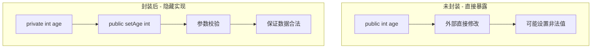
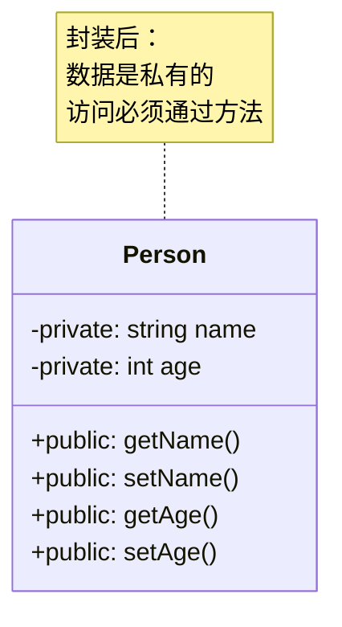
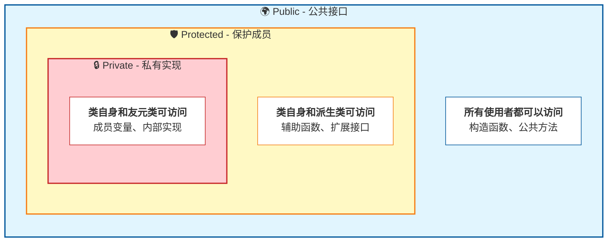
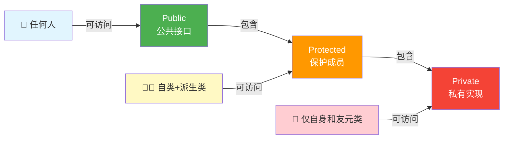

# 1.1 封装的目标：数据隐藏与接口暴露

> [返回第1章](./ch01-encapsulation.md) | [返回目录](../README.md)

## 1.1.1 实现目标

### 问题描述

在软件开发中，如果类的内部数据直接暴露给外部使用者，会产生以下问题：

| 问题 | 描述 | 后果 |
|------|------|------|
| **数据被意外修改** | 外部代码直接修改内部状态 | 对象进入不一致状态 |
| **实现细节暴露** | 外部代码依赖内部实现 | 实现变更时影响所有使用者 |
| **代码耦合严重** | 类的使用者需要了解内部细节 | 代码难以维护和扩展 |
| **责任边界模糊** | 无法明确哪些是内部实现，哪些是对外接口 | 职责混乱 |

### 期望效果

通过封装实现以下目标：



1. **数据保护**：防止外部代码直接修改内部状态，保证对象一致性
2. **接口稳定**：内部实现变更不影响外部调用代码
3. **职责清晰**：明确区分内部实现细节和对外公共接口
4. **降低耦合**：使用者只需关注接口，无需了解实现细节

---

## 1.1.2 核心原理

### 什么是封装

**封装（Encapsulation）**是将对象的**状态（数据）**和**行为（方法）**结合在一起，并隐藏内部实现细节，只通过明确的接口与外界交互。



### 封装的三个层次

访问控制由外向内逐层收紧，形成"俄罗斯套娃"式的嵌套结构：



另一种视角——访问权限的范围对比：



---

## 1.1.3 代码示例

### 未封装的代码（反例）

```cpp
// 反例：数据直接暴露
class BankAccount {
public:
    double balance;        // 余额直接暴露
    std::string password;  // 密码直接暴露！
};

void badExample() {
    BankAccount account;
    account.balance = -1000;        // 可以设置负数！
    account.password = "123456";   // 密码明文存储！

    // 任何代码都可以直接修改内部数据
    // 无法保证数据的合法性
}
```

### 封装后的代码（正例）

```cpp
#include <string>
#include <stdexcept>

class BankAccount {
private:
    double balance_;
    int id_;
    std::string encrypted_password_;

    // 辅助函数：验证金额是否合法
    bool isValidAmount(double amount) const {
        return amount >= 0;
    }
    // 同理：验证id是否合法
    bool isValidId(int id) const{
        return id > 0;
    }

public:
    // 构造函数
    BankAccount(double initialBalance,int id) : balance_(0),id_(-1) {
        if (isValidAmount(initialBalance)) {
            balance_ = initialBalance;
        }
        if (isValidId(id)){
            id_ = id;
        }
    }

    // 接口：获取余额（只读）
    double getBalance() const {
        return balance_;
    }

    // 接口：存款（带校验）
    bool deposit(double amount) {
        if (!isValidAmount(amount)) {
            return false;  // 存款金额不能为负
        }
        balance_ += amount;
        return true;
    }

    // 接口：取款（带校验）
    bool withdraw(double amount) {
        if (!isValidAmount(amount)) {
            return false;  // 取款金额不能为负
        }
        if (amount > balance_) {
            return false;  // 余额不足
        }
        balance_ -= amount;
        return true;
    }

    // 接口：修改密码（带验证）
    bool changePassword(const std::string& oldPwd,
                       const std::string& newPwd) {
        if (!verifyPassword(oldPwd)) {
            return false;  // 旧密码错误
        }
        if (newPwd.length() < 6) {
            return false;  // 新密码太短
        }
        encrypted_password_ = encrypt(newPwd);
        return true;
    }

private:    
    //简单的加密实现
    std::string encrypt(const std::string& pwd) const {
        std::string temp=pwd;
        for(int i=0;i<pwd.size();i++){
            temp[i]=char(int(temp[i])^id_); 
            //基于a^b^b=a实现的简单加密
            //对于部分字符可能会加密出现不可见特殊字符
        }
        return temp;  
    }

    bool verifyPassword(const std::string& pwd) const {
        if(encrypt(encrypted_password_) != pwd) return false;
        return true;
    }


};

void goodExample() {
    BankAccount account(1000,32);

    // account.balance_ = -1000;  // 编译错误！balance_是私有的

    account.deposit(500);   // 正确：通过接口操作
    account.withdraw(200);

    if (account.getBalance() > 0) {
        // 余额为正，可以继续操作
    }

    // 数据的合法性始终得到保证
}
```

---

## 1.1.4 深入讲解

### 为什么要封装

#### 1. 保护不变量（Invariant）

**不变量**是对象必须始终保持的条件。

```cpp
class Date {
private:
    int year_, month_, day_;

    // 不变量：日期必须是一个合法的日期
    void validate() {
        if (month_ < 1 || month_ > 12)
            throw std::invalid_argument("Invalid month");
        if (day_ < 1 || day_ > daysInMonth(month_, year_))
            throw std::invalid_argument("Invalid day");
    }

public:
    void setMonth(int m) {
        month_ = m;
        validate();  // 修改后立即验证不变量
    }

    void setDay(int d) {
        day_ = d;
        validate();  // 修改后立即验证不变量
    }
};
```

#### 2. 隔离变化

当内部实现改变时，只要接口不变，使用者代码无需修改：

```cpp
// 版本1：使用数组存储
class Stack {
private:
    int data[100];
    int top_;

public:
    void push(int x);
    int pop();
};

// 版本2：改用链表存储（接口不变）
class Stack {
private:
    struct Node {
        int value;
        Node* next;
    };
    Node* head_;

public:
    void push(int x);  // 接口完全相同
    int pop();         // 接口完全相同
};

// 使用者代码完全不需要修改
Stack s;
s.push(10);
s.pop();
```

#### 3. 简化使用

封装可以隐藏复杂的内部逻辑，提供简单易用的接口：

```cpp
class FileHandle {
private:
    int fd_;           // 文件描述符
    bool isLocked_;    // 锁状态

    // 复杂的初始化逻辑被隐藏
    void openAndLock(const std::string& path) {
        fd_ = open(path.c_str(), O_RDWR);
        if (fd_ < 0) throw std::runtime_error("Open failed");
        // 获取文件锁...
        // 设置各种标志位...
        // 更多初始化...
    }

public:
    // 使用者只需调用构造函数
    FileHandle(const std::string& path) {
        openAndLock(path);
    }

    ~FileHandle() {
        // 自动释放资源
        close(fd_);
    }

    void write(const std::string& data);
    std::string read();
};
```

---

## 1.1.5 封装的最佳实践

### 1. 所有成员变量默认为 private

```cpp
class Good {
private:
    int data_;  // 默认私有

public:
    int getData() const { return data_; }
    void setData(int value) { data_ = value; }
};

class Bad {
public:
    int data;  // 不要这样做！
};
```

### 2. 提供语义明确的接口

```cpp
// 好的接口：语义清晰
class Account {
public:
    void deposit(double amount);   // 存款
    bool withdraw(double amount);  // 取款
    double getBalance() const;     // 查询余额
};

// 不好的接口：只有通用的get/set
class Account {
public:
    void setBalance(double b);  // 语义不清晰
    double getBalance() const;
};
```

### 3. 区分 const 和非 const 方法

```cpp
class Vector {
private:
    double* data_;
    size_t size_;

public:
    // const方法：不修改对象状态
    double get(size_t index) const {
        return data_[index];
    }

    // 非const方法：会修改对象状态
    void set(size_t index, double value) {
        data_[index] = value;
    }
};
```

---

## 1.1.6 常见陷阱

### 陷阱1：过度封装

```cpp
// 过度封装：每个成员变量都有get/set
class Point {
public:
    int getX() const { return x_; }
    void setX(int x) { x_ = x; }
    int getY() const { return y_; }
    void setY(int y) { y_ = y; }
private:
    int x_, y_;
};

// 这种情况下，直接暴露x_, y_可能更清晰
// 或者使用结构体
struct Point {
    int x, y;
};
```

**判断标准**：如果 get/set 方法没有任何逻辑，只是简单地转发，考虑是否需要封装。

### 陷阱2：const成员函数返回内部引用

```cpp
class Container {
private:
    std::vector<int> data_;

public:
    // 危险！返回内部引用破坏了封装
    const std::vector<int>& getData() const {
        return data_;  // 调用者可以获取内部数据结构
    }
};

// 更好的做法：返回迭代器或提供只读访问
class Container {
public:
    using const_iterator = std::vector<int>::const_iterator;
    const_iterator begin() const { return data_.cbegin(); }
    const_iterator end() const { return data_.cend(); }
private:
    std::vector<int> data_;
};
```

---

## 1.1.7 思考题

1. 为什么说"封装不是简单的私有化"？
   > 提示：考虑接口设计、语义表达、职责分离等方面

2. 以下类的设计是否合理？为什么？
   ```cpp
   class Rectangle {
   public:
       double width, height;
       double area() { return width * height; }
   };
   ```

3. 如何设计一个"不可变对象"（Immutable Object）？

---

*下一节：[1.2 访问修饰符的底层实现](./ch01-02-access-modifiers.md)*
