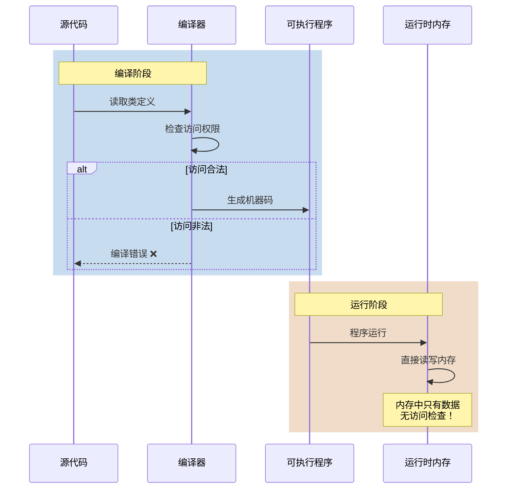
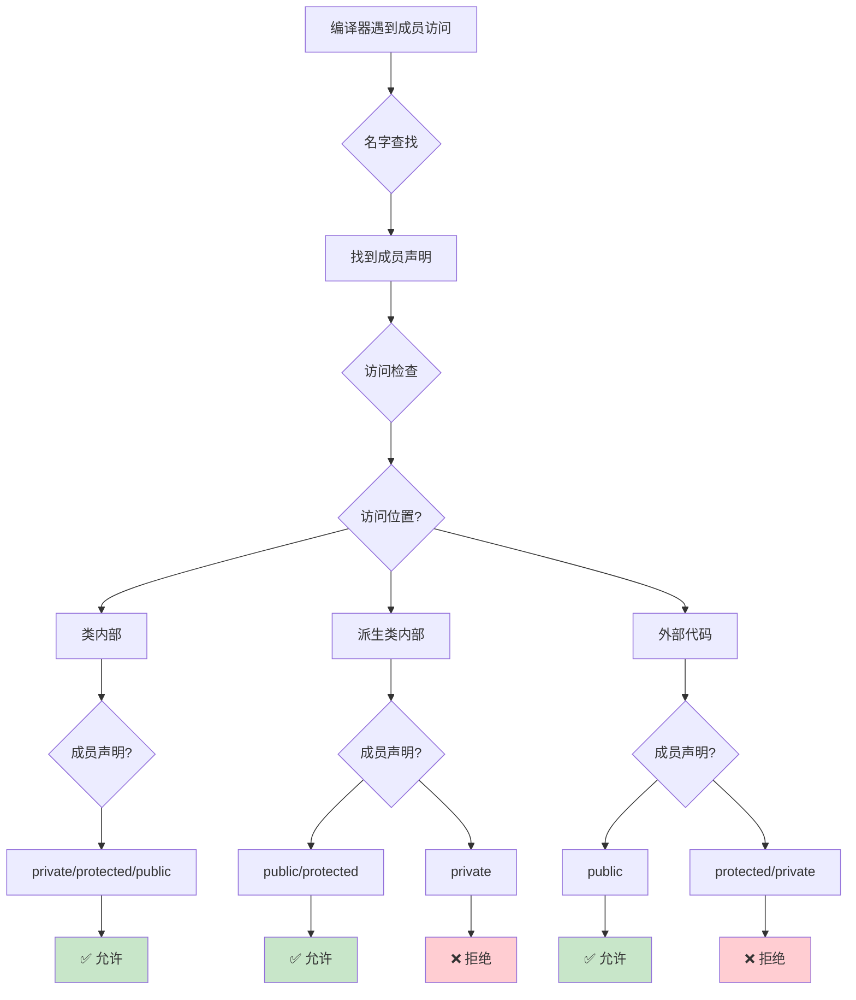
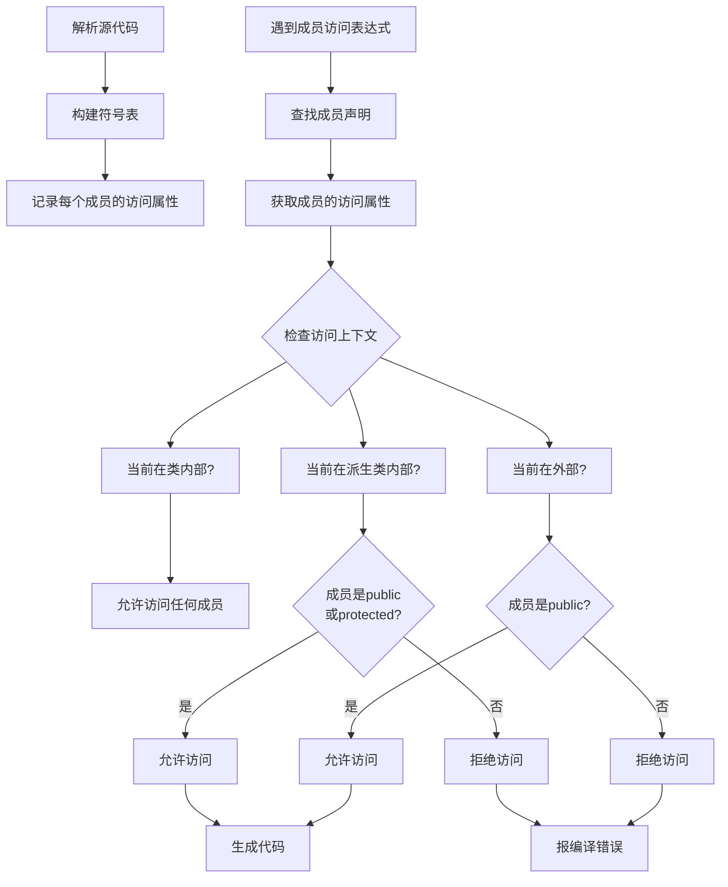
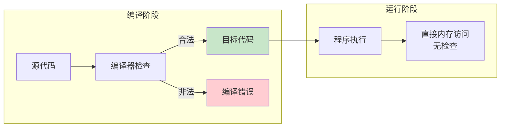

# 1.2 访问修饰符的底层实现

> [返回第1章](./ch01-encapsulation.md) | [返回目录](../README.md)

## 1.2.1 实现目标

### 问题描述

很多初学者有一个误解：认为访问修饰符（`public`、`protected`、`private`）在程序运行时会持续检查权限。他们可能会想：

> "如果我把数据设为 private，运行时别人就无法访问了。"

这种理解是**错误**的。访问修饰符是**编译时**的限制，而不是运行时的保护。

### 期望效果

通过本节学习，你将理解：
1. 访问修饰符只在**编译阶段**起作用
2. 编译器如何通过**名字查找**和**访问检查**来强制执行访问控制
3. 运行时内存中**没有**访问权限的区分
4. 如何通过"漏洞"绕过访问控制（以及为什么这样做很危险）

---

## 1.2.2 核心原理

### 编译时 vs 运行时



**关键结论**：访问修饰符是**编译器给你的安全带**，而不是**运行时的保安**。

### 访问检查的两个阶段



---

## 1.2.3 代码示例

### 示例1：编译时检查

```cpp
class MyClass {
private:
    int privateData;
protected:
    int protectedData;
public:
    int publicData;

    // 类内部可以访问所有成员
    void memberFunction() {
        privateData = 1;      // ✅ OK
        protectedData = 2;    // ✅ OK
        publicData = 3;       // ✅ OK
    }
};

class DerivedClass : public MyClass {
    // 派生类可以访问 public 和 protected
    void derivedFunction() {
        // privateData = 1;   // ❌ 编译错误：private成员不可访问
        protectedData = 2;    // ✅ OK
        publicData = 3;       // ✅ OK
    }
};

void externalFunction() {
    MyClass obj;

    // obj.privateData = 1;   // ❌ 编译错误：private成员不可访问
    // obj.protectedData = 2; // ❌ 编译错误：protected成员不可访问
    obj.publicData = 3;       // ✅ OK
}
```

### 示例2：运行时没有保护

虽然上面的代码无法编译通过，但如果我们**绕过编译器**，运行时可以直接访问私有成员：

```cpp
#include <iostream>

class Secret {
private:
    int privateValue = 42;  // 私有成员
};

void hack() {
    Secret obj;

    // 方法1：通过指针直接访问（危险！）
    int* ptr = (int*)&obj;
    std::cout << "Private value: " << *ptr << std::endl;  // 输出: 42

    // 方法2：通过内存偏移访问
    char* raw = (char*)&obj;
    int* valuePtr = (int*)(raw + 0);  // 假设privateValue在偏移0处
    std::cout << "Private value: " << *valuePtr << std::endl;  // 输出: 42
}

int main() {
    hack();
    return 0;
}
```

**输出**：
```
Private value: 42
Private value: 42
```

这说明：**运行时内存中没有任何访问限制！**

### 示例3：验证内存布局

```cpp
#include <iostream>
#include <cstring>

class AccessDemo {
public:
    int publicData;
private:
    int privateData;
protected:
    int protectedData;
public:
    AccessDemo() : publicData(1), privateData(2), protectedData(3) {}

    void print() {
        std::cout << "publicData=" << publicData
                  << ", privateData=" << privateData
                  << ", protectedData=" << protectedData << std::endl;
    }
};

int main() {
    AccessDemo obj;

    // 正常访问（通过public方法）
    obj.print();  // 输出: publicData=1, privateData=2, protectedData=3

    // 直接读取整个对象的内存
    int raw[3];
    std::memcpy(raw, &obj, sizeof(obj));

    std::cout << "\nRaw memory dump:\n";
    std::cout << "Offset 0: " << raw[0] << " (publicData)\n";
    std::cout << "Offset 4: " << raw[1] << " (privateData)\n";
    std::cout << "Offset 8: " << raw[2] << " (protectedData)\n";

    return 0;
}
```

**输出**：
```
publicData=1, privateData=2, protectedData=3

Raw memory dump:
Offset 0: 1 (publicData)
Offset 4: 2 (privateData)
Offset 8: 3 (protectedData)
```

在内存中，所有成员都是连续存储的，没有任何访问权限标记。

---

## 1.2.4 深入讲解

### 编译器如何实现访问检查

编译器在编译阶段执行以下步骤：



### 符号表中的信息

编译器在符号表中为每个成员存储访问属性：

| 成员名 | 类型 | 访问属性 | 偏移量 |
|--------|------|----------|--------|
| `publicData` | `int` | `public` | 0 |
| `privateData` | `int` | `private` | 4 |
| `protectedData` | `int` | `protected` | 8 |

**注意**：只有访问属性用于编译时检查，偏移量用于生成代码。

### C++标准的保证

C++标准规定（[class.access]）：

> Access control is uniformly applied to all names, whether the names are referred to from declarations or expressions.

这意味着：
1. 访问控制是**语言层面的**，不是硬件/操作系统层面的
2. 访问控制**不影响**对象的内存布局
3. 访问控制**不影响**代码生成（合法访问生成的代码与绕过访问生成的代码相同）

### 为什么只检查编译时？

**性能考虑**：

```cpp
class Point {
private:
    int x, y;
public:
    int getX() const { return x; }
    int getY() const { return y; }
};

// 如果运行时也要检查访问权限：
int result = p.getX();  // 每次调用都要检查 x 是否可访问
// 这会带来巨大的性能开销！
```

**设计哲学**：C++相信程序员——"你是专家，你知道自己在做什么"。访问控制是**防止意外**，而不是**防止故意**。

---

## 1.2.5 访问控制的"漏洞"

### 漏洞1：指针强制转换

```cpp
class Vault {
private:
    int secretCode = 1234;
};

int main() {
    Vault vault;

    // ❌ 无法直接访问
    // int code = vault.secretCode;  // 编译错误

    // ✅ 通过指针绕过
    int* ptr = (int*)&vault;
    int code = *ptr;  // code = 1234

    std::cout << "Secret code: " << code << std::endl;
    return 0;
}
```

### 漏洞2：内存复制

```cpp
class Source {
private:
    int privateKey = 999;
};

class Destination {
public:
    int stolenKey;
};

int main() {
    Source src;
    Destination dst;

    // 直接复制内存，绕过访问控制
    std::memcpy(&dst, &src, sizeof(int));
    std::cout << "Stolen key: " << dst.stolenKey << std::endl;  // 999

    return 0;
}
```

### 漏洞3：未定义行为——但"有效"

```cpp
class WithSecret {
private:
    int value = 42;

public:
    int getValue() const { return value; }
};

// 通过定义一个具有相同内存布局的"黑客"类
class HackerProxy {
public:
    int value;  // 注意：这里是public
};

int main() {
    WithSecret secret;
    HackerProxy* proxy = (HackerProxy*)&secret;

    std::cout << "Hacked value: " << proxy->value << std::endl;  // 42

    // 甚至可以修改！
    proxy->value = 100;
    std::cout << "After hack: " << secret.getValue() << std::endl;  // 100

    return 0;
}
```

**警告**：这些技术会产生**未定义行为（UB）**，但在大多数实现中"可以工作"。这证明了访问控制只在编译时有效。

---

## 1.2.6 内存布局验证

让我们用具体例子验证访问权限不影响内存布局：

```cpp
#include <iostream>
#include <cstdint>

class A {
public:
    int a;
private:
    int b;
public:
    int c;
};

class B {
public:
    int a;
    int b;  // 注意：这里是public
    int c;
};

int main() {
    std::cout << "sizeof(A) = " << sizeof(A) << std::endl;
    std::cout << "sizeof(B) = " << sizeof(B) << std::endl;

    A objA{1, 2, 3};
    B objB{10, 20, 30};

    // 打印内存
    auto printMem = [](const void* p, size_t n) {
        const uint8_t* bytes = static_cast<const uint8_t*>(p);
        for (size_t i = 0; i < n; ++i) {
            std::cout << static_cast<int>(bytes[i]) << " ";
        }
        std::cout << std::endl;
    };

    std::cout << "\nA的内存: ";
    printMem(&objA, sizeof(A));

    std::cout << "B的内存: ";
    printMem(&objB, sizeof(B));

    return 0;
}
```

**可能的输出**（取决于系统）：
```
sizeof(A) = 12
sizeof(B) = 12

A的内存: 1 0 0 0 2 0 0 0 3 0 0 0
B的内存: 10 0 0 0 20 0 0 0 30 0 0 0
```

两个类的大小完全相同，内存布局也完全相同——**访问权限不影响内存布局**。

---

## 1.2.7 最佳实践

### 1. 不要依赖访问控制作为安全机制

```cpp
// ❌ 错误的依赖
class SecurePassword {
private:
    std::string password;  // 以为这就"安全"了
};

// 攻击者可以轻松读取内存
```

**正确的做法**：敏感数据应该加密存储在安全内存区域。

### 2. 使用友元（friend）时要谨慎

```cpp
class Vault {
private:
    int secret = 999;

    friend int Hacker::steal(Vault&);  // 小心！
};
```

`friend`可以打破访问控制，应该谨慎使用。

### 3. 理解访问控制的局限性

访问控制是**编译时的辅助**，目的是：
- ✅ 防止意外错误
- ✅ 明确接口边界
- ✅ 支持重构

而不是：
- ❌ 运行时安全
- ❌ 防止恶意攻击

---

## 1.2.8 总结对比

| 特性 | 编译时 | 运行时 |
|------|--------|--------|
| 访问检查 | ✅ 执行 | ❌ 不执行 |
| 影响内存布局 | ❌ 无影响 | ❌ 无影响 |
| 影响性能 | ❌ 无影响 | ❌ 无影响 |
| 可以绕过 | ❌ 不可能（合法代码） | ✅ 可能（未定义行为） |



---

## 1.2.9 思考题

1. 既然访问控制只在编译时有效，为什么还需要它？
   > 提示：考虑代码维护、接口设计、团队协作等方面

2. 以下代码会有什么问题？
   ```cpp
   class A {
   private:
       int x;
   public:
       int& getXRef() { return x; }  // 返回私有成员的引用
   };
   ```

3. 为什么C++标准不要求在运行时检查访问权限？

---

*上一节：[1.1 封装的目标：数据隐藏与接口暴露](./ch01-01-encapsulation-goal.md)*
*下一节：[1.3 构造函数与析构函数的调用时机](./ch01-03-ctor-dtor.md)*
