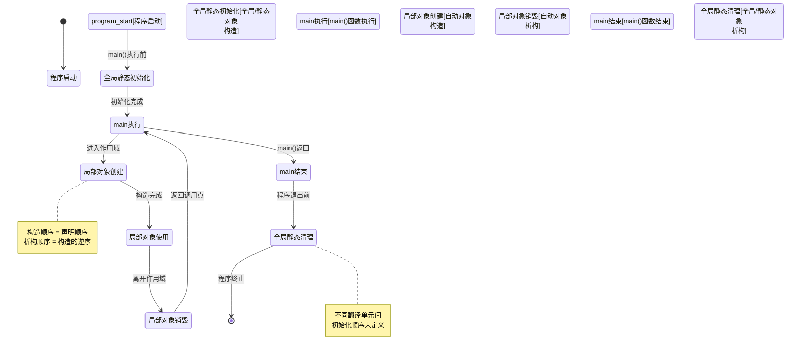
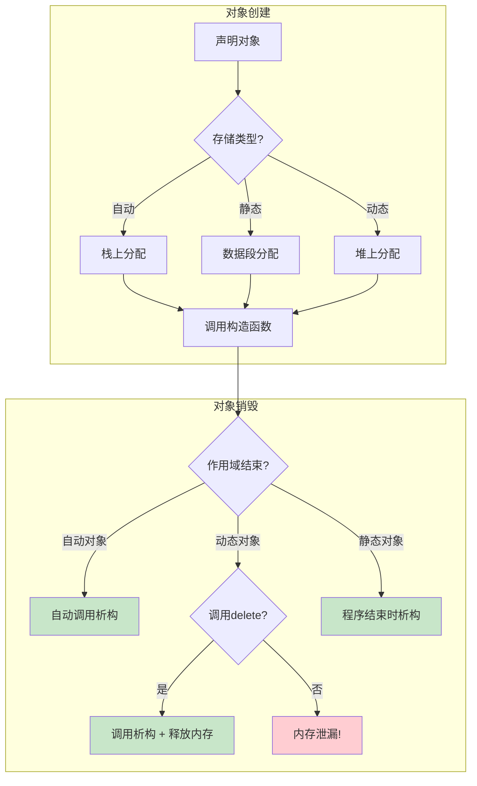

# 1.3 构造函数与析构函数的调用时机

> [返回第1章](./ch01-encapsulation.md) | [返回目录](../README.md)

## 1.3.1 实现目标

### 问题描述

很多初学者对对象生命周期的理解比较模糊，他们可能会遇到以下困惑：

> "我定义了一个对象，它的构造函数什么时候被调用？"
>
> "局部对象、全局对象、静态对象，它们的创建顺序有什么区别？"
>
> "对象数组中的元素是如何被构造的？"
>
> "使用 placement new 创建的对象需要手动调用析构函数吗？"

这些问题如果理解不清楚，会导致：
- **资源泄漏**：析构函数未在预期时机调用
- **未定义行为**：使用已析构的对象
- **性能问题**：不必要的临时对象创建和销毁

### 期望效果

通过本节学习，你将理解：

1. **各种存储持续期**的对象构造/析构时机
   - 自动存储持续期（局部变量）
   - 静态存储持续期（全局/静态变量）
   - 动态存储持续期（堆上对象）
   - 线程存储持续期（thread_local）

2. **特殊场景**下的调用规则
   - 对象数组的构造与析构顺序
   - 成员对象的构造顺序
   - 基类与派生类的构造顺序
   - 临时对象的生存期

3. **异常安全**下的析构保证
   - 栈展开（stack unwinding）机制
   - RAII 如何依赖析构函数的调用保证

---

## 1.3.2 核心原理

### 存储持续期与对象生命周期

C++ 中的每个对象都有一种**存储持续期（storage duration）**，它决定了对象的生存期：

| 存储持续期 | 关键字 | 生命周期开始 | 生命周期结束 | 内存位置 |
|-----------|--------|-------------|-------------|---------|
| **自动** | 无（局部变量） | 执行到声明处 | 离开作用域 | 栈 |
| **静态** | static / 全局 | 程序启动 | 程序结束 | 数据段 |
| **动态** | new / malloc | new 表达式执行 | delete / 回收 | 堆 |
| **线程** | thread_local | 线程启动 | 线程结束 | 线程局部存储 |

### 构造与析构的基本规则

**构造时机**：
- 自动对象：执行流到达声明点时
- 全局/静态对象：main 函数执行前（有序/无序初始化）
- 动态对象：new 表达式求值时
- 成员对象：在包含类的构造函数中（按声明顺序）
- 基类子对象：在派生类构造函数中（按继承顺序）

**析构时机**：
- 自动对象：离开作用域时（与构造**相反顺序**）
- 全局/静态对象：main 函数结束后（与构造**相反顺序**）
- 动态对象：delete 表达式执行时
- 成员对象：在包含类的析构函数中（与构造**相反顺序**）
- 基类子对象：在派生类析构函数中（与构造**相反顺序**）

---

## 1.3.3 对象生命周期可视化



---

## 1.3.4 代码示例

### 示例1：验证自动对象的构造与析构顺序

```cpp
#include <iostream>
#include <string>

class Tracer {
    std::string name;
public:
    Tracer(const std::string& n) : name(n) {
        std::cout << "构造: " << name << std::endl;
    }

    ~Tracer() {
        std::cout << "析构: " << name << std::endl;
    }
};

void functionB() {
    std::cout << "进入 functionB" << std::endl;
    Tracer t4("functionB::t4");
    std::cout << "离开 functionB" << std::endl;
}

void functionA() {
    std::cout << "进入 functionA" << std::endl;
    Tracer t2("functionA::t2");
    Tracer t3("functionA::t3");
    functionB();
    std::cout << "离开 functionA" << std::endl;
}

int main() {
    std::cout << "===== main 开始 =====" << std::endl;
    Tracer t1("main::t1");
    functionA();
    std::cout << "===== main 结束 =====" << std::endl;
    return 0;
}
```

**输出**：
```
===== main 开始 =====
构造: main::t1
进入 functionA
构造: functionA::t2
构造: functionA::t3
进入 functionB
构造: functionB::t4
离开 functionB
析构: functionB::t4      ← 先构造的后析构
离开 functionA
析构: functionA::t3      ← 先构造的后析构
析构: functionA::t2
===== main 结束 =====
析构: main::t1
```

**关键结论**：
- 构造顺序 = 声明顺序
- 析构顺序 = 构造的**逆序**

---

### 示例2：全局/静态对象的初始化时机

```cpp
#include <iostream>

class Tracer {
    std::string name;
    int id;
    static int count;
public:
    Tracer(const std::string& n) : name(n), id(++count) {
        std::cout << "[" << id << "] 构造: " << name << std::endl;
    }

    ~Tracer() {
        std::cout << "[" << id << "] 析构: " << name << std::endl;
    }
};

int Tracer::count = 0;

// 全局对象：在 main() 之前构造
Tracer global1("全局对象1");
Tracer global2("全局对象2");

Tracer& getStaticRef() {
    static Tracer localStatic("函数内静态对象");  // 第一次调用时构造
    return localStatic;
}

int main() {
    std::cout << "===== main 开始 =====" << std::endl;

    // 局部静态对象：第一次经过时构造
    getStaticRef();
    getStaticRef();  // 不会再次构造

    std::cout << "===== main 结束 =====" << std::endl;
    return 0;
}
```

**输出**：
```
[1] 构造: 全局对象1      ← main() 之前
[2] 构造: 全局对象2      ← main() 之前
===== main 开始 =====
[3] 构造: 函数内静态对象  ← 第一次经过声明
===== main 结束 =====
[3] 析构: 函数内静态对象  ← 析构顺序与构造相反
[2] 析构: 全局对象2
[1] 析构: 全局对象1
```

**关键结论**：
- 全局对象在 `main()` 执行**前**构造
- 函数内 `static` 对象在**第一次经过声明时**构造
- 所有静态对象在程序结束时按构造的**逆序**析构

---

### 示例3：成员对象与基类的构造顺序

```cpp
#include <iostream>
#include <string>

class Member {
    std::string name;
public:
    Member(const std::string& n) : name(n) {
        std::cout << "  Member构造: " << name << std::endl;
    }

    ~Member() {
        std::cout << "  Member析构: " << name << std::endl;
    }
};

class Base {
public:
    Base() {
        std::cout << "  Base构造" << std::endl;
    }

    virtual ~Base() {
        std::cout << "  Base析构" << std::endl;
    }
};

class Derived : public Base {
    Member m1;  // 注意：声明顺序是 m1, m2, m3
    Member m2;
    Member m3;
public:
    Derived() : m2("m2"), m1("m1"), m3("m3") {  // 初始化列表顺序不影响
        std::cout << "  Derived构造" << std::endl;
    }

    ~Derived() {
        std::cout << "  Derived析构" << std::endl;
    }
};

int main() {
    std::cout << "创建 Derived 对象:" << std::endl;
    Derived obj;
    std::cout << "\n销毁 Derived 对象:" << std::endl;
    return 0;
}
```

**输出**：
```
创建 Derived 对象:
  Base构造               ← 1. 先构造基类
  Member构造: m1         ← 2. 按成员声明顺序
  Member构造: m2         ←    (不是初始化列表顺序!)
  Member构造: m3         ←
  Derived构造            ← 3. 最后构造派生类

销毁 Derived 对象:
  Derived析构            ← 1. 先析构派生类
  Member析构: m3         ← 2. 按声明逆序析构成员
  Member析构: m2         ←
  Member析构: m1         ←
  Base析构               ← 3. 最后析构基类
```

**关键结论**：
- 构造顺序：基类 → 成员（按声明顺序）→ 派生类
- 析构顺序：派生类 → 成员（按声明逆序）→ 基类
- **初始化列表的顺序不影响实际的构造顺序**

---

### 示例4：异常发生时的析构调用（栈展开）

```cpp
#include <iostream>
#include <stdexcept>

class Resource {
    std::string name;
public:
    Resource(const std::string& n) : name(n) {
        std::cout << "获取资源: " << name << std::endl;
    }

    ~Resource() {
        std::cout << "释放资源: " << name << std::endl;
    }
};

void dangerousFunction() {
    Resource r3("资源3");
    throw std::runtime_error("出错了!");  // 抛出异常
    // r3 的析构函数会被自动调用
}

int main() {
    std::cout << "程序开始" << std::endl;

    Resource r1("资源1");

    try {
        Resource r2("资源2");
        dangerousFunction();
        // r2 的析构函数会被调用（即使发生异常）
    }
    catch (const std::exception& e) {
        std::cout << "捕获异常: " << e.what() << std::endl;
    }

    std::cout << "程序结束" << std::endl;
    return 0;
}
```

**输出**：
```
程序开始
获取资源: 资源1
获取资源: 资源2
获取资源: 资源3
释放资源: 资源3      ← 异常触发，栈展开导致 r3 析构
释放资源: 资源2      ← 继续栈展开，r2 析构
捕获异常: 出错了!
程序结束
释放资源: 资源1      ← 正常离开 main，r1 析构
```

**关键结论**：这是 **RAII（资源获取即初始化）** 的基础。当异常发生时，所有已构造的局部对象都会按逆序自动析构，确保资源被正确释放。

---

### 示例5：动态对象与 placement new

```cpp
#include <iostream>
#include <new>      // for ::operator new
#include <cstdlib>  // for free

class Widget {
    std::string name;
public:
    Widget(const std::string& n) : name(n) {
        std::cout << "构造: " << name << std::endl;
    }

    ~Widget() {
        std::cout << "析构: " << name << std::endl;
    }

    void greet() {
        std::cout << "Hello from " << name << std::endl;
    }
};

int main() {
    std::cout << "=== 普通堆对象 ===" << std::endl;
    Widget* p1 = new Widget("堆对象1");
    p1->greet();
    delete p1;  // 自动调用析构函数 + 释放内存

    std::cout << "\n=== placement new ===" << std::endl;
    // 手动分配内存（不调用构造函数）
    void* raw = ::operator new(sizeof(Widget));
    // 在已有内存上构造对象
    Widget* p2 = new(raw) Widget("栈上对象");
    p2->greet();

    // 必须手动调用析构函数！
    p2->~Widget();
    // 然后手动释放内存
    ::operator delete(raw);

    std::cout << "\n=== 对象数组 ===" << std::endl;
    Widget* arr = new Widget[3]{"元素0", "元素1", "元素2"};
    delete[] arr;  // 调用3次析构函数 + 释放内存

    return 0;
}
```

**输出**：
```
=== 普通堆对象 ===
构造: 堆对象1
Hello from 堆对象1
析构: 堆对象1

=== placement new ===
构造: 栈上对象
Hello from 栈上对象
析构: 栈上对象

=== 对象数组 ===
构造: 元素0
构造: 元素1
构造: 元素2
析构: 元素2      ← 析构顺序与构造相反
析构: 元素1
析构: 元素0
```

**关键结论**：
- 使用 placement new 时，必须**手动调用析构函数**
- 对象数组的析构顺序与构造顺序相反
- `delete` vs `delete[]`：必须匹配使用

---

## 1.3.5 深入讲解

### 编译器如何生成构造/析构调用

编译器在编译时会为对象插入隐式的构造和析构调用。让我们看看编译器实际上做了什么：

**原始代码**：
```cpp
void func() {
    Widget w;
    w.doSomething();
}  // 离开作用域
```

**编译器视角的伪代码**：
```cpp
void func() {
    Widget w;                    // 分配栈空间
    Widget::Widget(&w);          // 调用构造函数
    Widget::doSomething(&w);     // 成员函数调用
    Widget::~Widget(&w);         // 调用析构函数
    // 栈空间自动回收
}
```

这种机制解释了为什么：
- 析构函数**一定会**被调用（正常退出或异常）
- RAII 能够可靠工作
- 异常安全代码成为可能

### 全局对象的初始化顺序问题

不同翻译单元（.cpp 文件）中的全局对象，其初始化顺序是**未定义的**。这是一个经典的陷阱：

```cpp
// FileA.cpp
class Logger {
public:
    void log(const char* msg);
};
extern Logger globalLogger;  // 声明

// FileB.cpp
#include "FileA.h"
class Config {
public:
    Config() { globalLogger.log("Config initialized"); }  // 危险！
};
Config globalConfig;  // 可能比 globalLogger 先构造！
```

**解决方案：使用函数内局部静态对象（Meyer's Singleton）**：

```cpp
// FileA.h
class Logger { /* ... */ };

inline Logger& getLogger() {
    static Logger instance;  // C++11 保证线程安全的初始化
    return instance;
}

// FileB.cpp
class Config {
public:
    Config() { getLogger().log("Config initialized"); }  // 安全！
};
```

**原理**：函数内的 `static` 对象在**第一次调用时**初始化，而不是程序启动时。

### 为什么成员按声明顺序构造

C++ 标准规定成员必须按声明顺序构造，这是为了确保**析构顺序可预测**：

```cpp
class BadIdea {
    Member* m1;  // 可能依赖 m2
    Member m2;   // 先声明
public:
    BadIdea() : m2(/*...*/), m1(&m2) {  // 初始化列表看起来是对的
        // 但实际构造顺序是 m1 → m2！
        // m1 会收到未初始化的 m2 指针！
    }
};
```

**最佳实践**：让成员的声明顺序与初始化依赖一致。

### 虚析构函数的必要性

当通过基类指针删除派生类对象时，析构函数必须是 `virtual` 的：

```cpp
class Base {
public:
    ~Base() { std::cout << "Base析构\n"; }  // 不是 virtual！
};

class Derived : public Base {
    int* data;
public:
    Derived() : data(new int[1000]) {}
    ~Derived() {
        delete[] data;  // 这个不会被调用！
        std::cout << "Derived析构\n";
    }
};

int main() {
    Base* p = new Derived;
    delete p;  // 只调用 Base::~Base()！内存泄漏！
}
```

**输出**：
```
Base析构    ← Derived::~Derived() 未被调用！
```

**正确做法**：

```cpp
class Base {
public:
    virtual ~Base() {  // 添加 virtual
        std::cout << "Base析构\n";
    }
};
```

### 异常安全的构造函数

构造函数中如果抛出异常，已构造的成员会自动析构：

```cpp
class ResourceHolder {
    Resource r1;
    Resource* r2;  // 堆上分配
    Resource r3;
public:
    ResourceHolder()
        : r2(nullptr) {
        // r1 已构造
        r2 = new Resource();  // 如果这里抛异常
        // r1 会自动析构
        // 但 r2 不会（因为它还没构造完成）
        r3.doSomething();     // 如果这里抛异常
        // r1 和 r3 会自动析构
        // r2 会内存泄漏！
    }

    ~ResourceHolder() {
        delete r2;
    }
};
```

**最佳实践**：使用智能指针：

```cpp
class ResourceHolder {
    Resource r1;
    std::unique_ptr<Resource> r2;  // 智能指针
    Resource r3;
public:
    ResourceHolder() {
        r2 = std::make_unique<Resource>();
        r3.doSomething();  // 即使抛异常，r2 也会自动清理
    }
    // 不需要手动 delete
};
```

### 拷贝构造与移动构造的调用时机

```cpp
Widget createWidget() {
    Widget w("临时对象");
    return w;  // 可能触发移动构造（C++11 RVO）
}

int main() {
    Widget w1 = createWidget();  // 可能被优化掉（RVO/NRVO）

    Widget w2("源对象");
    Widget w3 = w2;              // 拷贝构造
    Widget w4 = std::move(w2);   // 移动构造

    return 0;
}
```

**返回值优化（RVO）**：编译器可能直接在目标位置构造对象，省略拷贝/移动。

### 禁止拷贝/移动的场景

```cpp
class UniqueResource {
    HANDLE handle;  // 假设是某种不可复制的资源句柄
public:
    UniqueResource(const char* name) : handle(openHandle(name)) {}
    ~UniqueResource() { closeHandle(handle); }

    // 禁止拷贝
    UniqueResource(const UniqueResource&) = delete;
    UniqueResource& operator=(const UniqueResource&) = delete;

    // 允许移动
    UniqueResource(UniqueResource&& other) noexcept
        : handle(other.handle) {
        other.handle = INVALID_HANDLE;
    }

    UniqueResource& operator=(UniqueResource&& other) noexcept {
        if (this != &other) {
            closeHandle(handle);
            handle = other.handle;
            other.handle = INVALID_HANDLE;
        }
        return *this;
    }
};
```

---

## 1.3.6 常见陷阱

### 陷阱1：析构函数中抛出异常

```cpp
// ❌ 危险代码
class BadWidget {
    std::FILE* file;
public:
    BadWidget(const char* filename) {
        file = std::fopen(filename, "w");
    }

    ~BadWidget() {
        if (std::fclose(file) != 0) {
            throw std::runtime_error("关闭文件失败");  // 危险！
        }
    }
};

// 当栈展开时，如果有两个对象都抛出异常，
// 程序会直接调用 std::terminate() 终止
```

**正确做法**：

```cpp
// ✅ 安全代码
class GoodWidget {
    std::FILE* file;
public:
    GoodWidget(const char* filename) : file(std::fopen(filename, "w")) {
        if (!file) throw std::runtime_error("打开文件失败");
    }

    ~GoodWidget() noexcept {
        if (file) {
            // 只记录错误，不抛出异常
            if (std::fclose(file) != 0) {
                std::fprintf(stderr, "警告: 关闭文件失败\n");
            }
        }
    }
};
```

### 陷阱2：在析构函数中访问已析构的成员

```cpp
// ❌ 危险代码
class Container {
    std::vector<int> data;
    std::size_t size;
public:
    ~Container() {
        std::cout << "容器大小: " << size << "\n";  // 未定义行为！
        // 成员按声明逆序析构，size 可能已被析构
    }
};
```

实际上基本类型（如 `size_t`）的"析构"什么都不做，所以这个例子通常能工作。但对于有真实析构函数的成员：

```cpp
// ❌ 真正的问题
class Container {
    std::shared_ptr<int> data;
    std::function<void()> callback;
public:
    ~Container() {
        callback();  // callback 可能已被析构！
    }
};
```

### 陷阱3：数组 delete 不匹配

```cpp
// ❌ 错误
Widget* arr = new Widget[10];
delete arr;  // 未定义行为！只调用第一个元素的析构函数

// ✅ 正确
Widget* arr = new Widget[10];
delete[] arr;  // 调用所有10个元素的析构函数

// ❌ 错误
Widget* single = new Widget;
delete[] single;  // 未定义行为！

// ✅ 正确
Widget* single = new Widget;
delete single;
```

---

## 1.3.7 总结对比

| 场景 | 构造时机 | 析构时机 | 是否自动 |
|-----|---------|---------|---------|
| 局部对象 | 到达声明处 | 离开作用域 | 是 |
| 全局对象 | main 前 | main 后 | 是 |
| 函数内 static | 第一次经过声明 | 程序结束时 | 是 |
| 堆对象 | new 时 | delete 时 | 否（需手动 delete） |
| 成员对象 | 包含类构造时 | 包含类析构时 | 是 |
| 基类子对象 | 派生类构造前 | 派生类析构后 | 是 |
| placement new | new(raw) 表达式 | 手动调用 ~X() | 否（需手动析构） |



---

## 1.3.8 思考题

1. 为什么 C++ 规定析构顺序必须与构造顺序相反？
   > 提示：考虑成员之间可能存在依赖关系

2. 以下代码的输出是什么？为什么？
   ```cpp
   struct A { A() { std::cout << "A"; } ~A() { std::cout << "a"; } };
   struct B { B() { std::cout << "B"; } ~B() { std::cout << "b"; } };

   int main() {
       const A& a = A();
       B b;
   }
   ```

3. 如何设计一个类，让它只能在堆上创建（不能作为局部对象或成员对象）？

---

*上一节：[1.2 访问修饰符的底层实现](./ch01-02-access-modifiers.md)*
*下一节：[1.4 RAII：资源管理即生命周期](./ch01-04-raii.md)*
