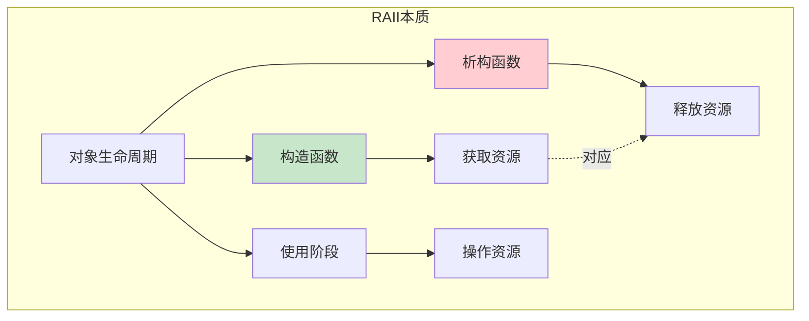
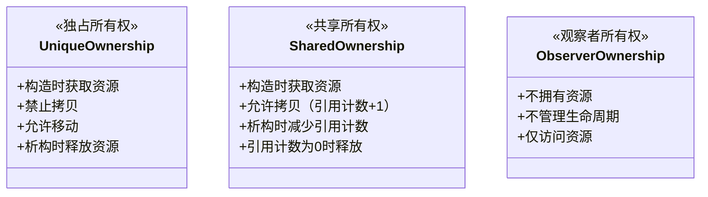
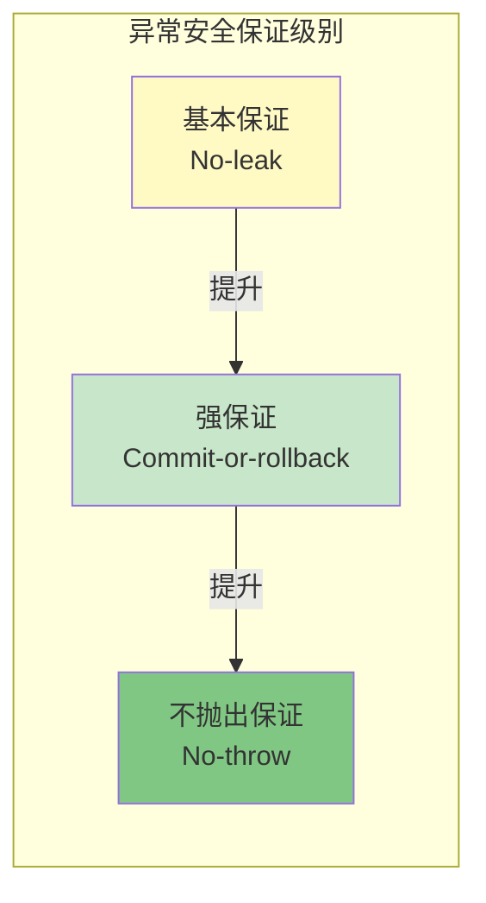
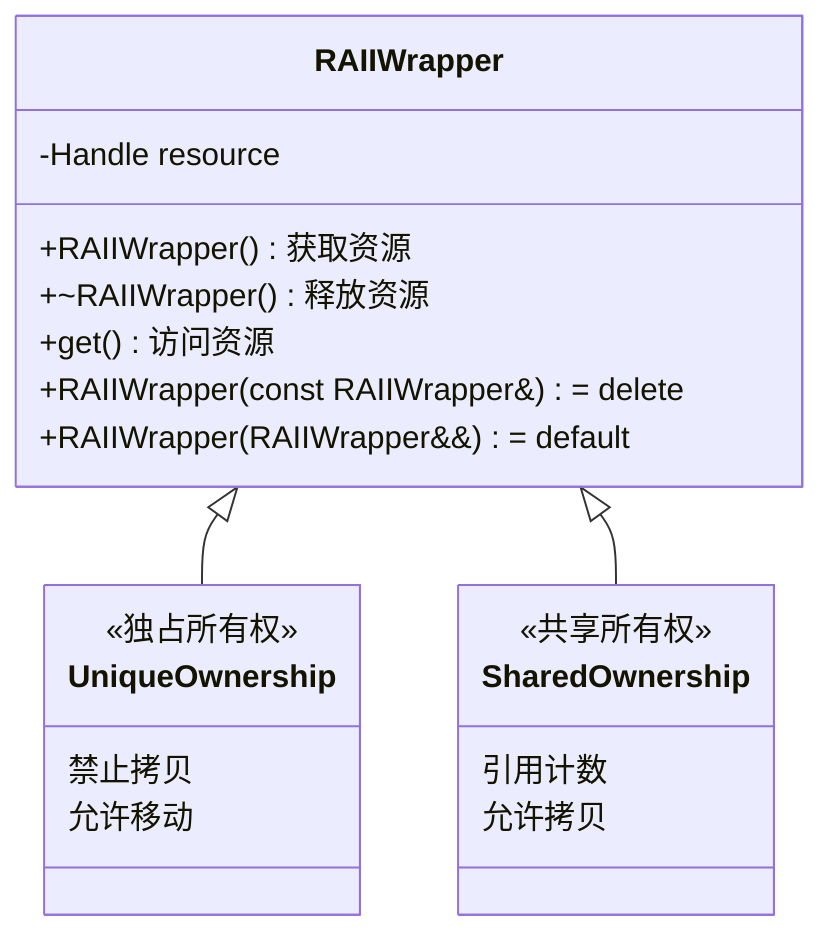

# 1.4 RAII：资源管理即生命周期

> [返回第1章](./ch01-encapsulation.md) | [返回目录](../README.md)

## 1.4.1 实现目标

### 问题描述

在系统编程中，资源管理是一个核心问题。资源可以是：
- **内存**（堆分配的内存块）
- **文件句柄**（`FILE*`、文件描述符）
- **网络套接字**（socket）
- **互斥锁**（mutex）
- **线程**（thread）
- **数据库连接**
- **GPU 资源**

传统 C 风格的代码容易出现资源泄漏：

```c
// ❌ 容易出错的 C 风格代码
void process_file(const char* filename) {
    FILE* f = fopen(filename, "r");
    if (!f) return;

    char* buffer = malloc(1024);
    if (!buffer) {
        fclose(f);  // 容易忘记！
        return;
    }

    if (some_error) {
        free(buffer);  // 又要记得清理
        fclose(f);     // 顺序还不能错！
        return;
    }

    // ... 更多代码 ...

    free(buffer);
    fclose(f);
}
```

这种代码的问题：
- **容易忘记释放**：每个返回路径都要记得清理
- **异常不安全**：如果抛出异常，清理代码不会执行
- **代码重复**：多处重复相同的清理逻辑
- **维护困难**：增加资源时，所有返回路径都要修改

### RAII 的核心思想

**RAII（Resource Acquisition Is Initialization）** = 资源获取即初始化

核心思想：
1. 将资源的**获取**封装在**构造函数**中
2. 将资源的**释放**封装在**析构函数**中
3. 对象的生命周期 = 资源的生命周期

```cpp
// ✅ RAII 风格代码
void process_file(const char* filename) {
    File file(filename);        // 构造时打开文件
    Buffer buffer(1024);        // 构造时分配内存

    if (some_error) {
        return;  // 自动清理：buffer、file 的析构函数会被调用
    }

    // ... 更多代码 ...

    // 离开作用域，自动清理
}
```

### 期望效果

通过本节学习，你将理解：

1. **RAII 的原理**：为什么 C++ 的析构机制能保证资源释放
2. **标准库中的 RAII**：`std::unique_ptr`、`std::lock_guard` 等
3. **自定义 RAII 类**：如何为自己的资源实现 RAII 包装器
4. **RAII 与异常安全**：如何编写异常安全的代码
5. **常见陷阱**：自引用、循环依赖等问题

---

## 1.4.2 核心原理

### RAII 的本质

RAII 不是某种特定的技术，而是**利用 C++ 对象生命周期特性**来管理资源的一种设计模式。



### 关键保证

C++ 语言保证：

| 场景 | 析构函数是否调用 | 说明 |
|-----|----------------|-----|
| 正常离开作用域 | ✅ 是 | 对象生命周期结束 |
| 提前 return | ✅ 是 | 离开作用域前自动析构 |
| 抛出异常 | ✅ 是 | 栈展开（stack unwinding） |
| 使用 `goto` 跳转 | ✅ 是 | 跳转目标在作用域外 |
| 使用 `longjmp` | ❌ 否 | 跳过析构，未定义行为 |

**示例**：

```cpp
{
    Resource r;     // 构造：获取资源

    if (condition) {
        return;     // ← r.~Resource() 被调用
    }

    throw error;    // ← r.~Resource() 被调用
}
// ← r.~Resource() 被调用
```

### RAII 类的基本结构

一个标准的 RAII 类需要满足：

```cpp
class RAIIWrapper {
    Handle handle;  // 资源句柄

public:
    // 1. 构造函数：获取资源
    explicit RAIIWrapper(const char* param) {
        handle = acquire(param);
        if (!handle) {
            throw std::runtime_error("资源获取失败");
        }
    }

    // 2. 析构函数：释放资源
    ~RAIIWrapper() {
        if (handle) {
            release(handle);
        }
    }

    // 3. 禁止拷贝（通常）
    RAIIWrapper(const RAIIWrapper&) = delete;
    RAIIWrapper& operator=(const RAIIWrapper&) = delete;

    // 4. 允许移动（可选）
    RAIIWrapper(RAIIWrapper&& other) noexcept
        : handle(other.handle) {
        other.handle = nullptr;
    }

    // 5. 访问资源的方法
    Handle get() const { return handle; }

    // 6. 其他操作...
};
```

### 资源所有权模型

RAII 可以实现不同的所有权语义：



---

## 1.4.3 代码示例

### 示例1：自定义文件句柄 RAII 包装器

```cpp
#include <iostream>
#include <cstdio>
#include <stdexcept>

class File {
    std::FILE* handle = nullptr;

public:
    // 构造函数：打开文件
    explicit File(const char* filename, const char* mode = "r") {
        handle = std::fopen(filename, mode);
        if (!handle) {
            throw std::runtime_error("无法打开文件");
        }
        std::cout << "文件已打开: " << filename << std::endl;
    }

    // 析构函数：关闭文件
    ~File() {
        if (handle) {
            std::fclose(handle);
            std::cout << "文件已关闭" << std::endl;
        }
    }

    // 禁止拷贝
    File(const File&) = delete;
    File& operator=(const File&) = delete;

    // 允许移动
    File(File&& other) noexcept : handle(other.handle) {
        other.handle = nullptr;
    }

    File& operator=(File&& other) noexcept {
        if (this != &other) {
            if (handle) std::fclose(handle);
            handle = other.handle;
            other.handle = nullptr;
        }
        return *this;
    }

    // 访问底层句柄
    std::FILE* get() const { return handle; }

    // 写入数据
    void write(const char* data) {
        if (handle) {
            std::fputs(data, handle);
        }
    }
};

// 使用示例
void process_data() {
    File file("test.txt", "w");

    file.write("Hello, RAII!\n");

    // 无论这里发生什么，file 都会被正确关闭
    if (true) {
        return;  // 提前返回，文件自动关闭
    }
}

int main() {
    process_data();
    return 0;
}
```

**输出**：
```
文件已打开: test.txt
文件已关闭
```

---

### 示例2：互斥锁 RAII 包装器

```cpp
#include <iostream>
#include <mutex>
#include <thread>

class ScopedLock {
    std::mutex& mtx;
    bool locked = true;

public:
    explicit ScopedLock(std::mutex& m) : mtx(m) {
        mtx.lock();
        std::cout << "锁已获取" << std::endl;
    }

    ~ScopedLock() {
        if (locked) {
            mtx.unlock();
            std::cout << "锁已释放" << std::endl;
        }
    }

    // 禁止拷贝和移动
    ScopedLock(const ScopedLock&) = delete;
    ScopedLock& operator=(const ScopedLock&) = delete;
    ScopedLock(ScopedLock&&) = delete;
    ScopedLock& operator=(ScopedLock&&) = delete;

    // 手动解锁（可选）
    void unlock() {
        if (locked) {
            mtx.unlock();
            locked = false;
        }
    }
};

// 共享资源
int shared_counter = 0;
std::counter_mutex;

void safe_increment() {
    ScopedLock lock(counter_mutex);  // 构造时加锁

    // 临界区：安全地访问共享资源
    ++shared_counter;
    std::cout << "计数器值: " << shared_counter << std::endl;

    // 离开作用域，自动解锁
}

int main() {
    std::thread t1(safe_increment);
    std::thread t2(safe_increment);

    t1.join();
    t2.join();

    return 0;
}
```

**输出**：
```
锁已获取
计数器值: 1
锁已释放
锁已获取
计数器值: 2
锁已释放
```

**注**：C++ 标准库已提供 `std::lock_guard` 和 `std::unique_lock`，实际项目应优先使用。

---

### 示例3：动态数组 RAII 包装器

```cpp
#include <iostream>
#include <algorithm>

class DynamicArray {
    int* data = nullptr;
    size_t size = 0;

public:
    // 构造函数：分配内存
    explicit DynamicArray(size_t n) : size(n) {
        data = new int[n];
        std::cout << "已分配 " << n << " 个 int" << std::endl;
    }

    // 析构函数：释放内存
    ~DynamicArray() {
        delete[] data;
        std::cout << "已释放内存" << std::endl;
    }

    // 禁止拷贝
    DynamicArray(const DynamicArray&) = delete;
    DynamicArray& operator=(const DynamicArray&) = delete;

    // 允许移动
    DynamicArray(DynamicArray&& other) noexcept
        : data(other.data), size(other.size) {
        other.data = nullptr;
        other.size = 0;
    }

    // 访问元素
    int& operator[](size_t index) {
        if (index >= size) throw std::out_of_range("索引越界");
        return data[index];
    }

    const int& operator[](size_t index) const {
        if (index >= size) throw std::out_of_range("索引越界");
        return data[index];
    }

    size_t get_size() const { return size; }
};

// 使用示例
void process_array() {
    DynamicArray arr(5);

    for (size_t i = 0; i < arr.get_size(); ++i) {
        arr[i] = static_cast<int>(i * 10);
    }

    // 发生异常？内存会自动释放！
    if (arr[0] == 0) {
        throw std::runtime_error("模拟异常");
    }
}

int main() {
    try {
        process_array();
    } catch (const std::exception& e) {
        std::cout << "捕获异常: " << e.what() << std::endl;
    }
    return 0;
}
```

**输出**：
```
已分配 5 个 int
已释放内存    ← 即使抛出异常，内存也被正确释放！
捕获异常: 模拟异常
```

---

### 示例4：RAII 配合异常安全的数据库操作

```cpp
#include <iostream>
#include <stdexcept>
#include <string>

// 模拟数据库连接
class DatabaseConnection {
    std::string connection_string;
    bool connected = false;
    bool in_transaction = false;

public:
    explicit DatabaseConnection(const std::string& conn_str)
        : connection_string(conn_str) {
        // 模拟连接数据库
        connected = true;
        std::cout << "已连接到数据库: " << conn_str << std::endl;
    }

    ~DatabaseConnection() {
        if (connected) {
            // 析构时如果有未提交的事务，自动回滚
            if (in_transaction) {
                std::cout << "事务未提交，自动回滚" << std::endl;
            }
            std::cout << "数据库连接已关闭" << std::endl;
        }
    }

    void begin_transaction() {
        if (!in_transaction) {
            std::cout << "开始事务" << std::endl;
            in_transaction = true;
        }
    }

    void commit() {
        if (in_transaction) {
            std::cout << "提交事务" << std::endl;
            in_transaction = false;
        }
    }

    void execute(const std::string& sql) {
        if (!connected) throw std::logic_error("未连接数据库");
        std::cout << "执行: " << sql << std::endl;
    }
};

// 使用示例
void transfer_money(DatabaseConnection& db) {
    db.begin_transaction();

    try {
        db.execute("UPDATE accounts SET balance = balance - 100 WHERE id = 1");
        db.execute("UPDATE accounts SET balance = balance + 100 WHERE id = 2");

        // 模拟：中途发生错误
        if (true) {
            throw std::runtime_error("银行系统故障");
        }

        db.commit();  // 只有正常执行到这里才提交
    }
    catch (...) {
        std::cout << "操作失败，事务将自动回滚" << std::endl;
        throw;  // 重新抛出，db 的析构函数会处理回滚
    }
}

int main() {
    DatabaseConnection db("localhost:5432/mydb");

    try {
        transfer_money(db);
    } catch (const std::exception& e) {
        std::cout << "捕获异常: " << e.what() << std::endl;
    }

    return 0;
}
```

**输出**：
```
已连接到数据库: localhost:5432/mydb
开始事务
执行: UPDATE accounts SET balance = balance - 100 WHERE id = 1
执行: UPDATE accounts SET balance = balance + 100 WHERE id = 2
操作失败，事务将自动回滚
事务未提交，自动回滚    ← 析构函数自动处理！
捕获异常: 银行系统故障
数据库连接已关闭
```

---

### 示例5：标准库中的 RAII 容器

```cpp
#include <iostream>
#include <memory>      // std::unique_ptr, std::shared_ptr
#include <mutex>       // std::lock_guard
#include <fstream>     // std::fstream
#include <vector>

// 标准库已经提供了许多 RAII 类！

void standard_raii_demo() {
    // 1. std::unique_ptr：独占所有权智能指针
    std::cout << "=== std::unique_ptr ===" << std::endl;
    {
        std::unique_ptr<int> ptr(new int(42));
        std::cout << "值: " << *ptr << std::endl;
        // 离开作用域，自动 delete
    }
    std::cout << "unique_ptr 已释放" << std::endl;

    // 2. std::shared_ptr：共享所有权智能指针
    std::cout << "\n=== std::shared_ptr ===" << std::endl;
    {
        auto shared = std::make_shared<int>(100);
        std::cout << "引用计数: " << shared.use_count() << std::endl;

        {
            auto shared2 = shared;  // 引用计数 +1
            std::cout << "引用计数: " << shared.use_count() << std::endl;
        }
        // shared2 离开作用域，引用计数 -1

        std::cout << "引用计数: " << shared.use_count() << std::endl;
    }
    // shared 离开作用域，内存被释放

    // 3. std::lock_guard：自动管理互斥锁
    std::cout << "\n=== std::lock_guard ===" << std::endl;
    {
        std::mutex mtx;
        std::lock_guard<std::mutex> lock(mtx);  // 自动加锁
        // 临界区代码
        std::cout << "锁已持有" << std::endl;
    }
    std::cout << "锁已释放" << std::endl;

    // 4. std::fstream：自动管理文件句柄
    std::cout << "\n=== std::fstream ===" << std::endl;
    {
        std::ofstream file("example.txt");
        file << "Hello, RAII!" << std::endl;
        // 离开作用域，文件自动关闭
    }
    std::cout << "文件已关闭" << std::endl;

    // 5. std::vector：自动管理动态数组
    std::cout << "\n=== std::vector ===" << std::endl;
    {
        std::vector<int> vec = {1, 2, 3, 4, 5};
        std::cout << "大小: " << vec.size() << std::endl;
    }
    std::cout << "vector 内存已释放" << std::endl;
}

int main() {
    standard_raii_demo();
    return 0;
}
```

**输出**：
```
=== std::unique_ptr ===
值: 42
unique_ptr 已释放

=== std::shared_ptr ===
引用计数: 1
引用计数: 2
引用计数: 1

=== std::lock_guard ===
锁已持有
锁已释放

=== std::fstream ===
文件已关闭

=== std::vector ===
大小: 5
vector 内存已释放
```

---

## 1.4.4 深入讲解

### RAII 与异常安全级别

C++ 标准库定义了三种异常安全保证级别，RAII 是实现它们的基础：



| 保证级别 | 含义 | RAII 的作用 |
|---------|-----|-----------|
| **基本保证** | 操作失败时无资源泄漏，对象处于有效但不确定状态 | 析构函数确保资源释放 |
| **强保证** | 操作成功则完全生效，失败则回滚到操作前状态 | RAII 对象管理临时状态 |
| **不抛出保证** | 操作保证不抛出异常 | `noexcept` 标记的析构函数 |

**示例：强异常安全保证**

```cpp
class TransactionalBuffer {
    std::vector<int> original_data;  // 备份原始数据
    std::vector<int>& data;          // 引用目标数据

public:
    explicit TransactionalBuffer(std::vector<int>& target)
        : original_data(target), data(target) {}

    ~TransactionalBuffer() {
        // 如果未提交，恢复原始数据
        if (!committed) {
            data = original_data;
        }
    }

    void modify(const std::function<void(std::vector<int>&)>& func) {
        func(data);  // 修改数据
    }

    void commit() {
        committed = true;
    }

private:
    bool committed = false;
};

// 使用
void update_records(std::vector<int>& records) {
    TransactionalBuffer transaction(records);

    // 执行复杂修改
    records.push_back(42);
    records.erase(records.begin());

    if (validation_failed) {
        return;  // 自动回滚
    }

    transaction.commit();  // 提交更改
}
```

### RAII 的性能考量

**常见误区**：RAII 会有运行时开销

**真相**：
- 析构函数调用是**编译时确定**的，没有运行时查找
- 现代编译器会优化掉简单的析构函数
- RAII 的开销主要是**一次函数调用**，通常可忽略不计

**性能对比**：

```cpp
// 方案1：手动管理（看起来"高效"）
void manual_code() {
    int* p = new int(42);
    // 使用 p
    delete p;  // 容易忘记
}

// 方案2：RAII（实际开销几乎相同）
void raii_code() {
    std::unique_ptr<int> p(new int(42));
    // 使用 p
}  // 自动 delete
```

**编译后的汇编**（现代编译器 `-O2` 优化后）：
- 两者生成的代码几乎完全相同
- `unique_ptr` 的析构函数被**内联**优化
- 零运行时开销

### RAII 与 move 语义

C++11 引入的移动语义使 RAII 更加灵活：

```cpp
class Socket {
    int fd;

public:
    explicit Socket(int descriptor) : fd(descriptor) {}

    ~Socket() {
        if (fd != -1) {
            close(fd);
        }
    }

    // 禁止拷贝：不能复制文件描述符
    Socket(const Socket&) = delete;
    Socket& operator=(const Socket&) = delete;

    // 允许移动：转移所有权
    Socket(Socket&& other) noexcept : fd(other.fd) {
        other.fd = -1;  // 源对象不再拥有资源
    }

    Socket& operator=(Socket&& other) noexcept {
        if (this != &other) {
            if (fd != -1) close(fd);
            fd = other.fd;
            other.fd = -1;
        }
        return *this;
    }
};

// 使用示例
Socket create_server_socket() {
    int fd = socket(AF_INET, SOCK_STREAM, 0);
    // 配置 socket...
    return Socket(fd);  // 移动构造，零拷贝
}

int main() {
    Socket server = create_server_socket();  // 移动语义
    return 0;
}
```

### RAII 在标准库中的应用

标准库大量使用 RAII，了解这些可以帮助你写出更好的代码：

| 类 | 管理的资源 | 释放操作 |
|---|----------|---------|
| `std::unique_ptr<T>` | 单个对象 | `delete` |
| `std::shared_ptr<T>` | 共享对象 | 引用计数为0时 `delete` |
| `std::vector<T>` | 动态数组 | 释放数组内存 |
| `std::string` | 字符数组 | 释放数组内存 |
| `std::fstream` | 文件句柄 | `fclose` |
| `std::mutex` | 互斥锁 | 销毁锁（未持有时） |
| `std::lock_guard<T>` | 锁的所有权 | `unlock` |
| `std::unique_lock<T>` | 锁的所有权 | `unlock` |
| `std::thread` | 线程 | `join` 或 `detach`（需手动） |
| `std::function` | 可调用对象 | 释放存储 |

### 自定义 deleter

`std::unique_ptr` 支持自定义删除器，这让它可以管理任意资源：

```cpp
// 示例1：管理 FILE*
struct FileDeleter {
    void operator()(FILE* f) const {
        if (f) {
            std::fclose(f);
            std::cout << "文件已关闭 (通过自定义 deleter)" << std::endl;
        }
    }
};

using UniqueFile = std::unique_ptr<FILE, FileDeleter>;

UniqueFile open_file(const char* filename) {
    FILE* f = std::fopen(filename, "r");
    if (!f) throw std::runtime_error("无法打开文件");
    return UniqueFile(f);
}

// 示例2：管理 Windows HANDLE
#ifdef _WIN32
struct HandleDeleter {
    void operator()(HANDLE h) const {
        if (h != INVALID_HANDLE_VALUE) {
            CloseHandle(h);
        }
    }
};

using UniqueHandle = std::unique_ptr<void, HandleDeleter>;
#endif

// 示例3：管理 C 风格数组
struct ArrayDeleter {
    void operator()(int* p) const {
        delete[] p;
    }
};

using UniqueIntArray = std::unique_ptr<int[], ArrayDeleter>;

UniqueIntArray make_array(size_t n) {
    return UniqueIntArray(new int[n]);
}
```

### RAII 与作用域

有时我们希望更精细地控制资源的生命周期，可以使用额外的作用域：

```cpp
void complex_operation() {
    // 资源1：整个函数都需要
    std::unique_ptr<Resource> r1 = acquire_resource1();

    {
        // 资源2：只在某个代码块中需要
        std::lock_guard<std::mutex> lock(global_mutex);

        // 临界区代码
        process_critical_section();

        // lock 在这里自动释放
    }

    // 资源3：另一个独立的代码块
    {
        File file("temp.txt");
        file.write("临时数据");
        // file 在这里自动关闭
    }

    // 继续使用 r1...
}
```

---

## 1.4.5 常见陷阱与最佳实践

### 陷阱1：自引用导致循环依赖

```cpp
// ❌ 问题代码
class Node {
    std::shared_ptr<Node> next;
public:
    Node() { std::cout << "Node 创建" << std::endl; }
    ~Node() { std::cout << "Node 销毁" << std::endl; }
};

void cycle_demo() {
    auto n1 = std::make_shared<Node>();
    auto n2 = std::make_shared<Node>();

    n1->next = n2;  // n1 引用 n2
    n2->next = n1;  // n2 引用 n1 → 循环引用！

    // 离开作用域，n1 和 n2 都不会被销毁！
}
```

**解决方案：使用 `std::weak_ptr` 打破循环**

```cpp
// ✅ 正确代码
class Node {
    std::shared_ptr<Node> next;
    std::weak_ptr<Node> prev;  // 弱引用，不增加引用计数
public:
    Node() { std::cout << "Node 创建" << std::endl; }
    ~Node() { std::cout << "Node 销毁" << std::endl; }
};
```

### 陷阱2：this 指针逃逸

```cpp
// ❌ 危险代码
class Holder {
    std::shared_ptr<Resource> resource;
public:
    Holder() : resource(std::make_shared<Resource>()) {}

    // 返回内部资源的 shared_ptr
    std::shared_ptr<Resource> get_resource() {
        return resource;  // 似乎没问题...
    }
};

// 但如果这样做：
class Dangerous {
    std::shared_ptr<Resource> resource;
public:
    Dangerous() {
        resource = std::make_shared<Resource>();
    }

    // 返回指向自己的 shared_ptr！
    std::shared_ptr<Resource> get_self_reference() {
        return resource;  // 如果 resource 持有 Dangerous 的 shared_ptr...
    }
};

// 更安全的做法：使用 std::enable_shared_from_this
class Safe : public std::enable_shared_from_this<Safe> {
public:
    std::shared_ptr<Safe> get_shared() {
        return shared_from_this();  // 正确返回指向自己的 shared_ptr
    }
};
```

### 陷阱3：在构造函数中注册对象

```cpp
// ❌ 问题代码
class RegisteredObject {
    static std::vector<RegisteredObject*> registry;
public:
    RegisteredObject() {
        registry.push_back(this);  // 危险！
    }
    // 如果构造函数后续步骤抛出异常，this 指针会悬空
};

// ✅ 更安全的做法：分离注册
class RegisteredObject {
    static std::vector<std::shared_ptr<RegisteredObject>> registry;
public:
    RegisteredObject() = default;

    static std::shared_ptr<RegisteredObject> create() {
        auto obj = std::shared_ptr<RegisteredObject>(new RegisteredObject());
        obj->register_self();
        return obj;
    }

private:
    void register_self() {
        registry.push_back(shared_from_this());
    }
};
```

### 最佳实践总结

1. **总是优先使用标准库的 RAII 类**
   ```cpp
   std::unique_ptr<int> p(new int(42));  // ✅
   int* p = new int(42);                  // ❌
   ```

2. **构造函数应该完成全部初始化，失败则抛出异常**
   ```cpp
   class Connection {
       Socket sock;
   public:
       Connection(const char* addr) : sock(connect(addr)) {}  // 失败会抛异常
   };
   ```

3. **析构函数不应该抛出异常**
   ```cpp
   ~SafeClass() noexcept {  // 标记为 noexcept
       try {
           cleanup();
       } catch (...) {
           // 记录错误，但不重新抛出
       }
   }
   ```

4. **使用移动语义转移资源所有权**
   ```cpp
   return std::move(resource);  // 显式移动
   ```

5. **为自定义资源使用自定义 deleter**
   ```cpp
   using UniqueHandle = std::unique_ptr<HANDLE, HandleDeleter>;
   ```

---

## 1.4.6 总结对比

### 手动管理 vs RAII

| 方面 | 手动管理 | RAII |
|-----|---------|------|
| **资源释放** | 需要手动编写清理代码 | 自动释放 |
| **异常安全** | 容易泄漏资源 | 异常安全 |
| **代码简洁性** | 大量重复的清理代码 | 代码简洁 |
| **可维护性** | 增加资源需修改多处 | 集中管理 |
| **性能开销** | 无（但容易出错） | 几乎为零 |
| **适用场景** | 简单程序 | 生产级代码 |

### RAII 的设计模式



### 标准 RAII 类速查表

| 场景 | 推荐类 | 头文件 |
|-----|-------|-------|
| 单一对象所有权 | `std::unique_ptr<T>` | `<memory>` |
| 共享对象所有权 | `std::shared_ptr<T>` | `<memory>` |
| 数组所有权 | `std::vector<T>` 或 `std::unique_ptr<T[]>` | `<vector>` / `<memory>` |
| 文件操作 | `std::fstream` / `std::ofstream` / `std::ifstream` | `<fstream>` |
| 互斥锁 | `std::lock_guard<T>` / `std::unique_lock<T>` | `<mutex>` |
| 动态数组 | `std::vector<T>` | `<vector>` |
| 字符串 | `std::string` | `<string>` |

---

## 1.4.7 完整示例：实现一个线程安全的日志系统

```cpp
#include <iostream>
#include <fstream>
#include <string>
#include <mutex>
#include <memory>
#include <thread>
#include <vector>
#include <chrono>

// RAII：管理文件句柄
class LogFile {
    std::ofstream file;
    std::mutex mtx;  // 每个日志文件有自己的互斥锁

public:
    explicit LogFile(const std::string& filename) {
        file.open(filename, std::ios::app);
        if (!file.is_open()) {
            throw std::runtime_error("无法打开日志文件");
        }
    }

    ~LogFile() {
        if (file.is_open()) {
            file.close();
        }
    }

    // 禁止拷贝
    LogFile(const LogFile&) = delete;
    LogFile& operator=(const LogFile&) = delete;

    // 线程安全的写入
    void write(const std::string& message) {
        std::lock_guard<std::mutex> lock(mtx);
        file << message << std::endl;
        file.flush();  // 确保立即写入
    }
};

// RAII：自动添加时间戳的日志记录器
class ScopedTimer {
    std::string name;
    std::shared_ptr<LogFile> logger;
    std::chrono::steady_clock::time_point start;

public:
    ScopedTimer(const std::string& n, std::shared_ptr<LogFile> log)
        : name(n), logger(log), start(std::chrono::steady_clock::now()) {}

    ~ScopedTimer() {
        auto end = std::chrono::steady_clock::now();
        auto duration = std::chrono::duration_cast<std::chrono::milliseconds>(end - start);
        logger->write("[" + name + "] 耗时: " + std::to_string(duration.count()) + "ms");
    }
};

// 使用示例
void worker_thread(int id, std::shared_ptr<LogFile> logger) {
    {
        ScopedTimer timer("线程" + std::to_string(id), logger);
        // 模拟工作
        std::this_thread::sleep_for(std::chrono::milliseconds(100 + id * 50));
    }
    // timer 析构，自动记录耗时
}

int main() {
    auto logger = std::make_shared<LogFile>("app.log");

    logger->write("=== 程序启动 ===");

    {
        std::vector<std::thread> threads;

        for (int i = 0; i < 3; ++i) {
            threads.emplace_back(worker_thread, i, logger);
        }

        for (auto& t : threads) {
            t.join();
        }
    }

    logger->write("=== 程序结束 ===");

    return 0;
}
```

**输出 (app.log)**：
```
=== 程序启动 ===
[线程0] 耗时: 100ms
[线程1] 耗时: 150ms
[线程2] 耗时: 200ms
=== 程序结束 ===
```

**这个例子展示了 RAII 的多个方面**：
- `LogFile`：RAII 管理文件句柄
- `std::mutex` + `std::lock_guard`：RAII 管理锁
- `ScopedTimer`：RAII 管理计时
- `std::shared_ptr`：共享所有权，多个线程共享同一个日志文件

---

## 1.4.8 思考题

1. 以下代码有什么问题？如何修复？
   ```cpp
   void process() {
       int* p = new int(42);
       std::shared_ptr<int> sp1(p);
       std::shared_ptr<int> sp2(p);
       // 离开作用域会发生什么？
   }
   ```

2. 为什么 `std::mutex` 的析构函数不会自动调用 `unlock()`？这对 RAII 设计有什么启示？

3. 设计一个 RAII 类来管理数据库连接，要求：
   - 构造时建立连接
   - 支持移动语义
   - 析构时如果事务未提交则自动回滚
   - 如果连接失败则抛出异常

4. `std::unique_ptr` 和 `std::shared_ptr` 在性能上有什么差异？在什么场景下应该选择哪一个？

5. 如何实现一个 RAII 类来测量代码块的执行时间，并在析构时输出结果？

---

*上一节：[1.3 构造函数与析构函数的调用时机](./ch01-03-ctor-dtor.md)*
*下一节：[1.5 智能指针的现代封装实践](./ch01-05-smart-ptr.md)*
