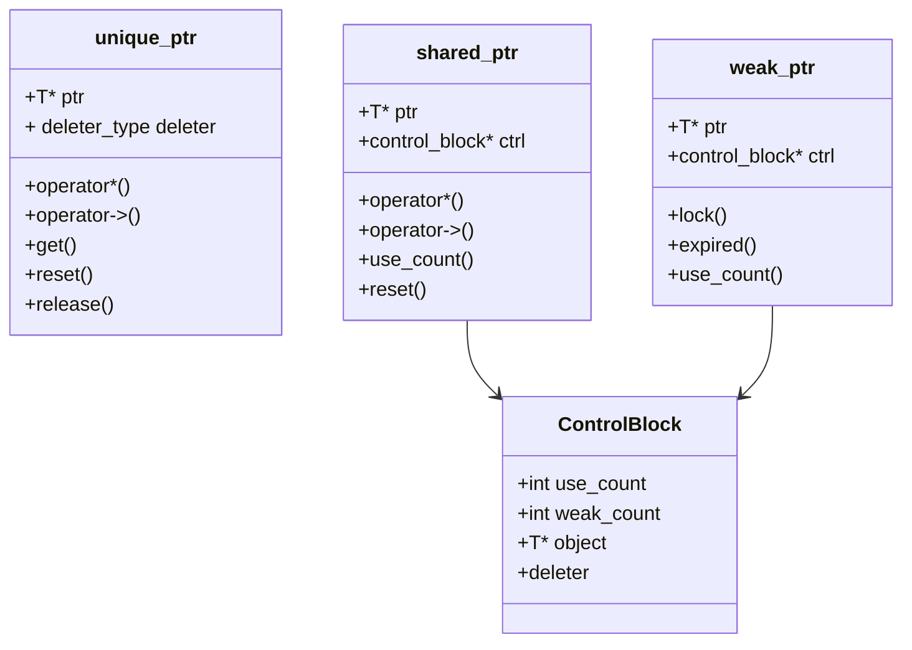
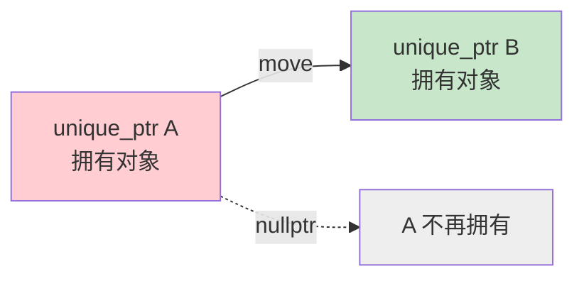
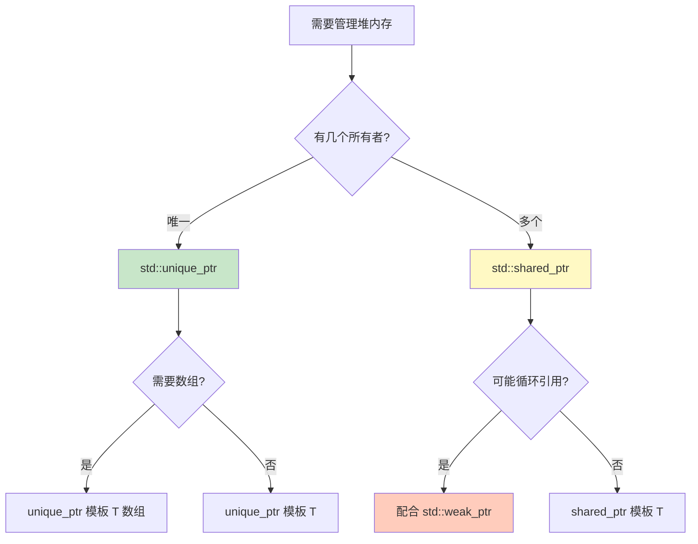

# 1.5 智能指针的现代封装实践

> [返回第1章](./ch01-encapsulation.md) | [返回目录](../README.md)

## 1.5.1 实现目标

### 问题描述

在 C++11 之前，手动管理堆内存是 C++ 程序员的噩梦：

```cpp
// ❌ 传统 C++03 代码
void process_data() {
    Widget* pw = new Widget();
    std::vector<Widget*> vec;

    vec.push_back(new Widget());
    vec.push_back(new Widget());

    // 如果这里抛出异常，所有 new 的内存都会泄漏！
    if (some_error) {
        delete pw;           // 容易忘记
        for (auto p : vec)   // 清理代码很繁琐
            delete p;
        return;
    }

    // ... 更多代码 ...

    // 必须记得清理所有内存
    delete pw;
    for (auto p : vec)
        delete p;
}
```

**手动内存管理的问题**：
- **忘记 delete** → 内存泄漏
- **异常发生** → 清理代码不会执行 → 内存泄漏
- **重复 delete** → 未定义行为/程序崩溃
- **悬空指针** → 使用已释放的内存
- **代码复杂**：大量精力花在内存管理上

### 智能指针的解决方案

C++11 引入了**智能指针（Smart Pointers）**，它们是 RAII 在内存管理上的经典应用：

```cpp
// ✅ 现代 C++ 代码
void process_data() {
    std::unique_ptr<Widget> pw = std::make_unique<Widget>();

    std::vector<std::unique_ptr<Widget>> vec;
    vec.push_back(std::make_unique<Widget>());
    vec.push_back(std::make_unique<Widget>());

    // 即使抛出异常，所有内存也会自动释放
    if (some_error) {
        return;  // 自动清理，无需手动 delete
    }

    // ... 更多代码 ...

    // 离开作用域，自动清理所有内存
}
```

### 三种智能指针对比

| 类型 | 所有权模型 | 性能 | 适用场景 |
|-----|-----------|-----|---------|
| `std::unique_ptr` | 独占所有权 | 最优 | 单一所有者，大多数场景 |
| `std::shared_ptr` | 共享所有权 | 较低（引用计数） | 多个所有者 |
| `std::weak_ptr` | 弱引用（不拥有） | 低 | 打破 `shared_ptr` 循环引用 |

### 期望效果

通过本节学习，你将理解：

1. **智能指针的原理**：引用计数、删除器、移动语义
2. **三种智能指针的使用场景**：何时用哪个
3. **性能考量**：智能指针的开销分析
4. **常见陷阱**：循环引用、`this` 指针等问题
5. **最佳实践**：现代 C++ 内存管理规范

---

## 1.5.2 核心原理

### 智能指针的本质

智能指针是一个**类模板**，它重载了 `*` 和 `->` 运算符，使其行为像普通指针，但同时利用 RAII 自动管理内存：

```cpp
template<typename T>
class SmartPtr {
    T* ptr;  // 原始指针

public:
    // 构造时获取资源
    explicit SmartPtr(T* p = nullptr) : ptr(p) {}

    // 析构时释放资源
    ~SmartPtr() {
        delete ptr;
    }

    // 解引用
    T& operator*() const { return *ptr; }

    // 箭头运算符
    T* operator->() const { return ptr; }

    // 禁止拷贝（unique_ptr 的行为）
    SmartPtr(const SmartPtr&) = delete;
    SmartPtr& operator=(const SmartPtr&) = delete;

    // 允许移动
    SmartPtr(SmartPtr&& other) noexcept : ptr(other.ptr) {
        other.ptr = nullptr;
    }
};
```

### 引用计数原理

`std::shared_ptr` 使用引用计数来跟踪有多少个 `shared_ptr` 指向同一个对象：

```mermaid
graph TB
    subgraph 引用计数 = 2
        SP1[shared_ptr 1]
        SP2[shared_ptr 2]
    end

    subgraph 控制块
        COUNT[引用计数: 2]
        OBJ[托管对象]
        DEL[删除器]
    end

    SP1 --> COUNT
    SP2 --> COUNT
    COUNT --> OBJ
    COUNT --> DEL

    style SP1 fill:#c8e6c9
    style SP2 fill:#c8e6c9
    style COUNT fill:#fff9c4
```

**工作流程**：
1. 创建 `shared_ptr` 时，引用计数初始化为 1
2. 每次**拷贝** `shared_ptr`，引用计数 **+1**
3. 每次**销毁** `shared_ptr`，引用计数 **-1**
4. 当引用计数变为 **0**，托管对象被删除

### 控制块（Control Block）

`shared_ptr` 的控制块包含：

```cpp
struct ControlBlock {
    int use_count;      // 强引用计数（shared_ptr 数量）
    int weak_count;     // 弱引用计数（weak_ptr 数量）
    void (*deleter)(void*);  // 删除器
    void (*allocator)(...);  // 分配器（可选）
    T* managed_object;  // 托管对象
};
```

**注意**：多个 `shared_ptr` 必须共享同一个控制块，即使它们分别创建：

```cpp
// ❌ 错误：两个独立的控制块，会导致 double free！
auto sp1 = std::shared_ptr<int>(new int(42));
auto sp2 = std::shared_ptr<int>(sp1.get());  // 危险！

// ✅ 正确：共享同一个控制块
auto sp1 = std::shared_ptr<int>(new int(42));
auto sp2 = sp1;  // 拷贝，共享控制块

// ✅ 最佳实践：使用 std::make_shared
auto sp1 = std::make_shared<int>(42);
auto sp2 = sp1;
```

### 三种智能指针的内存布局



---

## 1.5.3 代码示例

### 示例1：std::unique_ptr 的基本使用

```cpp
#include <iostream>
#include <memory>
#include <vector>

class Widget {
    int id;
public:
    explicit Widget(int i) : id(i) {
        std::cout << "Widget " << id << " 构造\n";
    }

    ~Widget() {
        std::cout << "Widget " << id << " 析构\n";
    }

    void doSomething() {
        std::cout << "Widget " << id << " 正在工作\n";
    }
};

void unique_ptr_demo() {
    std::cout << "=== 创建 unique_ptr ===\n";

    // 方式1：使用 new（不推荐）
    std::unique_ptr<Widget> p1(new Widget(1));

    // 方式2：使用 make_unique（推荐，C++14）
    auto p2 = std::make_unique<Widget>(2);

    std::cout << "\n=== 访问对象 ===\n";
    p1->doSomething();       // 使用 -> 运算符
    (*p2).doSomething();     // 使用 * 运算符

    std::cout << "\n=== 所有权转移 ===\n";
    std::unique_ptr<Widget> p3 = std::move(p1);  // p1 变为空
    // p1->doSomething();  // 错误！p1 已经是 nullptr

    if (p1) {
        std::cout << "p1 非空\n";
    } else {
        std::cout << "p1 为空（所有权已转移）\n";
    }

    p3->doSomething();

    std::cout << "\n=== 容器中使用 ===\n";
    std::vector<std::unique_ptr<Widget>> vec;
    vec.push_back(std::make_unique<Widget>(3));
    vec.push_back(std::make_unique<Widget>(4));

    // 移动语义：将 p2 转移到容器中
    vec.push_back(std::move(p2));

    std::cout << "\n=== 离开作用域 ===\n";
    // 所有 unique_ptr 自动析构
}

int main() {
    unique_ptr_demo();
    return 0;
}
```

**输出**：
```
=== 创建 unique_ptr ===
Widget 1 构造
Widget 2 构造

=== 访问对象 ===
Widget 1 正在工作
Widget 2 正在工作

=== 所有权转移 ===
p1 为空（所有权已转移）
Widget 1 正在工作

=== 容器中使用 ===
Widget 3 构造
Widget 4 构造

=== 离开作用域 ===
Widget 4 析构
Widget 3 析构
Widget 2 析构
Widget 1 析构
```

---

### 示例2：std::shared_ptr 的引用计数

```cpp
#include <iostream>
#include <memory>
#include <vector>

class Widget {
    int id;
public:
    explicit Widget(int i) : id(i) {
        std::cout << "Widget " << id << " 构造\n";
    }

    ~Widget() {
        std::cout << "Widget " << id << " 析构 (use_count=" << id << ")\n";
    }

    void doSomething() {
        std::cout << "Widget " << id << " 正在工作\n";
    }
};

void shared_ptr_demo() {
    std::cout << "=== 创建 shared_ptr ===\n";
    auto p1 = std::make_shared<Widget>(1);
    std::cout << "p1.use_count() = " << p1.use_count() << "\n";

    {
        std::cout << "\n=== 拷贝 shared_ptr ===\n";
        std::shared_ptr<Widget> p2 = p1;  // 拷贝，引用计数 +1
        std::cout << "p1.use_count() = " << p1.use_count() << "\n";
        std::cout << "p2.use_count() = " << p2.use_count() << "\n";

        std::cout << "\n=== 添加到容器 ===\n";
        std::vector<std::shared_ptr<Widget>> vec;
        vec.push_back(p1);  // 引用计数 +1
        std::cout << "p1.use_count() = " << p1.use_count() << "\n";

        std::cout << "\n=== 离开内部作用域 ===\n";
    }
    // p2 和 vec 中的元素被销毁，引用计数减少
    std::cout << "p1.use_count() = " << p1.use_count() << "\n";

    std::cout << "\n=== reset 操作 ===\n";
    p1.reset();  // 释放所有权
    std::cout << "p1.use_count() = " << p1.use_count() << "\n";
    std::cout << "p1 == nullptr: " << (p1 == nullptr) << "\n";

    std::cout << "\n=== 离开作用域 ===\n";
}

int main() {
    shared_ptr_demo();
    return 0;
}
```

**输出**：
```
=== 创建 shared_ptr ===
Widget 1 构造
p1.use_count() = 1

=== 拷贝 shared_ptr ===
p1.use_count() = 2
p2.use_count() = 2

=== 添加到容器 ===
p1.use_count() = 3

=== 离开内部作用域 ===
p1.use_count() = 1

=== reset 操作 ===
p1.use_count() = 0
p1 == nullptr: 1

=== 离开作用域 ===
Widget 1 析构 (use_count=1)
```

---

### 示例3：std::weak_ptr 打破循环引用

```cpp
#include <iostream>
#include <memory>

// 前向声明
class Child;

class Parent {
    std::string name;
    std::shared_ptr<Child> child;  // 父亲拥有孩子

public:
    explicit Parent(const std::string& n) : name(n) {
        std::cout << name << " (Parent) 构造\n";
    }

    ~Parent() {
        std::cout << name << " (Parent) 析构\n";
    }

    void setChild(std::shared_ptr<Child> c) {
        child = c;
    }
};

class Child {
    std::string name;
    // ❌ 如果用 shared_ptr，会导致循环引用！
    // std::shared_ptr<Parent> parent;
    // ✅ 使用 weak_ptr 打破循环
    std::weak_ptr<Parent> parent;

public:
    explicit Child(const std::string& n) : name(n) {
        std::cout << name << " (Child) 构造\n";
    }

    ~Child() {
        std::cout << name << " (Child) 析构\n";
    }

    void setParent(std::shared_ptr<Parent> p) {
        parent = p;
    }

    void doSomething() {
        // 使用 lock() 获取 shared_ptr，如果对象已销毁则返回空
        if (auto p = parent.lock()) {
            std::cout << name << " 的父亲是 " << p->name << "\n";
        } else {
            std::cout << name << " 的父亲已经不在了\n";
        }
    }
};

void circular_ref_demo() {
    std::cout << "=== 创建父节点 ===\n";
    auto parent = std::make_shared<Parent>("父亲");

    std::cout << "\n=== 创建子节点 ===\n";
    auto child = std::make_shared<Child>("儿子");

    std::cout << "\n=== 建立双向关系 ===\n";
    parent->setChild(child);   // Parent 强引用 Child
    child->setParent(parent);  // Child 弱引用 Parent

    std::cout << "Parent.use_count() = " << parent.use_count() << "\n";
    std::cout << "Child.use_count() = " << child.use_count() << "\n";

    child->doSomething();

    std::cout << "\n=== 离开作用域 ===\n";
    // 由于 Child 使用 weak_ptr，不会产生循环引用
    // 所有对象都能正确析构
}

int main() {
    circular_ref_demo();
    return 0;
}
```

**输出**：
```
=== 创建父节点 ===
父亲 (Parent) 构造

=== 创建子节点 ===
儿子 (Child) 构造

=== 建立双向关系 ===
Parent.use_count() = 1
Child.use_count() = 2
儿子 的父亲是 父亲

=== 离开作用域 ===
儿子 (Child) 析构
父亲 (Parent) 析构
```

---

### 示例4：自定义删除器

```cpp
#include <iostream>
#include <memory>
#include <fstream>

// 示例1：管理 FILE* 的删除器
struct FileDeleter {
    void operator()(FILE* f) const {
        if (f) {
            std::fclose(f);
            std::cout << "文件已关闭 (FILE*)\n";
        }
    }
};

using UniqueFile = std::unique_ptr<FILE, FileDeleter>;

// 示例2：管理数组
struct ArrayDeleter {
    void operator()(int* p) const {
        delete[] p;
        std::cout << "数组已删除\n";
    }
};

using UniqueIntArray = std::unique_ptr<int, ArrayDeleter>;

// 示例3：带日志的删除器
template<typename T>
struct LoggedDeleter {
    void operator()(T* p) const {
        std::cout << "即将删除对象\n";
        delete p;
        std::cout << "对象已删除\n";
    }
};

void custom_deleter_demo() {
    std::cout << "=== FILE* 删除器 ===\n";
    {
        UniqueFile file(std::fopen("test.txt", "w"));
        if (file) {
            std::fprintf(file.get(), "Hello, World!\n");
            std::cout << "文件已写入\n";
        }
    }
    // file 离开作用域，自动调用 fclose

    std::cout << "\n=== 数组删除器 ===\n";
    {
        UniqueIntArray arr(new int[5]);
        arr.get()[0] = 42;
        std::cout << "arr[0] = " << arr.get()[0] << "\n";
    }
    // arr 离开作用域，自动调用 delete[]

    std::cout << "\n=== 带日志的删除器 ===\n";
    {
        std::unique_ptr<int, LoggedDeleter<int>> p(new int(100));
        std::cout << "*p = " << *p << "\n";
    }
}

// 示例4：使用 lambda 作为删除器
void lambda_deleter_demo() {
    std::cout << "\n=== Lambda 删除器 ===\n";

    auto deleter = [](void* p) {
        std::cout << "Lambda 删除器被调用\n";
        // 假设这是某种特殊的释放操作
        ::operator delete(p);
    };

    std::unique_ptr<void, decltype(deleter)> p(
        ::operator new(1024), deleter
    );

    std::cout << "分配了 1024 字节内存\n";
}
// p 离开作用域，lambda 删除器被调用

int main() {
    custom_deleter_demo();
    lambda_deleter_demo();
    return 0;
}
```

**输出**：
```
=== FILE* 删除器 ===
文件已写入
文件已关闭 (FILE*)

=== 数组删除器 ===
arr[0] = 42
数组已删除

=== 带日志的删除器 ===
*p = 100
即将删除对象
对象已删除

=== Lambda 删除器 ===
分配了 1024 字节内存
Lambda 删除器被调用
```

---

### 示例5：unique_ptr 管理动态数组

```cpp
#include <iostream>
#include <memory>
#include <algorithm>

void unique_ptr_array_demo() {
    std::cout << "=== unique_ptr 管理数组 ===\n";

    // 方式1：使用 unique_ptr<T[]>（推荐）
    {
        std::unique_ptr<int[]> arr(new int[5]);
        for (int i = 0; i < 5; ++i) {
            arr[i] = i * 10;  // 使用 operator[] 访问
        }

        std::cout << "数组内容: ";
        for (int i = 0; i < 5; ++i) {
            std::cout << arr[i] << " ";
        }
        std::cout << "\n";
    }
    // 自动调用 delete[]

    // 方式2：使用 unique_ptr<vector>（更灵活）
    {
        auto vec = std::make_unique<std::vector<int>>(std::initializer_list<int>{1, 2, 3, 4, 5});
        std::cout << "Vector 大小: " << vec->size() << "\n";

        for (int v : *vec) {
            std::cout << v << " ";
        }
        std::cout << "\n";
    }

    // 方式3：使用 std::make_unique for arrays (C++20)
    #if __cplusplus >= 202002L
    {
        auto arr = std::make_unique<int[]>(5);
        arr[0] = 100;
        std::cout << "C++20 make_unique array: " << arr[0] << "\n";
    }
    #endif

    std::cout << "\n=== 离开作用域 ===\n";
}

int main() {
    unique_ptr_array_demo();
    return 0;
}
```

**输出**：
```
=== unique_ptr 管理数组 ===
数组内容: 0 10 20 30 40
Vector 大小: 5
1 2 3 4 5

=== 离开作用域 ===
```

---

## 1.5.4 深入讲解

### 性能对比分析

智能指针的开销对比：

| 操作 | unique_ptr | shared_ptr | 原始指针 |
|-----|-----------|-----------|---------|
| **大小** | 1 个指针 | 2 个指针 | 1 个指针 |
| **构造开销** | 极低 | 低（分配控制块） | 无 |
| **拷贝开销** | 不允许 | 中等（原子递增引用计数） | 极低 |
| **析构开销** | 极低 | 中等（原子递减+检查） | 无 |
| **间接访问** | 1 次解引用 | 1 次解引用 | 1 次解引用 |

**内存布局**：

```
unique_ptr<T>:     shared_ptr<T>:
+----------------+  +----------------+
| T* ptr         |  | T* ptr         |
| (deleter, 空基)|  | CtrlBlock* ctrl |
+----------------+  +----------------+
大小: 8 字节       大小: 16 字节 (64位)
                  (引用计数是原子操作)
```

**make_shared 的优势**：

```cpp
// 方式1：两次分配
auto sp1 = std::shared_ptr<int>(new int(42));
// 分配1：new int
// 分配2：控制块

// 方式2：一次分配（推荐）
auto sp2 = std::make_shared<int>(42);
// 分配1：int + 控制块在连续内存中
```

`make_shared` 的优势：
- **减少内存分配次数**：从 2 次降到 1 次
- **更好的缓存局部性**：对象和控制块相邻
- **异常安全**：不会出现内存泄漏

### 移动语义与所有权转移

```cpp
// unique_ptr 的所有权转移
std::unique_ptr<Widget> p1 = std::make_unique<Widget>();
std::unique_ptr<Widget> p2 = std::move(p1);  // p1 变为 nullptr

// p2.release();  // 释放所有权，不删除对象
// Widget* raw = p2.get();  // 获取原始指针，不释放所有权
```

**所有权转移图**：



### enable_shared_from_this

当类成员函数需要返回指向自己的 `shared_ptr` 时，不能直接这样做：

```cpp
// ❌ 错误代码
class Node {
public:
    std::shared_ptr<Node> getShared() {
        return std::shared_ptr<Node>(this);  // 危险！创建新的控制块
    }
};

void demo() {
    auto node = std::make_shared<Node>();
    auto sp1 = node->getShared();  // 创建第二个控制块！
    // 离开作用域时，两个控制块都会尝试删除 this → double free！
}
```

**正确做法：继承 `enable_shared_from_this`**

```cpp
// ✅ 正确代码
class Node : public std::enable_shared_from_this<Node> {
public:
    std::shared_ptr<Node> getShared() {
        return shared_from_this();  // 返回已有的 shared_ptr
    }
};

void demo() {
    auto node = std::make_shared<Node>();
    auto sp1 = node->getShared();  // 共享同一个控制块
    std::cout << "node.use_count() = " << node.use_count() << "\n";  // 输出: 2
}
```

**原理**：`make_shared` 创建对象时，会在控制块中存储一个 `weak_ptr` 指向自己。`shared_from_this()` 就从这个 `weak_ptr` 创建 `shared_ptr`。

### 智能指针与多态

智能指针完全支持多态：

```cpp
class Base {
public:
    virtual void foo() { std::cout << "Base::foo\n"; }
    virtual ~Base() = default;
};

class Derived : public Base {
public:
    void foo() override { std::cout << "Derived::foo\n"; }
};

void polymorphism_demo() {
    std::unique_ptr<Base> p = std::make_unique<Derived>();
    p->foo();  // 输出: Derived::foo

    // 向下转换
    if (auto dp = dynamic_cast<Derived*>(p.get())) {
        dp->foo();
    }
}
```

### 智能指针与标准容器

```cpp
// vector 中存储智能指针
std::vector<std::unique_ptr<Widget>> vec;
vec.push_back(std::make_unique<Widget>());
vec.emplace_back(new Widget(1));  // 更高效

// map 中存储智能指针
std::map<std::string, std::shared_ptr<Resource>> resources;
resources["db"] = std::make_shared<DatabaseResource>();

// 迭代时
for (const auto& p : vec) {
    p->doSomething();
}
```

### 智能指针作为函数参数

```cpp
// 按值传递（转移所有权）
void takeOwnership(std::unique_ptr<Widget> p) {
    p->doSomething();
}  // p 被销毁

// 按引用传递（不转移所有权）
void useWidget(const std::unique_ptr<Widget>& p) {
    p->doSomething();
}

// 按原始指针传递（最灵活，但不表达所有权）
void useWidgetRaw(Widget* p) {
    if (p) p->doSomething();
}

// 按 shared_ptr 传递（共享所有权）
void shareWidget(std::shared_ptr<Widget> p) {
    p->doSomething();
}  // 引用计数减 1

// 推荐方式：传递 shared_ptr 的常量引用（不增加引用计数）
void shareWidgetRef(const std::shared_ptr<Widget>& p) {
    p->doSomething();
}  // 引用计数不变
```

**选择建议**：
- **函数不需要保存所有权**：传递原始指针或引用
- **函数需要独占所有权**：按值传递 `unique_ptr`
- **函数需要共享所有权**：按值传递 `shared_ptr`
- **函数只是使用对象**：传递 `const shared_ptr&`

---

## 1.5.5 常见陷阱与最佳实践

### 陷阱1：同一裸指针创建多个 shared_ptr

```cpp
// ❌ 危险代码！
int* raw = new int(42);
std::shared_ptr<int> sp1(raw);
std::shared_ptr<int> sp2(raw);  // 第二个控制块！

// 离开作用域时，两个 shared_ptr 都会尝试 delete raw
// → double free → 未定义行为
```

**解决方案**：
```cpp
// ✅ 正确做法
auto sp1 = std::make_shared<int>(42);
std::shared_ptr<int> sp2 = sp1;  // 拷贝，共享控制块
```

### 陷阱2：循环引用导致内存泄漏

```cpp
// ❌ 循环引用
class A {
    std::shared_ptr<B> b_ptr;
};

class B {
    std::shared_ptr<A> a_ptr;  // 导致循环引用
};

// ✅ 使用 weak_ptr 打破循环
class B {
    std::weak_ptr<A> a_ptr;  // 弱引用
};
```

### 陷阱3：在构造函数中使用 shared_from_this

```cpp
// ❌ 错误
class Node : public std::enable_shared_from_this<Node> {
public:
    Node() {
        auto p = shared_from_this();  // 错误！对象还未被 shared_ptr 管理
    }
};

// ✅ 正确
class Node : public std::enable_shared_from_this<Node> {
public:
    Node() = default;

    void init() {
        auto p = shared_from_this();  // 正确
    }
};

auto node = std::make_shared<Node>();
node->init();  // 调用初始化函数
```

### 陷阱4：unique_ptr 误用

```cpp
// ❌ 错误：试图拷贝 unique_ptr
std::unique_ptr<int> p1 = std::make_unique<int>(42);
std::unique_ptr<int> p2 = p1;  // 编译错误！

// ✅ 正确：使用移动
std::unique_ptr<int> p2 = std::move(p1);

// ❌ 错误：在容器中直接 push_back
std::vector<std::unique_ptr<int>> vec;
auto p = std::make_unique<int>(42);
vec.push_back(p);  // 编译错误！试图拷贝

// ✅ 正确：使用移动
vec.push_back(std::move(p));
// 或
vec.emplace_back(new int(42));
```

### 最佳实践总结

1. **优先使用 `std::make_unique` 和 `std::make_shared`**
   ```cpp
   auto p1 = std::make_unique<Widget>();      // ✅
   auto p2 = std::make_shared<Widget>();      // ✅
   std::unique_ptr<Widget> p3(new Widget());  // ❌ 不推荐
   ```

2. **默认使用 `unique_ptr`，需要共享时才用 `shared_ptr`**
   ```cpp
   // 单一所有者 → unique_ptr
   std::unique_ptr<Database> db = std::make_unique<Database>();

   // 多个所有者 → shared_ptr
   std::shared_ptr<Config> config = std::make_shared<Config>();
   ```

3. **函数参数优先使用原始指针或引用**
   ```cpp
   void foo(Widget* p);           // ✅ 只使用对象
   void foo(const Widget& w);     // ✅ 只使用对象
   void foo(std::unique_ptr<Widget> p);  // 只在转移所有权时
   ```

4. **避免循环引用，使用 `weak_ptr` 打破**
   ```cpp
   class Child {
       std::weak_ptr<Parent> parent;  // ✅ 打破循环
   };
   ```

5. **不要从 `this` 创建 `shared_ptr`**
   ```cpp
   // ❌ return std::shared_ptr<Widget>(this);
   // ✅ 继承 enable_shared_from_this，使用 shared_from_this()
   ```

---

## 1.5.6 总结对比

### 智能指针选择决策树



### 三种智能指针对比

| 特性 | unique_ptr | shared_ptr | weak_ptr |
|-----|-----------|-----------|----------|
| **所有权** | 独占 | 共享 | 无所有权 |
| **大小** | 1 指针 | 2 指针 | 2 指针 |
| **拷贝** | 禁止 | 允许 | 允许 |
| **移动** | 允许 | 允许 | 允许 |
| **引用计数** | 无 | 有（原子操作） | 无 |
| **性能** | 最优 | 中等 | 中等 |
| **典型用途** | 单一所有者 | 共享资源 | 打破循环引用 |

### 现代 C++ 内存管理黄金法则

```
1. 永远不要手动使用 new/delete
2. 优先使用栈对象
3. 需要堆内存时使用智能指针
4. 默认使用 unique_ptr
5. 需要共享时使用 shared_ptr
6. 避免循环引用，使用 weak_ptr
7. 优先使用 make_unique/make_shared
```

---

## 1.5.7 思考题

1. `std::make_shared` 相比直接构造 `shared_ptr` 有什么优势？有什么潜在问题？

2. 以下代码的输出是什么？为什么？
   ```cpp
   std::shared_ptr<int> sp1 = std::make_shared<int>(42);
   std::weak_ptr<int> wp = sp1;
   std::cout << wp.use_count() << "\n";  // ?

   sp1.reset();
   std::cout << wp.use_count() << "\n";  // ?
   std::cout << wp.expired() << "\n";    // ?
   ```

3. 如何实现一个线程安全的引用计数？`std::shared_ptr` 是如何做到的？

4. 为什么 `std::unique_ptr` 的删除器是模板参数，而 `std::shared_ptr` 的删除器是运行时存储的？

5. 设计一个智能指针管理类，要求：
   - 管理固定大小的内存池
   - 当内存池满时自动扩容
   - 提供 `reset()` 和 `release()` 方法

---

*上一节：[1.4 RAII：资源管理即生命周期](./ch01-04-raii.md)*
*下一章：[第2章 继承 —— 代码复用与层次设计](../ch02/ch02-inheritance.md)*
