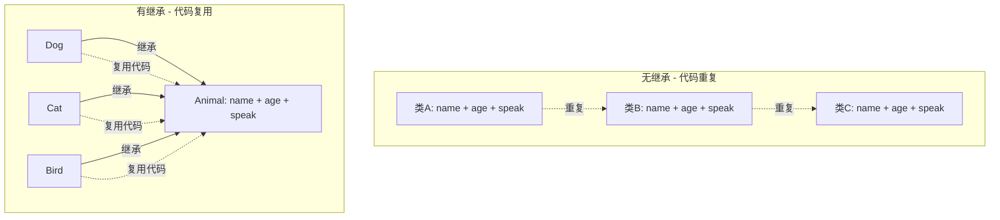
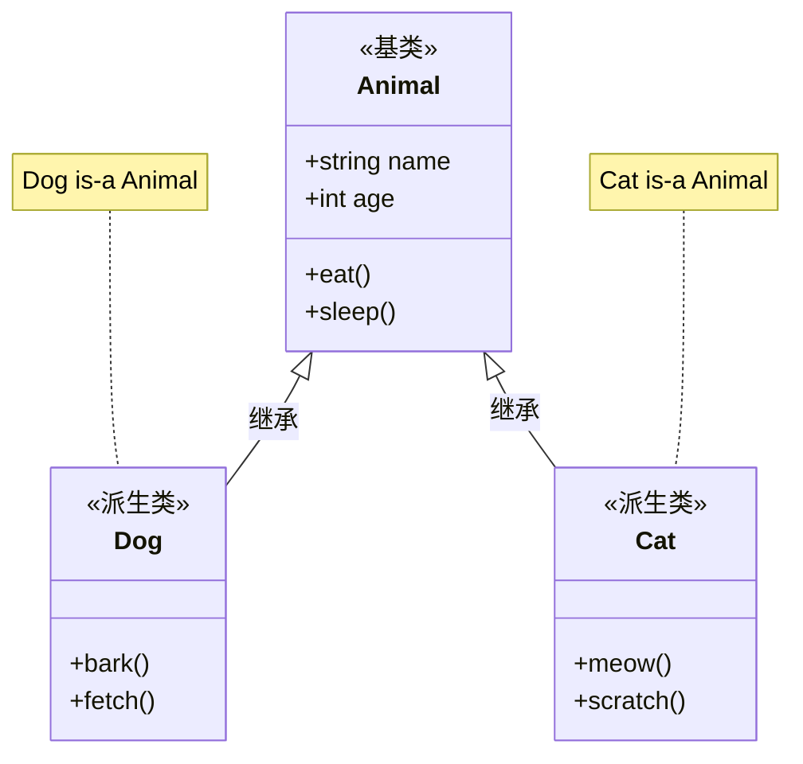
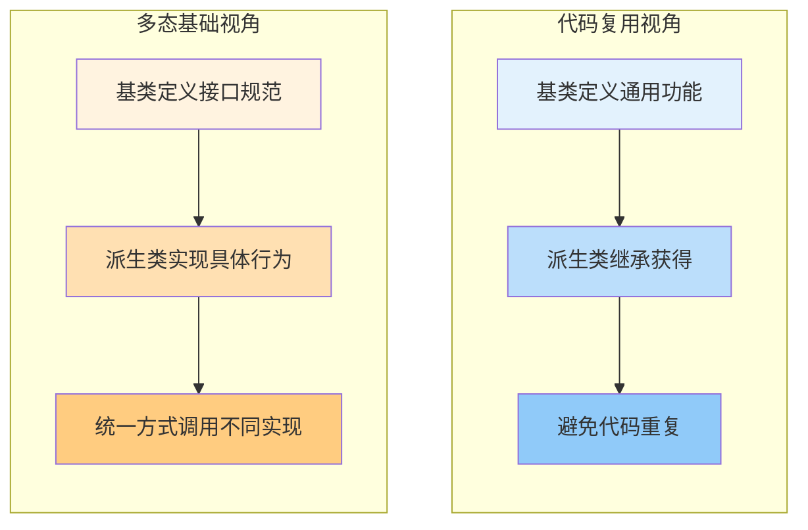
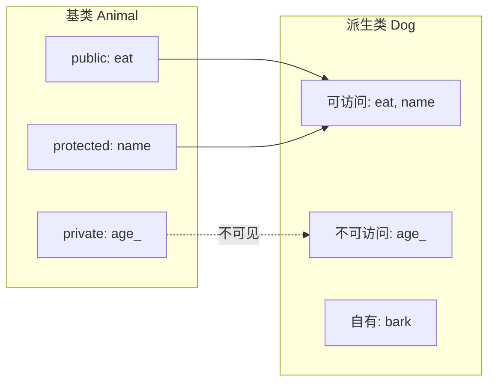
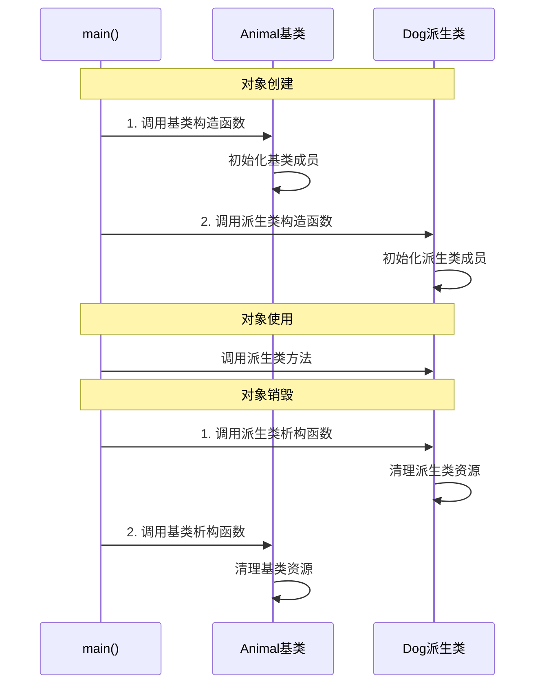
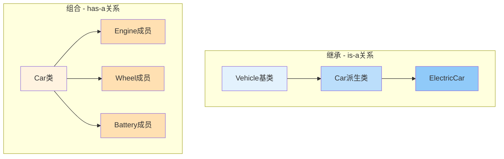

# 2.1 继承的目标：代码复用与多态基础

> [返回第2章](./ch02-inheritance.md) | [返回目录](../README.md)

## 2.1.1 实现目标

### 问题描述

在软件开发中，我们经常遇到多个类具有共同特征和行为的情况。如果没有继承机制，会产生以下问题：

| 问题 | 描述 | 后果 |
|------|------|------|
| **代码重复** | 相同的代码在多个类中重复出现 | 维护成本高，修改需要同步多处 |
| **类型关系模糊** | 类之间的关系无法明确表达 | 难以建立清晰的领域模型 |
| **无法统一处理** | 相似的类型无法用统一方式操作 | 需要针对每个类型单独处理 |
| **扩展困难** | 添加新功能需要修改现有代码 | 违反开闭原则(OCP) |

### 期望效果

通过继承实现以下目标：



1. **代码复用**：派生类自动获得基类的成员，避免重复编写
2. **建立层次**：表达"is-a"关系，构建清晰的类型层次
3. **统一接口**：通过基类指针/引用统一处理不同派生类对象
4. **易于扩展**：添加新类型无需修改现有代码

---

## 2.1.2 核心原理

### 什么是继承

**继承（Inheritance）**是一种允许一个类（派生类/子类）获得另一个类（基类/父类）成员的机制。它描述了"**is-a**"（是一种）关系。



### 继承的两种视角



### 继承中的成员访问



**访问规则**：
| 基类成员访问级别 | 在基类内 | 在派生类内 | 在外部 |
|----------------|---------|-----------|--------|
| `public` | 可访问 | 可访问 | 可访问 |
| `protected` | 可访问 | 可访问 | 不可访问 |
| `private` | 可访问 | 不可访问 | 不可访问 |

---

## 2.1.3 代码示例

### 示例1：未使用继承（代码重复）

```cpp
#include <iostream>
#include <string>

// 重复的代码 - 每个动物类都定义相同的成员
class Dog {
private:
    std::string name_;
    int age_;

public:
    Dog(const std::string& name, int age) : name_(name), age_(age) {}

    std::string getName() const { return name_; }
    int getAge() const { return age_; }

    void eat() {
        std::cout << name_ << " is eating.\n";
    }

    void sleep() {
        std::cout << name_ << " is sleeping.\n";
    }

    void bark() {
        std::cout << name_ << " says: Woof!\n";
    }
};

class Cat {
private:
    std::string name_;  // 重复！
    int age_;           // 重复！

public:
    Cat(const std::string& name, int age) : name_(name), age_(age) {}  // 重复！

    std::string getName() const { return name_; }  // 重复！
    int getAge() const { return age_; }           // 重复！

    void eat() {  // 重复！
        std::cout << name_ << " is eating.\n";
    }

    void sleep() {  // 重复！
        std::cout << name_ << " is sleeping.\n";
    }

    void meow() {
        std::cout << name_ << " says: Meow!\n";
    }
};

class Bird {
private:
    std::string name_;  // 重复！
    int age_;           // 重复！

public:
    Bird(const std::string& name, int age) : name_(name), age_(age) {}  // 重复！

    std::string getName() const { return name_; }  // 重复！
    int getAge() const { return age_; }           // 重复！

    void eat() {  // 重复！
        std::cout << name_ << " is eating.\n";
    }

    void sleep() {  // 重复！
        std::cout << name_ << " is sleeping.\n";
    }

    void chirp() {
        std::cout << name_ << " says: Tweet!\n";
    }
};
```

### 示例2：使用继承（代码复用）

```cpp
#include <iostream>
#include <string>

// 基类：定义所有动物共有的属性和行为
class Animal {
protected:  // 使用protected使派生类可以直接访问
    std::string name_;
    int age_;

public:
    Animal(const std::string& name, int age) : name_(name), age_(age) {}

    // 获取名字和年龄的接口
    std::string getName() const { return name_; }
    int getAge() const { return age_; }

    // 所有动物的共同行为
    void eat() {
        std::cout << name_ << " is eating.\n";
    }

    void sleep() {
        std::cout << name_ << " is sleeping.\n";
    }

    // 可以被子类覆盖的虚函数（多态基础，下一章详讲）
    virtual void makeSound() {
        std::cout << name_ << " makes a sound.\n";
    }

    // 虚析构函数（重要！防止内存泄漏）
    virtual ~Animal() = default;
};

// 派生类：Dog，只需添加自己特有的行为
class Dog : public Animal {
public:
    Dog(const std::string& name, int age) : Animal(name, age) {}

    void bark() {
        std::cout << name_ << " says: Woof!\n";
    }

    // 重写基类的makeSound
    void makeSound() override {
        bark();
    }
};

// 派生类：Cat，只需添加自己特有的行为
class Cat : public Animal {
public:
    Cat(const std::string& name, int age) : Animal(name, age) {}

    void meow() {
        std::cout << name_ << " says: Meow!\n";
    }

    void makeSound() override {
        meow();
    }
};

// 派生类：Bird，只需添加自己特有的行为
class Bird : public Animal {
public:
    Bird(const std::string& name, int age) : Animal(name, age) {}

    void chirp() {
        std::cout << name_ << " says: Tweet!\n";
    }

    void makeSound() override {
        chirp();
    }
};

int main() {
    Dog dog("Buddy", 3);
    Cat cat("Whiskers", 2);
    Bird bird("Tweety", 1);

    // 继承自基类的方法可以直接使用
    dog.eat();    // 输出: Buddy is eating.
    cat.sleep();  // 输出: Whiskers is sleeping.

    // 各自特有的方法
    dog.bark();   // 输出: Buddy says: Woof!
    cat.meow();   // 输出: Whiskers says: Meow!
    bird.chirp(); // 输出: Tweety says: Tweet!

    return 0;
}
```

### 示例3：继承与多态基础

```cpp
#include <iostream>
#include <string>
#include <vector>
#include <memory>

class Animal {
protected:
    std::string name_;

public:
    Animal(const std::string& name) : name_(name) {}
    virtual ~Animal() = default;

    // 虚函数：允许派生类重写
    virtual void makeSound() const {
        std::cout << name_ << " makes a sound.\n";
    }

    // 纯虚函数：要求派生类必须实现
    virtual std::string getSpecies() const = 0;
};

class Dog : public Animal {
public:
    Dog(const std::string& name) : Animal(name) {}

    void makeSound() const override {
        std::cout << name_ << " says: Woof!\n";
    }

    std::string getSpecies() const override {
        return "Dog";
    }
};

class Cat : public Animal {
public:
    Cat(const std::string& name) : Animal(name) {}

    void makeSound() const override {
        std::cout << name_ << " says: Meow!\n";
    }

    std::string getSpecies() const override {
        return "Cat";
    }
};

// 统一处理函数：可以接受任何派生类
void animalAction(const Animal& animal) {
    std::cout << "This is a " << animal.getSpecies() << ".\n";
    animal.makeSound();  // 多态调用：根据实际对象类型调用对应函数
}

int main() {
    Dog dog("Buddy");
    Cat cat("Whiskers");

    // 统一处理不同类型
    animalAction(dog);  // 输出: This is a Dog. Buddy says: Woof!
    animalAction(cat);  // 输出: This is a Cat. Whiskers says: Meow!

    // 使用容器存储基类指针
    std::vector<std::unique_ptr<Animal>> zoo;
    zoo.push_back(std::make_unique<Dog>("Max"));
    zoo.push_back(std::make_unique<Cat>("Mittens"));
    zoo.push_back(std::make_unique<Dog>("Rocky"));

    // 统一遍历处理
    std::cout << "\n--- Zoo Tour ---\n";
    for (const auto& animal : zoo) {
        animal->makeSound();
    }

    return 0;
}
```

---

## 2.1.4 深入讲解

### 继承的两大价值

#### 1. 代码复用（实现继承）

继承最直接的好处是避免代码重复：

```cpp
// 基类定义通用功能
class Vehicle {
protected:
    double speed_;
    double fuel_;

public:
    void accelerate(double amount) {
        speed_ += amount;
        fuel_ -= amount * 0.1;  // 消耗燃料
    }

    void brake(double amount) {
        speed_ -= amount;
        if (speed_ < 0) speed_ = 0;
    }

    double getSpeed() const { return speed_; }
    double getFuel() const { return fuel_; }
};

// 派生类自动获得所有功能
class Car : public Vehicle {
public:
    void honk() {
        std::cout << "Beep beep!\n";
    }
    // accelerate, brake, getSpeed, getFuel 自动可用
};

class Motorcycle : public Vehicle {
public:
    void wheelie() {
        if (speed_ > 30) {
            std::cout << "Doing a wheelie!\n";
        }
    }
    // accelerate, brake, getSpeed, getFuel 自动可用
};
```

#### 2. 接口统一（接口继承）

继承为多态提供基础，允许统一处理不同类型：

```cpp
class Shape {
public:
    // 纯虚函数：定义接口规范
    virtual double area() const = 0;
    virtual double perimeter() const = 0;
    virtual ~Shape() = default;
};

class Rectangle : public Shape {
    double width_, height_;
public:
    Rectangle(double w, double h) : width_(w), height_(h) {}
    double area() const override { return width_ * height_; }
    double perimeter() const override { return 2 * (width_ + height_); }
};

class Circle : public Shape {
    double radius_;
public:
    Circle(double r) : radius_(r) {}
    double area() const override { return 3.14159 * radius_ * radius_; }
    double perimeter() const override { return 2 * 3.14159 * radius_; }
};

// 统一处理函数
double totalArea(const std::vector<std::unique_ptr<Shape>>& shapes) {
    double sum = 0;
    for (const auto& shape : shapes) {
        sum += shape->area();  // 多态调用
    }
    return sum;
}
```

### 构造函数与析构函数的调用顺序



```cpp
#include <iostream>

class Base {
public:
    Base() {
        std::cout << "Base constructor\n";
    }
    ~Base() {
        std::cout << "Base destructor\n";
    }
};

class Derived : public Base {
public:
    Derived() {
        std::cout << "Derived constructor\n";
    }
    ~Derived() {
        std::cout << "Derived destructor\n";
    }
};

int main() {
    {  // 作用域
        Derived d;
    }  // d在这里销毁
}
```

**输出**：
```
Base constructor
Derived constructor
Derived destructor
Base destructor
```

### is-a 关系的正确理解

继承表达的是"is-a"关系，判断是否应该使用继承的一个简单方法是："B is a A"这个句子是否合理。

| ✅ 正确的继承关系 | ❌ 错误的继承关系 |
|-----------------|-----------------|
| Dog is an Animal | Dog is a Tail |
| Circle is a Shape | Circle is a Point |
| Car is a Vehicle | Car is an Engine |

**反例**：

```cpp
// ❌ 错误：不是is-a关系
class Engine {
public:
    void start() { /* ... */ }
    void stop() { /* ... */ }
};

// Car has an Engine，不是 Car is an Engine
class Car : public Engine {  // 错误的设计！
    // ...
};

// ✅ 正确：使用组合
class Car {
private:
    Engine engine_;  // Car has an Engine
public:
    void start() { engine_.start(); }
    void stop() { engine_.stop(); }
};
```

---

## 2.1.5 常见陷阱与最佳实践

### 常见陷阱

#### 陷阱1：在构造/析构函数中调用虚函数

```cpp
#include <iostream>
#include <string>

class Base {
public:
    Base() {
        init();  // 调用虚函数
    }

    virtual void init() {
        std::cout << "Base::init\n";
    }

    virtual ~Base() = default;
};

class Derived : public Base {
    std::string data_;
public:
    Derived() : data_("important") {
        // 此时Base构造函数已经执行完毕
    }

    void init() override {
        std::cout << "Derived::init, data=" << data_ << "\n";
    }
};

int main() {
    Derived d;
    // 输出: Base::init
    // 不会输出 "Derived::init"！
}
```

**原因**：在基类构造函数执行时，派生类部分还未初始化，此时调用虚函数只会调用基类版本。

**解决方案**：避免在构造函数中调用虚函数，或者使用非虚的init函数由派生类显式调用。

#### 陷阱2：继承破坏封装

```cpp
#include <vector>

class Base {
protected:
    std::vector<int> data_;  // protected让派生类可以直接访问

public:
    void add(int value) {
        data_.push_back(value);
    }
};

class Derived : public Base {
public:
    void modify(int index, int value) {
        if (index >= 0 && index < data_.size()) {
            data_[index] = value;  // 直接操作基类的内部数据
        }
    }
    // 问题：如果Base改变了data_的实现，Derived也需要修改
};
```

**更好的做法**：通过基类的public接口操作，而不是直接访问protected成员。

#### 陷阱3：过度继承

```cpp
// ❌ 过深的继承层次
class Animal { };
class Mammal : public Animal { };
class Dog : public Mammal { };
class GoldenRetriever : public Dog { };
class PetGoldenRetriever : public GoldenRetriever { };
```

继承层次过深会导致：
- 代码难以理解
- 编译时间增加
- 运行时性能下降（虚函数调用链）
- 难以维护

**建议**：继承层次一般不超过3层。

#### 陷阱4：误用继承表达has-a关系

```cpp
// ❌ 错误：Car has an Engine，不是 Car is an Engine
class Engine {
public:
    void start() { }
    void stop() { }
};

class Car : public Engine {  // 错误的设计！
    // ...
};

// ✅ 正确：使用组合
class Car {
private:
    Engine engine_;  // Car has an Engine
public:
    void start() { engine_.start(); }
    void stop() { engine_.stop(); }
};
```

---

### 最佳实践

#### 1. 所有成员变量默认为 private，优先使用 public 继承

```cpp
// ✅ 推荐：public继承用于is-a关系
class Animal { };

class Dog : public Animal {  // Dog is an Animal
    // 外部可以将Dog*当作Animal*使用
};

// protected/private继承很少使用，通常组合是更好的选择
```

#### 2. 基类应该有虚析构函数

```cpp
// ❌ 危险：没有虚析构函数
class Base {
public:
    ~Base() { std::cout << "Base dtor\n"; }
};

class Derived : public Base {
public:
    ~Derived() { std::cout << "Derived dtor\n"; }
};

Base* ptr = new Derived();
delete ptr;  // 未定义行为！Derived析构函数可能不会被调用

// ✅ 正确：声明虚析构函数
class Base {
public:
    virtual ~Base() { std::cout << "Base dtor\n"; }
};

// 现在delete ptr会正确调用：Derived析构函数 → Base析构函数
```

#### 3. 明确使用 `override` 关键字（C++11及以上）

```cpp
class Base {
public:
    virtual void func() {}
    virtual void process() {}
};

class Derived : public Base {
public:
    // ✅ 明确表示要重写基类函数
    void func() override {}

    // ✅ 编译器会检查是否真的重写了虚函数
    // void fumc() override {}  // 编译错误：没有名为fumc的虚函数
    // void func() const override {}  // 编译错误：没有const版本的func
};
```

#### 4. 提供语义明确的接口，避免简单的get/set

```cpp
// ❌ 不好的接口：只有通用的get/set
class Account {
public:
    void setBalance(double b);  // 语义不清晰
    double getBalance() const;
};

// ✅ 好的接口：语义清晰
class Account {
public:
    void deposit(double amount);   // 存款
    bool withdraw(double amount);  // 取款，返回是否成功
    double getBalance() const;     // 查询余额
};
```

---

## 2.1.6 继承与组合的对比

继承和组合都是代码复用的方式，但适用场景不同：



| 特性 | 继承 | 组合 |
|------|------|------|
| 关系类型 | is-a（是一种） | has-a（有一个） |
| 访问权限 | 可访问基类的protected成员 | 只能访问public接口 |
| 耦合程度 | 强耦合（白盒复用） | 弱耦合（黑盒复用） |
| 编译时依赖 | 依赖基类定义 | 依赖成员类型定义 |
| 多态支持 | 支持（虚函数） | 不直接支持 |
| 灵活性 | 较低（编译时确定） | 较高（可运行时替换） |

**判断标准**：
- 如果两个类是"is-a"关系，使用继承
- 如果两个类是"has-a"关系，使用组合

---

## 2.1.8 思考题

1. 为什么说"继承是一种强耦合关系"？
   > 提示：考虑基类变化对派生类的影响

2. 以下代码的输出是什么？为什么？
   ```cpp
   class Base {
   public:
       virtual void func() { std::cout << "Base"; }
       Base() { func(); }
   };
   class Derived : public Base {
   public:
       void func() override { std::cout << "Derived"; }
   };
   int main() {
       Derived d;
   }
   ```

3. 什么时候应该使用继承，什么时候应该使用组合？

4. 为什么基类的析构函数应该是虚函数？

---

*下一节：[2.2 单继承与多继承的内存布局](./ch02-02-memory-layout.md)*
