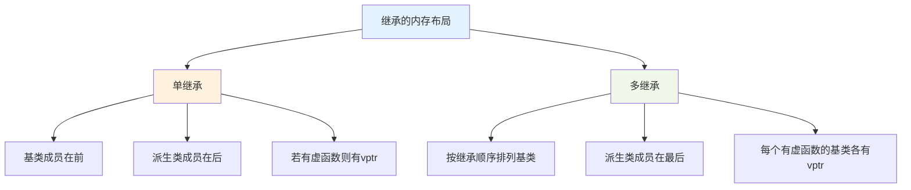
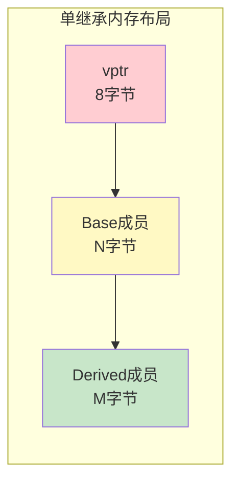
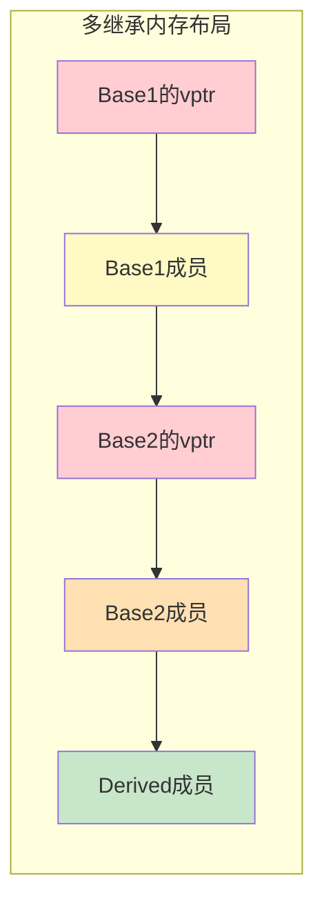
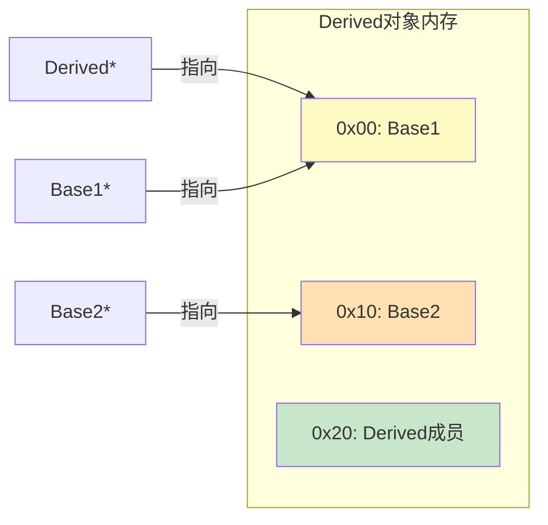
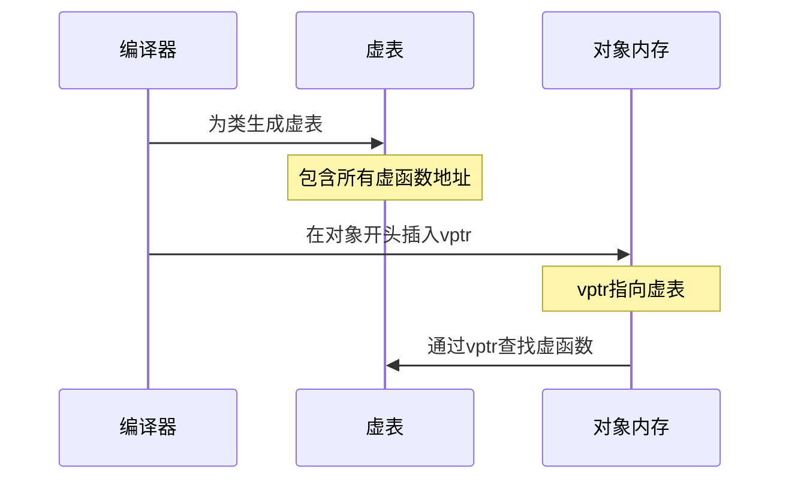
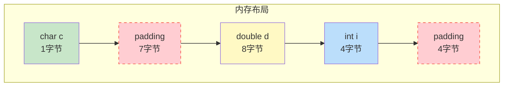
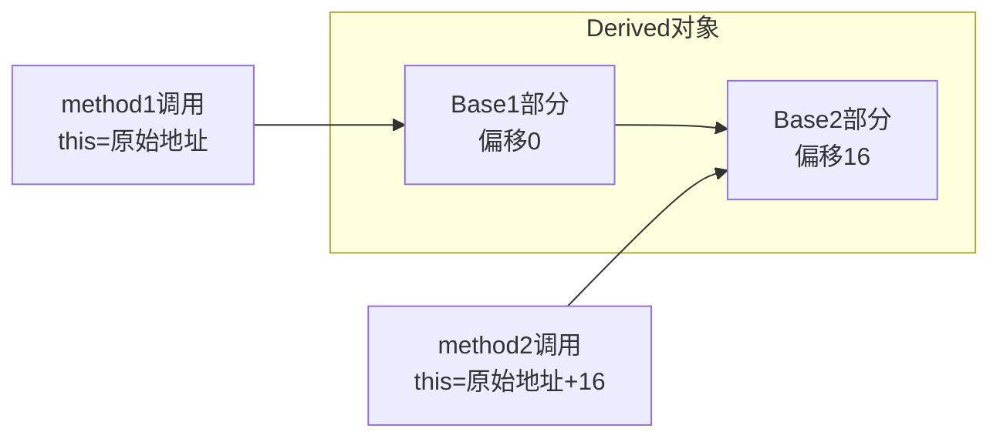

# 2.2 单继承与多继承的内存布局

> [返回第2章](./ch02-inheritance.md) | [返回目录](../README.md)

## 2.2.1 实现目标

### 问题描述

很多C++学习者对继承对象的内存布局缺乏直观理解，这会导致：

| 问题 | 描述 | 后果 |
|------|------|------|
| **内存浪费** | 不了解对象的实际大小和布局 | 无法优化内存使用 |
| **指针转换错误** | 不理解多继承时指针需要调整 | 类型转换产生错误的内存地址 |
| **虚函数开销不明** | 不了解vptr在内存中的位置 | 无法评估虚函数调用的性能影响 |
| **内存对齐困惑** | 不理解编译器如何对齐成员 | 对sizeof结果感到意外 |

### 期望效果

通过本节学习，你将理解：



1. **单继承布局**：派生类对象包含基类子对象和派生类成员
2. **多继承布局**：按继承顺序拼接多个基类子对象
3. **指针调整**：多继承类型转换时指针可能需要偏移
4. **虚表开销**：每个包含虚函数的类都有一个vptr

---

## 2.2.2 核心原理

### 单继承的内存布局

在单继承中，派生类对象的内存布局是**拼接式**的：



**布局规则**：
1. 如果有虚函数，对象起始位置放置vptr（虚表指针）
2. 基类的成员按声明顺序排列
3. 派生类新增成员按声明顺序追加在后面

### 多继承的内存布局

多继承的内存布局是**按继承顺序拼接**多个基类：



**布局规则**：
1. 按继承声明顺序排列各个基类子对象
2. 每个有虚函数的基类都有自己的vptr
3. 派生类成员排在所有基类之后

### 指针转换的内存调整



当从 `Derived*` 转换为 `Base2*` 时，指针需要向后偏移。

---

## 2.2.3 代码示例

### 示例1：单继承的内存布局

```cpp
#include <iostream>
#include <cstdint>

class Base {
public:
    int baseData1;
    long baseData2;

    Base() : baseData1(1), baseData2(2) {
        std::cout << "Base constructed\n";
    }

    virtual void func() {
        std::cout << "Base::func\n";
    }
};

class Derived : public Base {
public:
    int derivedData1;
    char derivedData2;

    Derived() : derivedData1(3), derivedData2('X') {
        std::cout << "Derived constructed\n";
    }

    void func() override {
        std::cout << "Derived::func\n";
    }
};

void printMemoryLayout(const void* obj, size_t size) {
    const uint8_t* bytes = static_cast<const uint8_t*>(obj);

    std::cout << "Memory dump (hex):\n";
    for (size_t i = 0; i < size; i += 8) {
        std::cout << "  offset 0x" << std::hex << i << ": ";
        for (size_t j = 0; j < 8 && i + j < size; ++j) {
            printf("%02x ", bytes[i + j]);
        }
        std::cout << "\n";
    }
    std::cout << std::dec;
}

int main() {
    std::cout << "=== Single Inheritance Memory Layout ===\n\n";

    std::cout << "sizeof(Base) = " << sizeof(Base) << "\n";
    std::cout << "sizeof(Derived) = " << sizeof(Derived) << "\n\n";

    Derived d;
    d.baseData1 = 0x11111111;
    d.baseData2 = 0x2222222222222222;
    d.derivedData1 = 0x33333333;
    d.derivedData2 = 'X';

    std::cout << "Derived object memory layout:\n";
    printMemoryLayout(&d, sizeof(Derived));

    std::cout << "\nField offsets:\n";
    std::cout << "  vptr*:       offset = " << (char*)&d - (char*)&d << " (address: " << &d << ")\n";
    std::cout << "  baseData1:   offset = " << (char*)&d.baseData1 - (char*)&d << "\n";
    std::cout << "  baseData2:   offset = " << (char*)&d.baseData2 - (char*)&d << "\n";
    std::cout << "  derivedData1: offset = " << (char*)&d.derivedData1 - (char*)&d << "\n";
    std::cout << "  derivedData2: offset = " << (char*)&d.derivedData2 - (char*)&d << "\n";

    // 验证vptr的存在
    using VPtrType = void*;
    VPtrType vptr = *(VPtrType*)&d;
    std::cout << "\n  vptr value = 0x" << std::hex << vptr << std::dec << "\n";

    return 0;
}
```

**可能的输出**（64位系统）：
```
=== Single Inheritance Memory Layout ===

sizeof(Base) = 24
sizeof(Derived) = 32

Derived constructed

Derived object memory layout:
Memory dump (hex):
  offset 0x00: 00 00 00 00 00 00 00 00   # vptr (8字节)
  offset 0x08: 11 11 11 11 00 00 00 00   # baseData1 (4字节 + 4字节padding)
  offset 0x10: 22 22 22 22 22 22 22 22   # baseData2 (8字节)
  offset 0x18: 33 33 33 33 58 00 00 00   # derivedData1 (4字节) + derivedData2 (1字节) + padding

Field offsets:
  vptr*:       offset = 0 (address: 0x7ffd12345600)
  baseData1:   offset = 8
  baseData2:   offset = 16
  derivedData1: offset = 24
  derivedData2: offset = 28
  vptr value = 0x556677889900
```

### 示例2：多继承的内存布局

```cpp
#include <iostream>
#include <cstdint>

class Base1 {
public:
    int base1Data;
    virtual void func1() { std::cout << "Base1::func1\n"; }
};

class Base2 {
public:
    int base2Data;
    virtual void func2() { std::cout << "Base2::func2\n"; }
};

class Derived : public Base1, public Base2 {
public:
    int derivedData;

    Derived() : base1Data(1), base2Data(2), derivedData(3) {}

    void func1() override { std::cout << "Derived::func1\n"; }
    void func2() override { std::cout << "Derived::func2\n"; }
};

void printMemoryLayout(const void* obj, size_t size) {
    const uint8_t* bytes = static_cast<const uint8_t*>(obj);

    for (size_t i = 0; i < size; i += 8) {
        std::cout << "  offset 0x" << std::hex << i << ": ";
        for (size_t j = 0; j < 8 && i + j < size; ++j) {
            printf("%02x ", bytes[i + j]);
        }
        std::cout << "\n";
    }
    std::cout << std::dec;
}

int main() {
    std::cout << "=== Multiple Inheritance Memory Layout ===\n\n";

    std::cout << "sizeof(Base1) = " << sizeof(Base1) << "\n";
    std::cout << "sizeof(Base2) = " << sizeof(Base2) << "\n";
    std::cout << "sizeof(Derived) = " << sizeof(Derived) << "\n\n";

    Derived d;

    std::cout << "Derived object memory layout:\n";
    printMemoryLayout(&d, sizeof(Derived));

    std::cout << "\nField offsets:\n";
    std::cout << "  Derived*  : " << &d << "\n";
    std::cout << "  Base1*    : " << static_cast<Base1*>(&d) << " (offset: +"
              << (char*)static_cast<Base1*>(&d) - (char*)&d << ")\n";
    std::cout << "  Base2*    : " << static_cast<Base2*>(&d) << " (offset: +"
              << (char*)static_cast<Base2*>(&d) - (char*)&d << ")\n";
    std::cout << "  base1Data : offset +" << (char*)&d.base1Data - (char*)&d << "\n";
    std::cout << "  base2Data : offset +" << (char*)&d.base2Data - (char*)&d << "\n";
    std::cout << "  derivedData: offset +" << (char*)&d.derivedData - (char*)&d << "\n";

    return 0;
}
```

**可能的输出**（64位系统）：
```
=== Multiple Inheritance Memory Layout ===

sizeof(Base1) = 16
sizeof(Base2) = 16
sizeof(Derived) = 40

Derived object memory layout:
  offset 0x00: 00 00 00 00 00 00 00 00   # Base1的vptr
  offset 0x08: 01 00 00 00 00 00 00 00   # base1Data
  offset 0x10: 00 00 00 00 00 00 00 00   # Base2的vptr
  offset 0x18: 02 00 00 00 00 00 00 00   # base2Data
  offset 0x20: 03 00 00 00 00 00 00 00   # derivedData

Field offsets:
  Derived*  : 0x7ffd12345600
  Base1*    : 0x7ffd12345600 (offset: +0)
  Base2*    : 0x7ffd12345610 (offset: +16)
  base1Data : offset +8
  base2Data : offset +24
  derivedData: offset +32
```

### 示例3：指针转换的调整

```cpp
#include <iostream>
#include <cstdint>

class Base1 {
public:
    int x = 1;
    virtual void f1() {}
};

class Base2 {
public:
    int y = 2;
    virtual void f2() {}
};

class Derived : public Base1, public Base2 {
public:
    int z = 3;
    void f1() override {}
    void f2() override {}
};

int main() {
    Derived d;
    std::cout << "Derived object address: " << &d << "\n";

    Base1* b1 = &d;
    Base2* b2 = &d;

    std::cout << "\nPointer conversion:\n";
    std::cout << "  Derived* -> " << &d << "\n";
    std::cout << "  Base1*   -> " << b1 << " (no adjustment)\n";
    std::cout << "  Base2*   -> " << b2 << " (adjusted by +"
              << (char*)b2 - (char*)&d << " bytes)\n";

    // 转换回去
    Derived* d1 = static_cast<Derived*>(b1);
    Derived* d2 = static_cast<Derived*>(b2);

    std::cout << "\nConvert back to Derived*:\n";
    std::cout << "  from Base1* -> " << d1 << " (no adjustment)\n";
    std::cout << "  from Base2* -> " << d2 << " (adjusted by "
              << (char*)d2 - (char*)b2 << " bytes)\n";

    // 验证最终地址相同
    std::cout << "\nVerification: d1 == d2? " << (d1 == d2 ? "yes" : "no") << "\n";
    std::cout << "  d1 == &d? " << (d1 == &d ? "yes" : "no") << "\n";
    std::cout << "  d2 == &d? " << (d2 == &d ? "yes" : "no") << "\n";

    return 0;
}
```

**输出**：
```
Derived object address: 0x7ffd12345600

Pointer conversion:
  Derived* -> 0x7ffd12345600
  Base1*   -> 0x7ffd12345600 (no adjustment)
  Base2*   -> 0x7ffd12345610 (adjusted by +16 bytes)

Convert back to Derived*:
  from Base1* -> 0x7ffd12345600 (no adjustment)
  from Base2* -> 0x7ffd12345600 (adjusted by -16 bytes)

Verification: d1 == d2? yes
  d1 == &d? yes
  d2 == &d? yes
```

---

## 2.2.4 深入讲解

### 虚表指针(vptr)的位置

当一个类有虚函数时，编译器会：



**关键点**：
1. 每个有虚函数的类都有自己的虚表
2. 该类的每个对象包含一个指向虚表的指针
3. vptr通常位于对象内存的起始位置
4. 构造函数中初始化vptr

### 内存对齐的影响

编译器会对成员进行对齐以提高访问效率：

```cpp
class AlignedExample {
    char c;      // 1字节
    // 7字节padding
    double d;    // 8字节，需要8字节对齐
    int i;       // 4字节
    // 4字节padding
    // 总大小: 24字节
};
```



### 多继承时的this指针调整

当调用继承自不同基类的函数时，`this` 指针需要调整：

```cpp
class Base1 {
public:
    void method1() {
        std::cout << "this in Base1::method1: " << this << "\n";
    }
};

class Base2 {
public:
    void method2() {
        std::cout << "this in Base2::method2: " << this << "\n";
    }
};

class Derived : public Base1, public Base2 {
public:
    void callAll() {
        std::cout << "this in Derived: " << this << "\n";
        method1();  // this不变
        method2();  // this被调整！
    }
};
```



### dynamic_cast的实现原理

`dynamic_cast` 在多继承中需要运行时查表来确定偏移量：

```cpp
Base2* b2 = dynamic_cast<Base2*>(derivedPtr);
// 编译器生成的伪代码：
// 1. 获取对象的类型信息
// 2. 查找Base2在Derived中的偏移量
// 3. 计算新地址 = 原地址 + 偏移量
```

---

## 2.2.5 继承方式对布局的影响

### public/protected/private 继承

```cpp
class Base {
public:
    int pub;
protected:
    int prot;
private:
    int priv;
};

// 继承方式不影响内存布局！
class PublicDerived : public Base { };
class ProtectedDerived : protected Base { };
class PrivateDerived : private Base { };

std::cout << sizeof(PublicDerived) << "\n";     // = sizeof(Base)
std::cout << sizeof(ProtectedDerived) << "\n";   // = sizeof(Base)
std::cout << sizeof(PrivateDerived) << "\n";     // = sizeof(Base)
```

**重要**：继承方式只影响访问权限，不影响内存布局。

### 虚继承对布局的影响

虚继承会改变布局（详见下一节）：

```cpp
class Base { public: int data; };
class Derived : public virtual Base { public: int more; };
// 布局: [vptr] [derived成员] [Base成员或指针]
// 而不是: [Base成员] [derived成员]
```

---

## 2.2.6 实践验证：查看内存布局

### 使用clang的布局dump

```bash
# 编译时查看内存布局
clang -Xclang -fdump-record-layouts test.cpp
```

### 使用GCC的布局dump

```cpp
// 在代码中添加
#pragma GCC diagnostic ignored "-Winvalid-offsetof"
#define offset_of(type, member) ((size_t)&(((type*)0)->member))

std::cout << "offset of base1Data: " << offset_of(Derived, base1Data) << "\n";
```

---

## 2.2.7 常见陷阱与最佳实践

### 常见陷阱

#### 陷阱1：假设sizeof(Derived) == sizeof(Base) + sizeof(新成员)

```cpp
#include <iostream>

class Base {
public:
    virtual void func() {}
    int x;
};

class Derived : public Base {
public:
    int y;
};

int main() {
    // ❌ 错误假设：sizeof(Derived) == sizeof(Base) + sizeof(y)
    std::cout << "sizeof(Base) = " << sizeof(Base) << "\n";
    std::cout << "sizeof(Derived) = " << sizeof(Derived) << "\n";

    // ✅ 实际情况（64位系统）：
    // sizeof(Base) = 16 (vptr 8字节 + int x 4字节 + padding 4字节)
    // sizeof(Derived) = 24 (vptr 8字节 + int x 4字节 + int y 4字节 + padding 8字节)
    // 注意：Derived的padding是因为y之后要对齐到8字节边界

    return 0;
}
```

#### 陷阱2：多继承时指针类型转换的地址变化

```cpp
#include <iostream>

class Base1 {
public:
    int x = 1;
    virtual void f1() {}
};

class Base2 {
public:
    int y = 2;
    virtual void f2() {}
};

class Derived : public Base1, public Base2 {
public:
    int z = 3;
    void f1() override {}
    void f2() override {}
};

int main() {
    Derived d;
    std::cout << "Derived address: " << &d << "\n";

    Base2* b2 = &d;  // 指针会被调整！
    std::cout << "Base2 address:   " << b2 << "\n";
    std::cout << "Difference:      " << (char*)b2 - (char*)&d << " bytes\n";

    // 地址不同，但都指向同一个Derived对象
    // 编译器会自动处理指针调整
    return 0;
}
```

#### 陷阱3：C风格强制转换绕过指针调整

```cpp
#include <iostream>

class Base1 {
public:
    int x = 1;
    virtual void f1() {}
};

class Base2 {
public:
    int y = 2;
    virtual void f2() {}
};

class Derived : public Base1, public Base2 {
public:
    int z = 3;
    void f1() override {}
    void f2() override {}
};

int main() {
    Derived d;
    Base2* b2 = &d;

    // ❌ 危险：C风格转换可能不正确调整指针
    Derived* bad = (Derived*)b2;
    std::cout << "C-style cast result: " << bad << "\n";

    // ✅ 正确：使用static_cast
    Derived* good = static_cast<Derived*>(b2);
    std::cout << "static_cast result: " << good << "\n";

    // good指向正确的对象地址，bad可能指向错误的位置

    return 0;
}
```

#### 陷阱4：多继承中使用memcmp比较对象

```cpp
#include <iostream>
#include <cstring>

class Base1 {
public:
    int a = 1;
    virtual void f() {}
};

class Base2 {
public:
    int b = 2;
    virtual void g() {}
};

class Derived : public Base1, public Base2 {
public:
    int c = 3;
    void f() override {}
    void g() override {}
};

int main() {
    Derived d1, d2;
    d1.c = 100;
    d2.c = 100;

    // ❌ 危险：使用memcmp比较含虚函数的对象
    // vptr的值可能在运行时不同，即使对象"相等"
    if (memcmp(&d1, &d2, sizeof(Derived)) == 0) {
        std::cout << "Equal\n";
    } else {
        std::cout << "Not equal (vptr may differ)\n";
    }

    // ✅ 正确：重载operator==进行比较
    return 0;
}
```

---

### 最佳实践

#### 1. 尽量避免多继承，优先使用单继承 + 组合

多继承会使内存布局复杂化，指针转换需要运行时调整：

```cpp
// ✅ 推荐：单继承 + 组合
class Renderer { public: void render() {} };
class PhysicsObject { public: void update() {} };

class GameObject {
    Renderer renderer_;
    PhysicsObject physics_;
public:
    void render() { renderer_.render(); }
    void update() { physics_.update(); }
};

// sizeof(GameObject) = sizeof(Renderer) + sizeof(PhysicsObject)
// 内存布局清晰，无指针调整开销
```

#### 2. 将数据成员放在需要的派生类中

如果只有部分派生类需要某个成员，不要放在基类：

```cpp
// ❌ 所有派生类都携带不需要的成员
class Base {
    int rarelyUsedData;  // 大部分派生类不需要
};

// ✅ 按需在派生类中添加
class Base { };  // 空基类
class DerivedThatNeedsIt : public Base {
    int rarelyUsedData;  // 只在需要的类中添加
};
```

#### 3. 了解empty base optimization (EBO)

空基类优化可以避免空基类占用空间：

```cpp
class EmptyBase {};  // 空类

// 某些情况下，空基类不占用空间
class Derived : public EmptyBase {
    int data;
};

// sizeof(Derived) 可能等于 sizeof(int)，而不是 sizeof(int) + 1
// 这是因为编译器实施了空基类优化(EBO)
```

#### 4. 使用static_cast而非C风格转换进行类型转换

```cpp
Derived d;
Base2* b2 = &d;

// ❌ 危险：C风格转换可能不正确调整指针
Derived* bad = (Derived*)b2;

// ✅ 正确：使用static_cast
Derived* good = static_cast<Derived*>(b2);
```

---

## 2.2.8 思考题

1. 为什么多继承时从 `Derived*` 转换为 `Base2*` 指针地址会改变？

2. 以下代码的输出是什么？为什么？
   ```cpp
   class A { int x; };
   class B { int y; };
   class C : public A, public B { int z; };
   std::cout << sizeof(C);
   ```

3. 如果一个类有虚函数，对象内存的第一个字段是什么？

4. 为什么说"继承方式不影响内存布局"？

---

*上一节：[2.1 继承的目标：代码复用与多态基础](./ch02-01-inheritance-goal.md)*
*下一节：[2.3 虚继承与菱形继承问题](./ch02-03-virtual-inheritance.md)*
