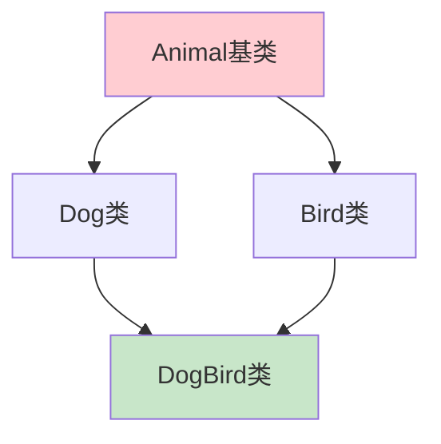
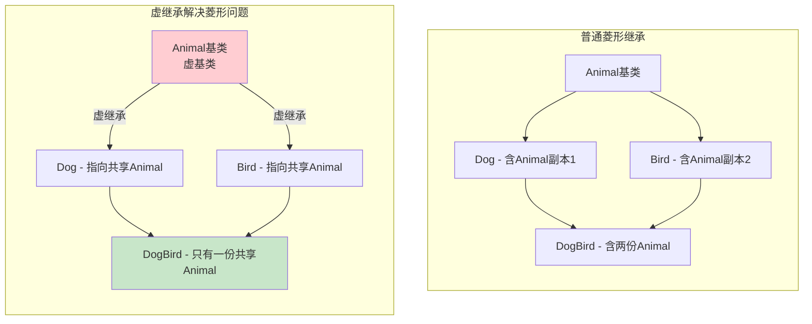
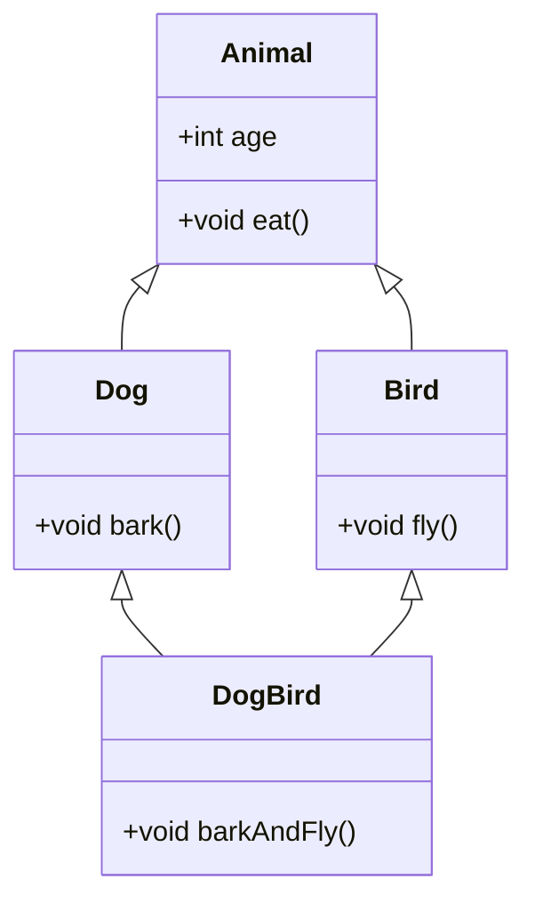
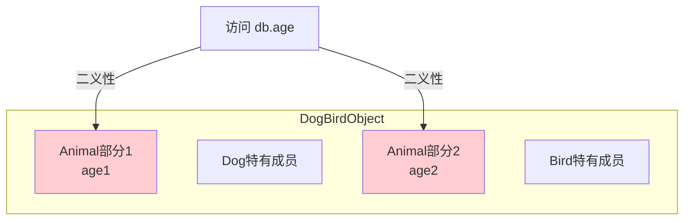
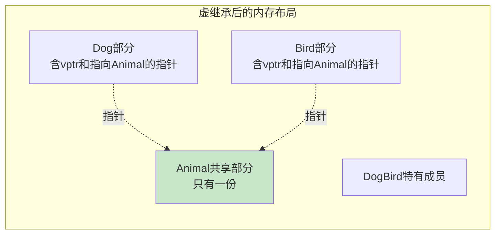
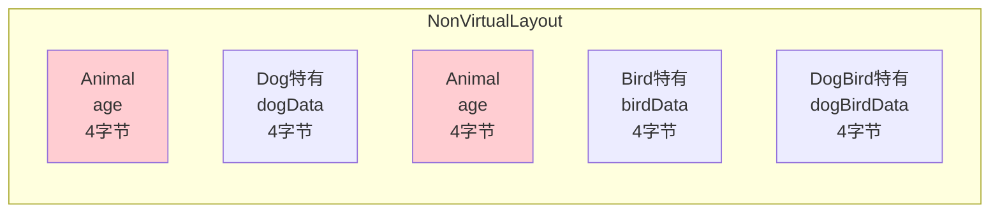
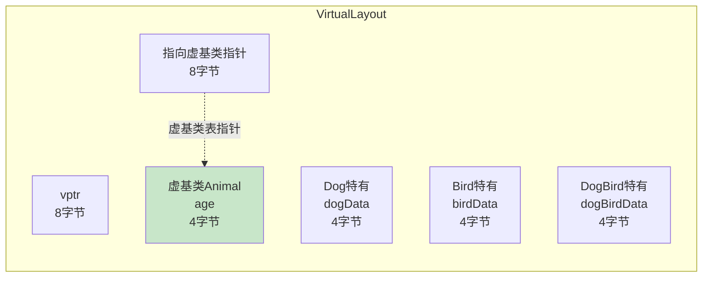
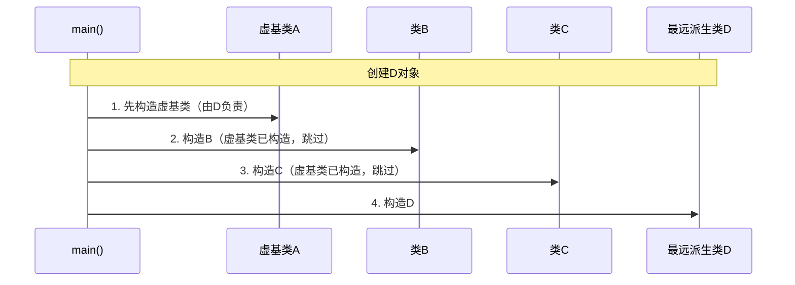

# 2.3 虚继承与菱形继承问题

> [返回第2章](./ch02-inheritance.md) | [返回目录](../README.md)

在2.2节中，我们提到虚继承会改变对象的内存布局。本节将深入探讨虚继承的设计动机——解决菱形继承问题，以及它带来的内存和性能开销。

---

## 2.3.1 实现目标

### 问题描述

当一个类同时继承自两个共同的基类时，会形成"菱形继承"结构，这会导致以下问题：



| 问题 | 描述 | 后果 |
|------|------|------|
| **二义性** | 无法确定访问哪个基类成员 | 编译错误 |
| **数据冗余** | 基类成员被复制多份 | 内存浪费 |
| **状态不一致** | 多份基类副本可能状态不同 | 逻辑错误 |
| **this指针复杂** | 类型转换需要多次调整 | 性能开销 |

### 期望效果

通过虚继承实现以下目标：



1. **消除二义性**：派生类中只有一份基类子对象
2. **节省内存**：避免重复存储基类成员
3. **状态一致**：所有路径访问的是同一个基类对象

---

## 2.3.2 核心原理

### 什么是菱形继承

菱形继承是指一个派生类同时继承自两个或多个基类，而这些基类又共同继承自同一个基类，形成菱形结构：



### 菱形继承的二义性问题



当尝试访问 `DogBird::age` 时，编译器无法确定是访问 `Dog::Animal::age` 还是 `Bird::Animal::age`。

### 虚继承的解决机制

虚继承通过在派生类中存储一个指向共享基类的指针来解决菱形继承问题：



**关键机制**：
1. 虚基类的成员被放置在对象内存的末尾
2. 每个直接继承虚基类的派生类都包含一个指向虚基类的指针
3. 访问虚基类成员时，通过指针间接访问

---

## 2.3.3 代码示例

### 示例1：菱形继承的二义性问题

```cpp
#include <iostream>

class Animal {
public:
    int age = 0;
    void eat() {
        std::cout << "Animal eating, age: " << age << "\n";
    }
};

class Dog : public Animal {
public:
    void bark() {
        std::cout << "Woof!\n";
    }
};

class Bird : public Animal {
public:
    void fly() {
        std::cout << "Flying!\n";
    }
};

class DogBird : public Dog, public Bird {
public:
    void barkAndFly() {
        bark();
        fly();
    }
};

int main() {
    DogBird db;

    // db.age = 5;  // ❌ 编译错误：二义性
    // error: request for member 'age' is ambiguous
    // note: candidates are: int Animal::age
    // note:                 int Animal::age

    // 解决方法1：明确指定路径
    db.Dog::age = 5;
    db.Bird::age = 3;

    std::cout << "Dog::age = " << db.Dog::age << "\n";   // 5
    std::cout << "Bird::age = " << db.Bird::age << "\n"; // 3

    // 问题：Dog中的Animal和Bird中的Animal是两个不同的对象！

    return 0;
}
```

### 示例2：使用虚继承解决菱形问题

```cpp
#include <iostream>

class Animal {
public:
    int age = 0;
    void eat() {
        std::cout << "Animal eating, age: " << age << "\n";
    }
};

// 使用 virtual 继承，表示 Animal 是虚基类
class Dog : virtual public Animal {
public:
    void bark() {
        std::cout << "Woof!\n";
    }
};

class Bird : virtual public Animal {
public:
    void fly() {
        std::cout << "Flying!\n";
    }
};

class DogBird : public Dog, public Bird {
public:
    void barkAndFly() {
        bark();
        fly();
    }
};

int main() {
    DogBird db;

    // ✅ 不再有二义性：只有一个 Animal 子对象
    db.age = 5;
    std::cout << "db.age = " << db.age << "\n";  // 5

    db.eat();  // 输出: Animal eating, age: 5

    // 通过任何路径访问的都是同一个 Animal 对象
    db.Dog::age = 10;
    std::cout << "db.Bird::age = " << db.Bird::age << "\n";  // 10（同一个对象）

    return 0;
}
```

### 示例3：验证内存布局差异

```cpp
#include <iostream>

// 非虚继承版本
class Animal {
public:
    int age = 0;
};

class Dog : public Animal {
public:
    int dogData = 1;
};

class Bird : public Animal {
public:
    int birdData = 2;
};

class DogBird : public Dog, public Bird {
public:
    int dogBirdData = 3;
};

// 虚继承版本
class VAnimal {
public:
    int age = 0;
};

class VDog : virtual public VAnimal {
public:
    int dogData = 1;
};

class VBird : virtual public VAnimal {
public:
    int birdData = 2;
};

class VDogBird : public VDog, public VBird {
public:
    int dogBirdData = 3;
};

int main() {
    std::cout << "=== 内存大小对比 ===\n\n";

    std::cout << "非虚继承:\n";
    std::cout << "  sizeof(Dog)    = " << sizeof(Dog) << "\n";
    std::cout << "  sizeof(Bird)   = " << sizeof(Bird) << "\n";
    std::cout << "  sizeof(DogBird)= " << sizeof(DogBird) << "\n";

    std::cout << "\n虚继承:\n";
    std::cout << "  sizeof(VDog)    = " << sizeof(VDog) << "\n";
    std::cout << "  sizeof(VBird)   = " << sizeof(VBird) << "\n";
    std::cout << "  sizeof(VDogBird)= " << sizeof(VDogBird) << "\n";

    std::cout << "\n=== 分析 ===\n";
    std::cout << "非虚继承 DogBird 包含两份 Animal，sizeof = 2 * sizeof(Animal) + 成员\n";
    std::cout << "虚继承 VDogBird 只有一份 Animal，但需要额外的指针开销\n";

    return 0;
}
```

**可能的输出**（64位系统）：
```
=== 内存大小对比 ===

非虚继承:
  sizeof(Dog)    = 8
  sizeof(Bird)   = 8
  sizeof(DogBird)= 24

虚继承:
  sizeof(VDog)    = 16
  sizeof(VBird)   = 16
  sizeof(VDogBird)= 32

=== 分析 ===
非虚继承 DogBird 包含两份 Animal，sizeof = 2 * sizeof(Animal) + 成员
虚继承 VDogBird 只有一份 Animal，但需要额外的指针开销
```

### 示例4：虚继承的构造函数调用顺序

```cpp
#include <iostream>

class A {
public:
    A(int x) : val(x) {
        std::cout << "A constructor: " << val << "\n";
    }
    int val;
};

class B : virtual public A {
public:
    B() : A(1) {  // 虚基类的初始化由最远派生类控制
        std::cout << "B constructor\n";
    }
};

class C : virtual public A {
public:
    C() : A(2) {  // 这里的初始化会被忽略
        std::cout << "C constructor\n";
    }
};

class D : public B, public C {
public:
    // 最远派生类负责初始化虚基类
    D() : A(100) {
        std::cout << "D constructor\n";
    }
};

int main() {
    D d;
    std::cout << "A::val = " << d.val << "\n";
    return 0;
}
```

**输出**：
```
A constructor: 100
B constructor
C constructor
D constructor
A::val = 100
```

**注意**：虚基类的构造函数由**最远派生类**调用，中间类的虚基类初始化列表会被忽略。

---

## 2.3.4 深入讲解

### 虚继承的内存布局详解

虚继承改变了对象的内存布局方式。让我们深入分析：

**非虚继承的DogBird内存布局**：


**虚继承的VDogBird内存布局**：


**关键差异**：
1. 虚继承中，虚基类被放在内存布局的最后
2. 每个继承虚基类的类都有一个指针（或偏移量）用于定位虚基类
3. 访问虚基类成员需要额外的间接寻址

**重要说明**：虚继承的主要目的是**解决二义性和保证状态一致**，而非节省空间。当虚基类较小时（如只有一个int），指针开销可能反而导致总空间增大：

```cpp
// 虚基类只有4字节，但指针开销16字节
sizeof(VDogBird) = 32  // 虚继承
sizeof(DogBird) = 24   // 非虚继承（可能加上padding）

// 结论：虚继承不一定节省空间，主要用于消除二义性
```

虚继承只有在以下情况才可能节省空间：
- 虚基类本身较大（如包含大数组或多个成员）
- 菱形继承层次较深（重复的虚基类份数多）

**示例：虚基类较大时，虚继承节省空间**：
```cpp
class BigBase {
    char data[100];  // 100字节
};

// 非虚继承：重复3份BigBase = 300字节
class A : public BigBase { };
class B : public BigBase { };
class C : public A, public B { };  // BigBase x3 = 300字节

// 虚继承：只有1份BigBase = 100字节 + 指针开销16字节 = 116字节
class VA : virtual public BigBase { };
class VB : virtual public BigBase { };
class VC : public VA, public VB { };  // BigBase x1 = 116字节
```

### 虚继承的构造顺序

虚继承的构造遵循特殊规则：



**规则**：
1. 虚基类先于非虚基类构造
2. 虚基类由最远派生类初始化
3. 同一层级按声明顺序构造

### 访问虚基类成员的性能开销

```cpp
class VBase {
public:
    int data;
};

class Derived : virtual public VBase {
    int moreData;
};

void accessTest(Derived& d) {
    // 每次访问虚基类成员都需要间接寻址
    d.data = 10;  // 需要通过虚基类表查找VBase的位置
}
```

**性能影响**：
- 虚基类成员访问比普通成员访问慢
- 需要额外的间接寻址步骤
- 可能影响缓存局部性

---

## 2.3.5 虚继承的应用场景

### 场景1：接口继承

虚继承常用于确保只有一个共享的接口基类：

```cpp
class IInterface {
public:
    virtual void foo() = 0;
    virtual ~IInterface() = default;
};

class ImplementationA : virtual public IInterface {
public:
    void foo() override { /* 实现 */ }
};

class ImplementationB : virtual public IInterface {
public:
    void foo() override { /* 实现 */ }
};

class Combined : public ImplementationA, public ImplementationB {
public:
    // 只有一个 IInterface，没有二义性
};
```

### 场景2： mixin模式

虚继承允许灵活地组合多个功能：

```cpp
class Serializable {
public:
    virtual void serialize(std::ostream&) const = 0;
    virtual ~Serializable() = default;
};

class Persistent : virtual public Serializable {
public:
    void save(const std::string& filename) const;
};

class User : virtual public Persistent {
    std::string name;
public:
    void serialize(std::ostream& os) const override {
        os << name;
    }
};
```

---

## 2.3.6 常见陷阱与最佳实践

### 常见陷阱

#### 陷阱1：虚基类的构造函数初始化被忽略

```cpp
class Base {
public:
    Base(int x) : val(x) {}
    int val;
};

class Derived : virtual public Base {
public:
    Derived() : Base(100) {  // 这个初始化会被忽略！
        std::cout << "Derived: Base::val = " << val << "\n";
    }
};

class MostDerived : public Derived {
public:
    MostDerived() : Base(999) {  // 只有这里有效
        std::cout << "MostDerived: Base::val = " << val << "\n";
    }
};

int main() {
    MostDerived md;
    // 输出: MostDerived: Base::val = 999
    // Derived中的 Base(100) 被忽略了
}
```

**原因**：虚基类只由最远派生类初始化，中间类的初始化列表会被忽略。

#### 陷阱2：混淆虚继承与虚函数

```cpp
// 虚继承：virtual public Base
class Derived : virtual public Base { };

// 虚函数：virtual void func()
class Base {
public:
    virtual void func() {}
};

// 这是两个完全不同的概念！
```

#### 陷阱3：滥用虚继承导致性能问题

```cpp
// ❌ 不必要地使用虚继承
class A { };
class B : virtual public A { };
class C : virtual public A { };
class D : public B, public C { };

// 如果不存在菱形继承，虚继承只会带来性能开销而没有好处
```

#### 陷阱4：在虚基类中放置数据成员

```cpp
// ❌ 虚基类中有大量数据成员
class HugeBase {
    int data[1000];  // 访问这些数据需要额外开销
};

class Derived1 : virtual public HugeBase { };
class Derived2 : virtual public HugeBase { };
class Combined : public Derived1, public Derived2 { };

// 每次访问 HugeBase::data 都需要间接寻址
```

---

### 最佳实践

#### 1. 只在必要时使用虚继承

```cpp
// ✅ 只有存在菱形继承时才使用虚继承
class Animal { };  // 会被多个类继承

class Dog : virtual public Animal { };   // 虚继承
class Bird : virtual public Animal { };  // 虚继承

class DogBird : public Dog, public Bird { };  // 菱形结构，虚继承有意义

// ✅ 如果没有菱形结构，不需要虚继承
class Base { };
class Derived1 : public Base { };  // 普通继承
class Derived2 : public Base { };  // 普通继承
// 不存在同时继承 Derived1 和 Derived2 的类
```

#### 2. 虚基类尽量只包含接口，不包含数据

```cpp
// ✅ 推荐：虚基类作为接口
class IStream {
public:
    virtual void read(char* buffer, size_t size) = 0;
    virtual void write(const char* buffer, size_t size) = 0;
    virtual ~IStream() = default;
};

// ❌ 避免：虚基类包含大量数据
class Buffer {
    char data[1024];  // 访问开销大
};
```

#### 3. 明确最远派生类的构造责任

```cpp
class Base {
public:
    Base(int x) : val(x) {}
    int val;
};

class Middle : virtual public Base {
public:
    // 提供默认构造，但注明虚基类由最终派生类初始化
    Middle() : Base(0) {  // 会被忽略，但提供默认值
        std::cout << "Middle constructed (Base init ignored)\n";
    }
};

class Final : public Middle {
public:
    // 明确初始化虚基类
    Final() : Base(42) {
        std::cout << "Final initializing virtual Base\n";
    }
};
```

#### 4. 了解虚继承的性能代价

```cpp
// 虚继承的性能影响：
// 1. 对象大小增加（需要存储虚基类指针）
// 2. 虚基类成员访问需要额外间接寻址
// 3. 构造/析构顺序更复杂

// 在性能关键代码中谨慎使用
```

---

## 2.3.7 思考题

1. 为什么虚基类的构造函数由最远派生类调用，而不是由直接派生类调用？
   > 提示：考虑虚基类只应该被构造一次的需求

2. 以下代码的输出是什么？
   ```cpp
   class A {
   public:
       A() { std::cout << "A"; }
   };
   class B : virtual public A {
   public:
       B() { std::cout << "B"; }
   };
   class C : virtual public A {
   public:
       C() { std::cout << "C"; }
   };
   class D : public B, public C {
   public:
       D() { std::cout << "D"; }
   };
   int main() { D d; }
   ```

3. 虚继承和虚函数有什么区别？

4. 为什么说"虚基类应该只包含接口，不包含数据"？

---

*上一节：[2.2 单继承与多继承的内存布局](./ch02-02-memory-layout.md)*
*下一节：[2.4 继承 vs 组合：设计决策](./ch02-04-composition.md)*
