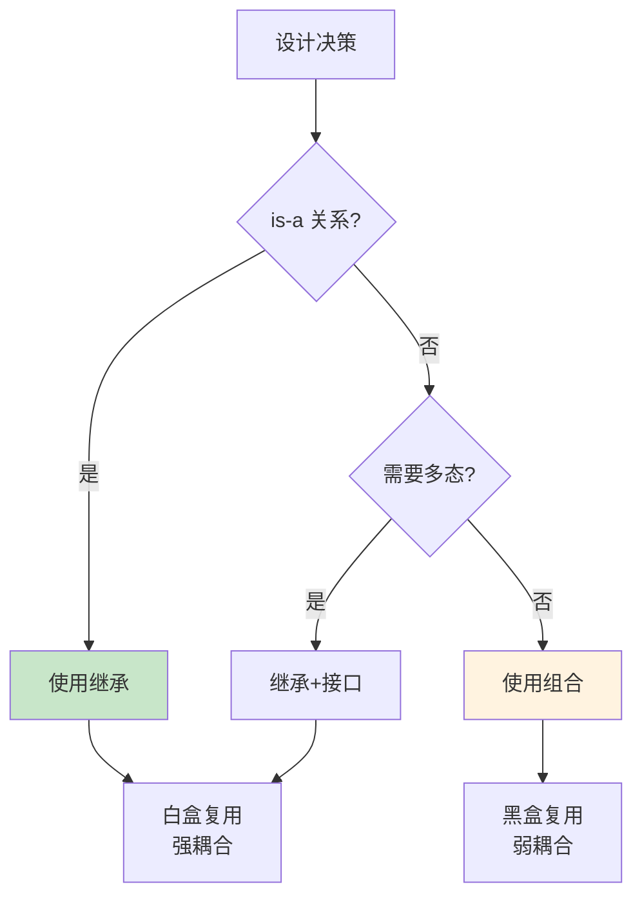
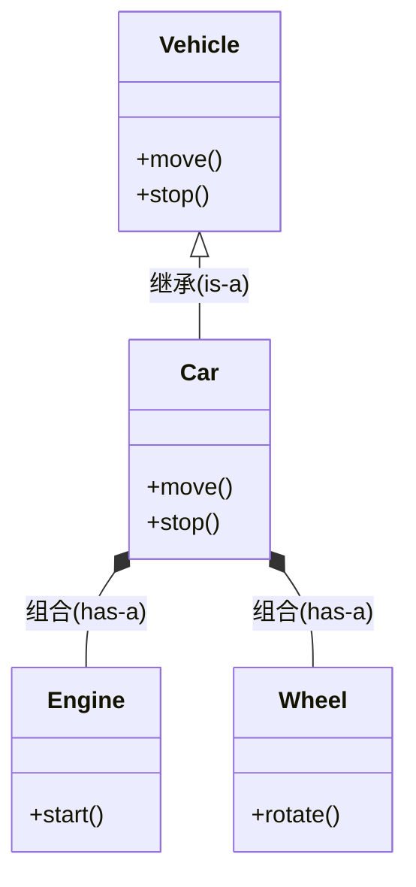
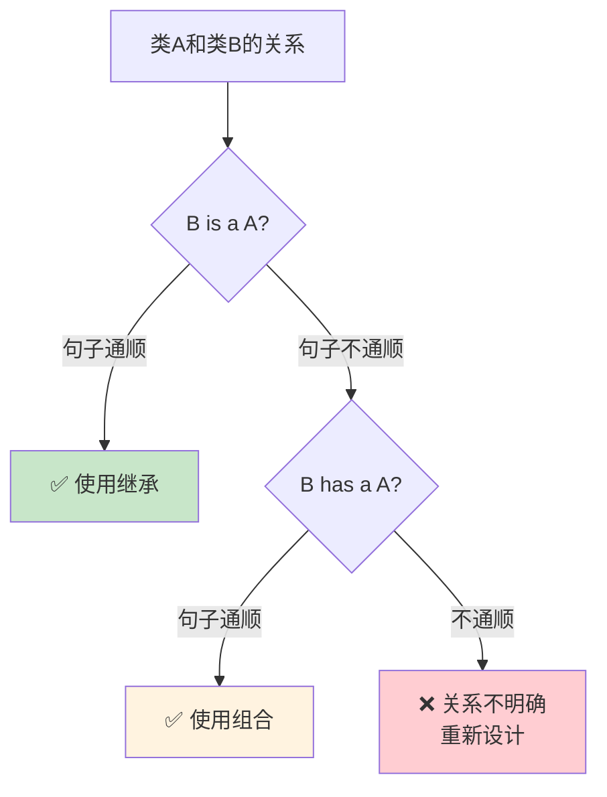
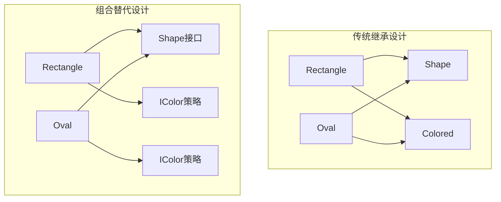
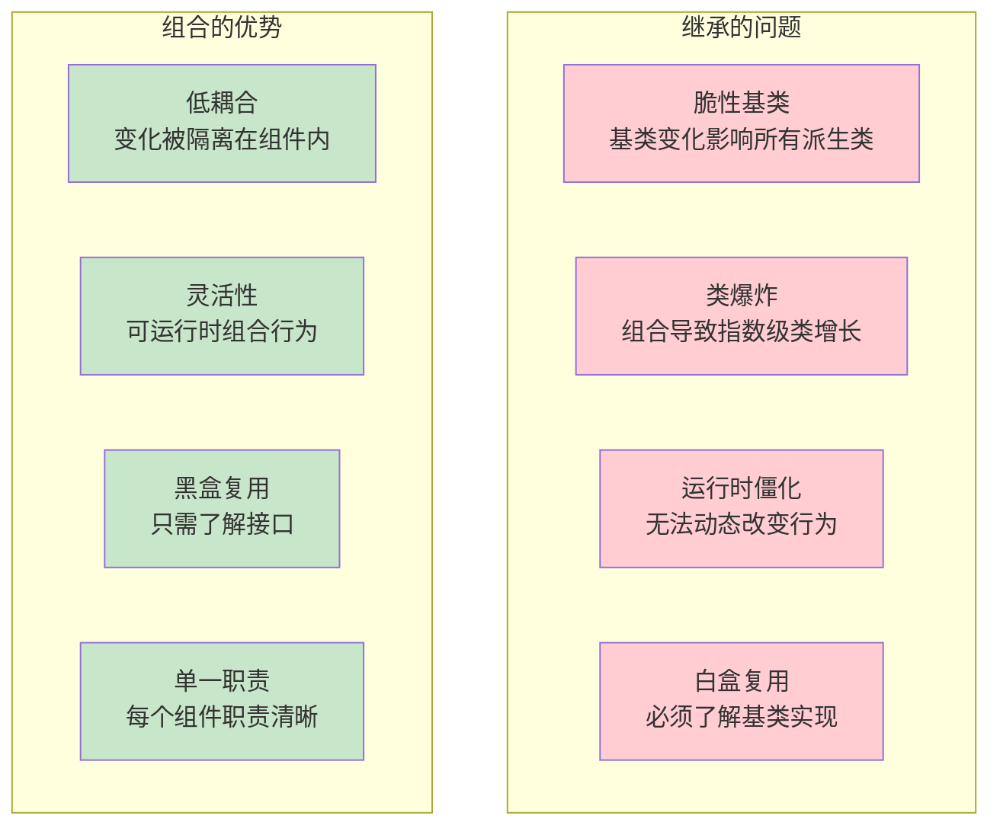

# 2.4 继承 vs 组合：设计决策

> [返回第2章](./ch02-inheritance.md) | [返回目录](../README.md)

在2.1.6节中，我们简单对比了继承与组合的特性。本节将深入探讨如何在两者之间做出设计决策，以及"组合优于继承"这一设计原则的真正含义。

---

## 2.4.1 实现目标

### 问题描述

面向对象设计中最常见的决策之一就是：**应该使用继承还是组合**？

| 问题 | 描述 | 后果 |
|------|------|------|
| **过度继承** | 滥用继承来表达所有关系 | 类层次臃肿、强耦合、难以维护 |
| **误用继承** | 用继承表达has-a关系 | 语义不清、接口暴露 |
| **组合不足** | 该用继承时却用组合 | 失去多态能力、代码冗余 |
| **设计僵化** | 继承层次过深 | 难以修改和扩展 |

### 期望效果

通过本节学习，你将能够：



1. **正确判断关系**：区分is-a和has-a关系
2. **理解权衡**：了解继承与组合的优缺点
3. **应用原则**：掌握"组合优于继承"的适用场景
4. **灵活设计**：知道何时该用继承，何时该用组合

---

## 2.4.2 核心原理

### 继承 vs 组合的本质区别



| 维度 | 继承 | 组合 |
|------|------|------|
| **语义** | "B is a A"（B是一种A） | "B has a A"（B有一个A） |
| **耦合类型** | 白盒复用（可见内部） | 黑盒复用（只看接口） |
| **依赖方向** | 派生类依赖基类 | 容器类依赖成员类型 |
| **多态支持** | 原生支持（虚函数） | 需要额外设计 |
| **修改影响** | 基类变化影响所有派生类 | 成员变化只影响容器类 |

### is-a vs has-a 的判断方法

一个简单的判断方法是**句子测试法**：



**示例**：

| 关系 | 句子测试 | 结果 |
|------|---------|------|
| Dog - Animal | "Dog is an Animal" ✅ | 继承 |
| Car - Engine | "Car is an Engine" ❌ "Car has an Engine" ✅ | 组合 |
| Circle - Shape | "Circle is a Shape" ✅ | 继承 |
| Person - Account | "Person is an Account" ❌ "Person has an Account" ✅ | 组合 |

---

## 2.4.3 代码示例

### 示例1：正确使用继承（is-a关系）

```cpp
#include <iostream>
#include <vector>
#include <memory>
#include <string>

// 基类：所有图形的抽象
class Shape {
public:
    virtual ~Shape() = default;
    virtual double area() const = 0;
    virtual double perimeter() const = 0;
    virtual void draw() const {
        std::cout << "Drawing a shape\n";
    }
};

// 派生类：圆形是一种图形
class Circle : public Shape {
    double radius_;
public:
    Circle(double r) : radius_(r) {}

    double area() const override {
        return 3.14159 * radius_ * radius_;
    }

    double perimeter() const override {
        return 2 * 3.14159 * radius_;
    }

    void draw() const override {
        std::cout << "Drawing a circle with radius " << radius_ << "\n";
    }
};

// 派生类：矩形是一种图形
class Rectangle : public Shape {
    double width_, height_;
public:
    Rectangle(double w, double h) : width_(w), height_(h) {}

    double area() const override {
        return width_ * height_;
    }

    double perimeter() const override {
        return 2 * (width_ + height_);
    }

    void draw() const override {
        std::cout << "Drawing a rectangle " << width_ << "x" << height_ << "\n";
    }
};

// 统一处理所有图形
void processShapes(const std::vector<std::unique_ptr<Shape>>& shapes) {
    for (const auto& shape : shapes) {
        shape->draw();
        std::cout << "  Area: " << shape->area() << "\n";
    }
}

int main() {
    std::vector<std::unique_ptr<Shape>> shapes;
    shapes.push_back(std::make_unique<Circle>(5.0));
    shapes.push_back(std::make_unique<Rectangle>(3.0, 4.0));

    processShapes(shapes);

    return 0;
}
```

### 示例2：正确使用组合（has-a关系）

```cpp
#include <iostream>
#include <string>

// Engine是一个独立的类
class Engine {
    std::string model_;
public:
    Engine(const std::string& model) : model_(model) {}

    void start() {
        std::cout << "Engine " << model_ << " starting...\n";
    }

    void stop() {
        std::cout << "Engine " << model_ << " stopping...\n";
    }

    std::string getModel() const { return model_; }
};

// Car有一个Engine（不是is-a关系）
class Car {
    Engine engine_;
    std::string brand_;
public:
    Car(const std::string& brand, const std::string& engineModel)
        : engine_(engineModel), brand_(brand) {}

    void start() {
        std::cout << brand_ << " car starting...\n";
        engine_.start();
    }

    void stop() {
        engine_.stop();
        std::cout << brand_ << " car stopped.\n";
    }

    void replaceEngine(const std::string& newModel) {
        engine_ = Engine(newModel);  // 可以在运行时更换
        std::cout << "Engine replaced with " << newModel << "\n";
    }
};

int main() {
    Car car("Toyota", "V6");

    car.start();
    car.stop();

    car.replaceEngine("Electric");

    return 0;
}
```

### 示例3：反例 - 误用继承表达has-a关系

```cpp
// ❌ 错误的设计：用继承表达has-a关系
class Engine {
public:
    void start() { std::cout << "Engine start\n"; }
    void stop() { std::cout << "Engine stop\n"; }
};

class Car : public Engine {  // Car is NOT an Engine!
public:
    void drive() { std::cout << "Driving\n"; }
};

// 问题：
// 1. 语义错误：Car不是一种Engine
// 2. 接口暴露：Car的用户可以直接调用start/stop
// 3. 无法替换：一个Car对象不能在运行时更换Engine
// 4. 强耦合：Car依赖Engine的所有实现细节

// ✅ 正确的设计：使用组合
class Car {
    Engine engine_;  // Car has an Engine
public:
    void start() { engine_.start(); }
    void stop() { engine_.stop(); }
    void drive() { /* ... */ }
};
```

### 示例4：组合 + 接口实现多态

组合本身不支持多态，但可以通过接口实现：

```cpp
#include <iostream>
#include <memory>

// 前向声明
class IEngine;

// 引擎接口
class IEngine {
public:
    virtual ~IEngine() = default;
    virtual void start() = 0;
    virtual void stop() = 0;
};

// 具体引擎实现
class GasEngine : public IEngine {
public:
    void start() override { std::cout << "Gas engine starting\n"; }
    void stop() override { std::cout << "Gas engine stopping\n"; }
};

class ElectricEngine : public IEngine {
public:
    void start() override { std::cout << "Electric engine starting\n"; }
    void stop() override { std::cout << "Electric engine stopping\n"; }
};

// Car通过组合持有引擎接口，支持多态
class Car {
    std::unique_ptr<IEngine> engine_;
    std::string brand_;

public:
    Car(const std::string& brand, std::unique_ptr<IEngine> engine)
        : brand_(brand), engine_(std::move(engine)) {}

    void start() {
        std::cout << brand_ << " starting...\n";
        engine_->start();
    }

    // 可以在运行时更换引擎
    void setEngine(std::unique_ptr<IEngine> newEngine) {
        engine_ = std::move(newEngine);
    }
};

int main() {
    Car car1("Tesla", std::make_unique<ElectricEngine>());
    car1.start();

    Car car2("Ford", std::make_unique<GasEngine>());
    car2.start();

    // 运行时更换引擎
    car1.setEngine(std::make_unique<GasEngine>());
    car1.start();

    return 0;
}
```

---

## 2.4.4 深入讲解

### "组合优于继承"的真正含义



**"组合优于继承"不是说要完全避免继承**，而是：
1. **优先使用组合**来复用实现
2. **只在is-a关系时使用继承**
3. **通过组合来扩展功能**，而不是通过深度继承层次

### 继承的适用场景

| 场景 | 示例 | 说明 |
|------|------|------|
| **类型层次** | Animal → Dog → GoldenRetriever | 自然的概念层次 |
| **接口规范** | IStream → FileStream | 定义统一的接口契约 |
| **多态需求** | Shape → Circle, Rectangle | 需要统一处理不同类型 |
| **模板方法** | Framework → UserImpl | 框架定义算法骨架 |

### 组合的适用场景

| 场景 | 示例 | 说明 |
|------|------|------|
| **部件组装** | Car = Engine + Wheel + Seat | 物理上的组成关系 |
| **功能复用** | Container + Comparator | 复用代码但不建立类型关系 |
| **运行时变化** | Strategy模式 | 需要在运行时切换行为 |
| **降低耦合** | 通过接口组合 | 只依赖接口，不依赖实现 |

### 组合+接口 = 强大的设计

```cpp
// 组合 + 接口 = 灵活性 + 多态
class GameObject {
    std::vector<std::unique_ptr<IComponent>> components_;
};

// 组件可以是：RenderComponent, PhysicsComponent, AIComponent...
// 每个组件都可以独立开发和测试
// GameObject通过组合获得能力，而非继承
```

---

### 为什么说"组合优于继承"？

让我们通过一个完整的例子来对比继承和组合两种设计方案。

#### 场景：为鸟添加不同的飞行行为

**方案A：使用继承**

```cpp
// ❌ 问题方案：用继承表达行为变化

class Bird {
public:
    virtual void fly() {
        std::cout << "Flying at 10 km/h\n";
    }
    virtual void display() {
        std::cout << "I'm a bird\n";
    }
};

// 想要更快的鸟？必须继承
class FastBird : public Bird {
public:
    void fly() override {
        std::cout << "Flying at 50 km/h\n";
    }
};

// 想要不会飞的鸟？必须重写
class Ostrich : public Bird {
public:
    void fly() override {
        std::cout << "I can't fly!\n";
    }
};

// 想要既有速度又不会飞的鸟？继承层次爆炸！
// FastOstrich ? 需要再继承一个类？
```

**继承方案的问题**：
- 每增加一种行为组合，就需要新的继承层次
- 类数量爆炸：Bird, FastBird, SlowBird, FlyingBird, NonFlyingBird...
- 代码重复：多个子类可能有相同的行为
- 修改困难：改变飞行行为需要修改多个类

**方案B：使用组合（策略模式）**

```cpp
// ✅ 优秀方案：用组合表达行为变化

// 飞行行为接口
class FlyBehavior {
public:
    virtual void fly() = 0;
    virtual ~FlyBehavior() = default;
};

// 具体飞行行为
class NormalFly : public FlyBehavior {
public:
    void fly() override { std::cout << "Flying at 10 km/h\n"; }
};

class FastFly : public FlyBehavior {
public:
    void fly() override { std::cout << "Flying at 50 km/h\n"; }
};

class NoFly : public FlyBehavior {
public:
    void fly() override { std::cout << "I can't fly!\n"; }
};

// 鸟类通过组合获得飞行能力
class Bird {
private:
    std::unique_ptr<FlyBehavior> flyBehavior_;

public:
    Bird(std::unique_ptr<FlyBehavior> fb) : flyBehavior_(std::move(fb)) {}

    void fly() { flyBehavior_->fly(); }

    void setFlyBehavior(std::unique_ptr<FlyBehavior> fb) {
        flyBehavior_ = std::move(fb);
    }

    virtual void display() { std::cout << "I'm a bird\n"; }
};

// 各种鸟只需要组合不同的行为
class Sparrow : public Bird {
public:
    Sparrow() : Bird(std::make_unique<NormalFly>()) {}
};

class Eagle : public Bird {
public:
    Eagle() : Bird(std::make_unique<FastFly>()) {}
};

class Ostrich : public Bird {
public:
    Ostrich() : Bird(std::make_unique<NoFly>()) {}
};
```

**组合方案的优势**：
- 行为可以独立变化
- 可以在运行时改变行为
- 避免类爆炸
- 代码复用性高

#### 对比总结表

| 对比维度 | 继承方案 | 组合方案 |
|---------|---------|---------|
| **添加新行为** | 需要新建派生类 | 只需新建行为类 |
| **组合行为** | 需要创建组合类（如FastOstrich） | 直接组合即可 |
| **运行时改变** | 不可能 | 容易实现 |
| **类数量** | 指数增长 | 线性增长 |
| **代码复用** | 困难 | 容易 |
| **测试难度** | 需要整个继承体系 | 可独立测试每个行为 |

#### 继承的"脆性基类问题"

继承的另一个严重问题是**脆性基类（Fragile Base Class）**：

```cpp
// 假设有一个稳定的基类
class Account {
protected:
    double balance_ = 0;

public:
    void deposit(double amount) {
        balance_ += amount;
        // 这里新增了一个日志记录
        logTransaction("deposit", amount);
    }

    void withdraw(double amount) {
        if (balance_ >= amount) {
            balance_ -= amount;
            logTransaction("withdraw", amount);
        }
    }

private:
    void logTransaction(const std::string& type, double amount) {
        // 新功能：记录交易日志
    }
};

// 问题：所有派生类都可能受到影响！
class SavingsAccount : public Account {
public:
    void deposit(double amount) {
        // 派生类可能重写了deposit，但没调用logTransaction
        Account::deposit(amount);
        addInterest();
    }

private:
    void addInterest() { /* ... */ }
};

// 当基类改变时，所有派生类都需要检查和测试
// 这就是"脆性基类"问题
```

**组合方案如何避免脆性基类**：

```cpp
// ✅ 使用组合，变化被隔离
class TransactionLogger {
public:
    void log(const std::string& type, double amount) {
        // 日志逻辑独立封装
    }
};

class Account {
    TransactionLogger logger_;
protected:
    double balance_ = 0;

public:
    void deposit(double amount) {
        balance_ += amount;
        logger_.log("deposit", amount);
    }
};

// Account 的内部变化不影响组合它的类
// TransactionLogger 可以独立修改和测试
```

#### 组合优于继承的核心原因



**核心原因总结**：

1. **耦合方向**：继承是强耦合（白盒复用），组合是弱耦合（黑盒复用）
2. **变化隔离**：组合的变化被隔离在组件内部，不影响使用者
3. **灵活性**：组合可以在运行时动态改变，继承在编译期固定
4. **可测试性**：组合的组件可独立测试，继承需要测试整个层次
5. **可维护性**：组合遵循单一职责，继承容易产生"胖基类"

---

## 2.4.5 常见陷阱与最佳实践

### 常见陷阱

#### 陷阱1：滥用继承实现代码复用

```cpp
// ❌ 为了复用代码而继承
class Logger {
    std::vector<std::string> logs_;
public:
    void log(const std::string& msg) {
        logs_.push_back(msg);
    }
    void saveToFile(const std::string& filename);
};

class NetworkManager : public Logger {  // NetworkManager is not a Logger!
public:
    void send() {
        log("Sending data...");  // 复用log功能
    }
};

// 问题：NetworkManager和Logger不是is-a关系
// 应该使用组合
```

#### 陷阱2：继承层次过深

```cpp
// ❌ 过深的继承层次
class Animal { };
class Mammal : public Animal { };
class Dog : public Mammal { };
class GoldenRetriever : public Dog { };
class PetGoldenRetriever : public GoldenRetriever { };
class ShowDog : public PetGoldenRetriever { };

// 问题：层次越深，代码越难理解和维护
```

#### 陷阱3：用继承来表达行为变化

```cpp
// ❌ 用继承表达不同的飞行行为
class Bird {
public:
    virtual void fly() { std::cout << "Flying\n"; }
};

class Penguin : public Bird {
public:
    void fly() override { std::cout << "I can't fly!\n"; }
};

// 问题：每个不会飞的鸟都要重写fly()
// 应该使用策略模式（组合）
```

#### 陷阱4：基类包含过多实现

```cpp
// ❌ 基类包含大量具体实现
class Base {
public:
    void func1() { /* 100行代码 */ }
    void func2() { /* 100行代码 */ }
    void func3() { /* 100行代码 */ }
    // ...更多函数
};

// 派生类被迫继承它不需要的功能
class Derived : public Base {
    // 可能只需要func1，但继承了所有函数
};
```

---

### 最佳实践

#### 1. 使用句子测试法判断is-a关系

```cpp
// Dog is an Animal? ✅ → 继承
// Car is an Engine? ❌ → 组合
// Circle is a Shape? ✅ → 继承
// Person is an Account? ❌ → 组合
```

#### 2. 优先使用组合，而非继承

```cpp
// ✅ 推荐：组合
class Car {
    Engine engine_;
    Transmission transmission_;
    // 通过组合获得能力
};

// ❌ 避免：多重继承获取实现
class Car : public Engine, public Transmission {
    // 继承带来强耦合
};
```

#### 3. 用策略模式替代继承表达行为变化

```cpp
// ✅ 推荐：策略模式（组合）
class FlyBehavior {
public:
    virtual void fly() = 0;
    virtual ~FlyBehavior() = default;
};

class CanFly : public FlyBehavior {
public:
    void fly() override { std::cout << "Flying!\n"; }
};

class CannotFly : public FlyBehavior {
public:
    void fly() override { std::cout << "Cannot fly!\n"; }
};

class Bird {
    std::unique_ptr<FlyBehavior> flyBehavior_;
public:
    Bird(std::unique_ptr<FlyBehavior> fb) : flyBehavior_(std::move(fb)) {}
    void fly() { flyBehavior_->fly(); }
};

// 不同的鸟可以有不同的飞行行为，不需要继承层次
```

#### 4. 继承只用于建立"is-a"类型层次

```cpp
// ✅ 正确：继承用于类型层次
class Shape { /* ... */ };
class Circle : public Shape { /* ... */ };
class Rectangle : public Shape { /* ... */ };

// ✅ 正确：组合用于功能复用
class DrawingContext {
    std::vector<std::unique_ptr<Shape>> shapes_;
    std::unique_ptr<IRenderer> renderer_;
};
```

#### 5. 基类应该只定义接口，包含少量实现

```cpp
// ✅ 推荐：轻量级基类
class Shape {
public:
    virtual double area() const = 0;      // 纯虚函数
    virtual double perimeter() const = 0;  // 纯虚函数
    virtual ~Shape() = default;            // 虚析构函数
    // 尽量少的具体实现
};

// 派生类实现所有接口
class Circle : public Shape {
    double radius_;
public:
    Circle(double r) : radius_(r) {}
    double area() const override { return 3.14 * radius_ * radius_; }
    double perimeter() const override { return 2 * 3.14 * radius_; }
};
```

---

## 2.4.6 设计模式中的应用

### 模式1：策略模式（Strategy）- 组合优于继承的典型

```cpp
// 使用组合实现可替换的算法
class SortStrategy {
public:
    virtual void sort(int* arr, size_t n) = 0;
    virtual ~SortStrategy() = default;
};

class QuickSort : public SortStrategy {
public:
    void sort(int* arr, size_t n) override { /* 快排实现 */ }
};

class MergeSort : public SortStrategy {
public:
    void sort(int* arr, size_t n) override { /* 归排实现 */ }
};

class Sorter {
    std::unique_ptr<SortStrategy> strategy_;
public:
    void setStrategy(std::unique_ptr<SortStrategy> s) {
        strategy_ = std::move(s);
    }
    void sort(int* arr, size_t n) { strategy_->sort(arr, n); }
};
```

### 模式2：装饰器模式（Decorator）- 组合扩展功能

```cpp
// 使用组合动态添加功能
class Text {
public:
    virtual std::string getContent() const = 0;
    virtual ~Text() = default;
};

class PlainText : public Text {
    std::string content_;
public:
    PlainText(const std::string& s) : content_(s) {}
    std::string getContent() const override { return content_; }
};

class BoldDecorator : public Text {
    std::unique_ptr<Text> text_;
public:
    BoldDecorator(std::unique_ptr<Text> t) : text_(std::move(t)) {}
    std::string getContent() const override {
        return "<b>" + text_->getContent() + "</b>";
    }
};

// 可以继续装饰，不需要复杂的继承层次
```

---

## 2.4.7 思考题

1. 如何判断应该使用继承还是组合？
   > 提示：使用句子测试法

2. 为什么说"组合优于继承"？

3. 以下设计是否合理？为什么？
   ```cpp
   class LinkedList : public List, public Searchable, public Serializable {
       // 多继承获取多种功能
   };
   ```

4. 策略模式是如何体现"组合优于继承"原则的？

---

*上一节：[2.3 虚继承与菱形继承问题](./ch02-03-virtual-inheritance.md)*
*下一节：[2.5 CRTP：奇异递归模板模式](./ch02-05-crtp.md)*
