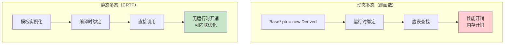
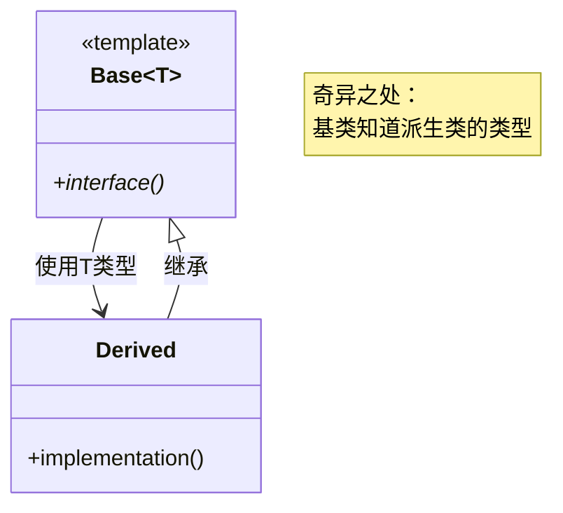
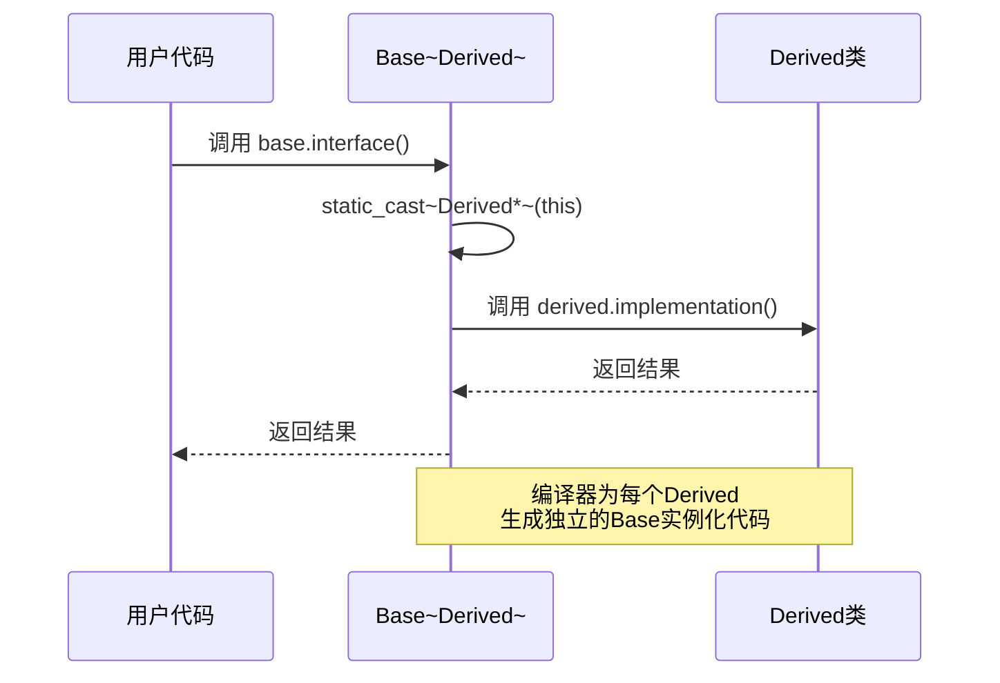
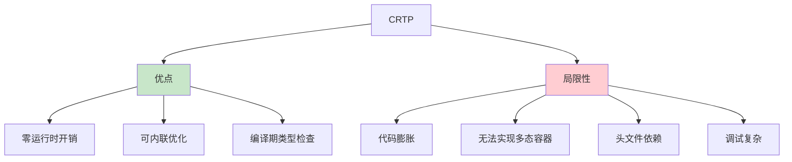

# 2.5 CRTP：奇异递归模板模式

> [返回第2章](./ch02-inheritance.md) | [返回目录](../README.md)

在前面的章节中，我们学习了继承实现多态的经典方式——通过虚函数实现**动态多态**。本节将介绍一种特殊的模板与继承结合的技术——**CRTP（Curiously Recurring Template Pattern，奇异递归模板模式）**，它可以在编译期实现多态，称为**静态多态**。

---

## 2.5.1 实现目标

### 问题描述

使用虚函数实现多态时，存在以下代价：

| 问题 | 描述 | 后果 |
|------|------|------|
| **虚函数开销** | 每次调用需要通过虚表查找 | 性能损失 |
| **内存开销** | 每个对象需要携带虚表指针 | 对象体积增大 |
| **内联失效** | 虚函数调用难以内联 | 优化受限 |
| **无法静态约束** | 接口检查在运行期进行 | 早期错误难以发现 |

### 期望效果

CRTP 通过模板技术实现编译期多态：



通过本节学习，你将能够：

1. **理解 CRTP**：掌握其工作原理和实现方式
2. **静态多态**：了解如何在不使用虚函数的情况下实现多态
3. **性能优化**：在适当场景下用 CRTP 替代虚函数
4. **灵活应用**：掌握 CRTP 的常见应用模式

---

## 2.5.2 核心原理

### 什么是 CRTP

**CRTP（Curiously Recurring Template Pattern）** 是一种 C++ 惯用法，其特点是：**派生类作为模板参数传递给基类**，且基类将派生类类型用于自身实现。



### CRTP 的基本形式

```cpp
// 基本形式
template <typename Derived>
class Base {
public:
    void interface() {
        // 基类调用"派生类"的方法
        static_cast<Derived*>(this)->implementation();
    }
};

// 派生类继承自身作为模板参数的基类
class Derived : public Base<Derived> {
public:
    void implementation() {
        // 具体实现
    }
};
```

### CRTP vs 虚函数

| 维度 | 虚函数（动态多态） | CRTP（静态多态） |
|------|-------------------|-----------------|
| **绑定时机** | 运行时 | 编译时 |
| **性能开销** | 虚表查找 | 无（可内联） |
| **内存开销** | 每对象一个 vptr | 无 |
| **类型安全** | 运行时检查 | 编译时检查 |
| **代码膨胀** | 小 | 大（每个派生类生成一份基类代码） |
| **多态容器** | 支持 `std::vector<Base*>` | 不支持 |
| **头文件依赖** | 接口分离 | 实现需可见 |

---

## 2.5.3 代码示例

### 示例1：CRTP 基础 - 静态多态

```cpp
#include <iostream>

// CRTP 基类
template <typename Derived>
class Animal {
public:
    // 基类定义接口，调用派生类实现
    void speak() {
        static_cast<Derived*>(this)->speakImpl();
    }

    void move() {
        static_cast<Derived*>(this)->moveImpl();
    }

    // 默认实现（可选）
    void sleep() {
        std::cout << "Sleeping...\n";
    }
};

// 派生类：Dog
class Dog : public Animal<Dog> {
public:
    void speakImpl() {
        std::cout << "Woof!\n";
    }

    void moveImpl() {
        std::cout << "Running on four legs\n";
    }
};

// 派生类：Cat
class Cat : public Animal<Cat> {
public:
    void speakImpl() {
        std::cout << "Meow!\n";
    }

    void moveImpl() {
        std::cout << "Prowling silently\n";
    }
};

// 派生类：Bird（可选覆盖 sleep）
class Bird : public Animal<Bird> {
public:
    void speakImpl() {
        std::cout << "Tweet!\n";
    }

    void moveImpl() {
        std::cout << "Flying\n";
    }
};

int main() {
    Dog dog;
    Cat cat;
    Bird bird;

    dog.speak();   // 输出: Woof!
    dog.move();    // 输出: Running on four legs
    dog.sleep();   // 输出: Sleeping...

    cat.speak();   // 输出: Meow!
    cat.move();    // 输出: Prowling silently

    bird.speak();  // 输出: Tweet!
    bird.move();   // 输出: Flying

    // 编译期确定调用，无虚函数开销
    return 0;
}
```

### 示例2：CRTP 实现单例模式

```cpp
#include <iostream>

// CRTP 单例基类
template <typename Derived>
class Singleton {
public:
    static Derived& getInstance() {
        static Derived instance;
        return instance;
    }

    // 删除拷贝和移动
    Singleton(const Singleton&) = delete;
    Singleton& operator=(const Singleton&) = delete;
    Singleton(Singleton&&) = delete;
    Singleton& operator=(Singleton&&) = delete;

protected:
    Singleton() = default;
    ~Singleton() = default;
};

// 使用 CRTP 的单例
class MyManager : public Singleton<MyManager> {
    // 让基类能访问构造函数
    friend class Singleton<MyManager>;

private:
    MyManager() {
        std::cout << "MyManager initialized\n";
    }

    int data_ = 0;

public:
    void doSomething() {
        std::cout << "Manager working, data = " << data_ << "\n";
    }

    void setData(int value) { data_ = value; }
};

int main() {
    // 获取单例
    MyManager& mgr = MyManager::getInstance();
    mgr.setData(42);
    mgr.doSomething();

    // 同一个实例
    MyManager& mgr2 = MyManager::getInstance();
    mgr2.doSomething();  // data 仍是 42

    return 0;
}
```

### 示例3：CRTP 实现对象计数

```cpp
#include <iostream>
#include <string>

// CRTP 对象计数基类
template <typename Derived>
class ObjectCounter {
protected:
    ObjectCounter() {
        ++count_;
    }

    ObjectCounter(const ObjectCounter&) {
        ++count_;
    }

    ObjectCounter(ObjectCounter&&) {
        ++count_;
    }

    ~ObjectCounter() {
        --count_;
    }

public:
    static size_t getCount() {
        return count_;
    }

private:
    inline static size_t count_ = 0;
};

// 使用对象计数
class User : public ObjectCounter<User> {
    std::string name_;
public:
    User(const std::string& name) : name_(name) {
        std::cout << "User " << name_ << " created\n";
    }
};

class Product : public ObjectCounter<Product> {
    std::string name_;
public:
    Product(const std::string& name) : name_(name) {
        std::cout << "Product " << name_ << " created\n";
    }
};

int main() {
    std::cout << "Initial User count: " << User::getCount() << "\n";  // 0
    std::cout << "Initial Product count: " << Product::getCount() << "\n";  // 0

    {
        User u1("Alice");
        User u2("Bob");
        std::cout << "User count: " << User::getCount() << "\n";  // 2

        Product p1("Laptop");
        std::cout << "Product count: " << Product::getCount() << "\n";  // 1
        std::cout << "User count: " << User::getCount() << "\n";  // 2 (独立计数)
    }

    std::cout << "After scope, User count: " << User::getCount() << "\n";  // 0
    std::cout << "After scope, Product count: " << Product::getCount() << "\n";  // 0

    return 0;
}
```

### 示例4：CRTP vs 虚函数性能对比

```cpp
#include <iostream>
#include <chrono>
#include <vector>

// ========== 虚函数版本 ==========
class ShapeVirtual {
public:
    virtual ~ShapeVirtual() = default;
    virtual double area() const = 0;
};

class CircleVirtual : public ShapeVirtual {
    double radius_;
public:
    CircleVirtual(double r) : radius_(r) {}
    double area() const override { return 3.14159 * radius_ * radius_; }
};

// ========== CRTP 版本 ==========
template <typename Derived>
class ShapeCRTP {
public:
    double area() const {
        return static_cast<const Derived*>(this)->areaImpl();
    }
};

class CircleCRTP : public ShapeCRTP<CircleCRTP> {
    double radius_;
public:
    CircleCRTP(double r) : radius_(r) {}
    double areaImpl() const { return 3.14159 * radius_ * radius_; }
};

// ========== 性能测试 ==========
constexpr size_t ITERATIONS = 100'000'000;
constexpr double RADIUS = 5.0;

void benchmarkVirtual() {
    CircleVirtual circle(RADIUS);
    double sum = 0;

    auto start = std::chrono::high_resolution_clock::now();
    for (size_t i = 0; i < ITERATIONS; ++i) {
        sum += circle.area();
    }
    auto end = std::chrono::high_resolution_clock::now();

    auto duration = std::chrono::duration_cast<std::chrono::milliseconds>(end - start);
    std::cout << "Virtual: " << duration.count() << "ms, sum=" << sum << "\n";
}

void benchmarkCRTP() {
    CircleCRTP circle(RADIUS);
    double sum = 0;

    auto start = std::chrono::high_resolution_clock::now();
    for (size_t i = 0; i < ITERATIONS; ++i) {
        sum += circle.area();
    }
    auto end = std::chrono::high_resolution_clock::now();

    auto duration = std::chrono::duration_cast<std::chrono::milliseconds>(end - start);
    std::cout << "CRTP: " << duration.count() << "ms, sum=" << sum << "\n";
}

int main() {
    std::cout << "Performance comparison (" << ITERATIONS << " iterations):\n";

    // 多次运行以稳定结果
    for (int i = 0; i < 3; ++i) {
        std::cout << "\nRound " << (i + 1) << ":\n";
        benchmarkVirtual();
        benchmarkCRTP();
    }

    // 典型输出（优化编译下）：
    // Virtual: 120ms (虚函数调用)
    // CRTP: 0ms (完全内联优化)

    return 0;
}
```

---

## 2.5.4 深入讲解

### CRTP 的工作原理



CRTP 的核心是**模板实例化**和**静态类型转换**：

1. **编译期实例化**：当编译器处理 `class Derived : public Base<Derived>` 时，会为 `Base<Derived>` 生成独立的代码
2. **类型安全转换**：`static_cast<Derived*>(this)` 在编译期确定类型，转换是安全的
3. **内联优化**：编译器可以直接内联 `implementation()` 调用，消除所有函数调用开销

### static_cast 为什么是安全的

```cpp
template <typename Derived>
class Base {
public:
    void interface() {
        // static_cast 安全的原因：
        // 1. Base<Derived> 只会被 Derived 继承（设计约定）
        // 2. Base<Derived>* 指向的实际上是 Derived 对象
        // 3. 这是一个向下转型，但类型在编译期确定
        static_cast<Derived*>(this)->implementation();
    }
};
```

**类型安全保证**：
- 如果遵循 CRTP 惯用法，`Base<Derived>` 只能被 `Derived` 继承
- 调用 `interface()` 时，`this` 的动态类型确实是 `Derived`
- 因此 `static_cast<Derived*>(this)` 是安全的

### CRTP 的常见应用模式

#### 1. 多态方法链（Method Chaining）

```cpp
template <typename Derived>
class Builder {
public:
    Derived& setName(const std::string& name) {
        name_ = name;
        return static_cast<Derived&>(*this);
    }

    Derived& setValue(int value) {
        value_ = value;
        return static_cast<Derived&>(*this);
    }

protected:
    std::string name_;
    int value_ = 0;
};

class MyObjectBuilder : public Builder<MyObjectBuilder> {
    bool flag_ = false;
public:
    MyObjectBuilder& setFlag(bool flag) {
        flag_ = flag;
        return *this;
    }

    void build() {
        std::cout << "Building: name=" << name_
                  << ", value=" << value_
                  << ", flag=" << flag_ << "\n";
    }
};

int main() {
    MyObjectBuilder builder;
    builder.setName("test")
           .setValue(42)
           .setFlag(true)
           .build();

    return 0;
}
```

#### 2. 混入（Mixin）功能

```cpp
// 混入：可序列化
template <typename Derived>
class Serializable {
public:
    std::string serialize() const {
        return static_cast<const Derived*>(this)->serializeImpl();
    }

    void deserialize(const std::string& data) {
        static_cast<Derived*>(this)->deserializeImpl(data);
    }
};

// 混入：可比较
template <typename Derived>
class Comparable {
public:
    bool operator==(const Derived& other) const {
        return static_cast<const Derived*>(this)->compareTo(other) == 0;
    }

    bool operator<(const Derived& other) const {
        return static_cast<const Derived*>(this)->compareTo(other) < 0;
    }
};

// 组合多个混入
class User : public Serializable<User>,
             public Comparable<User> {
    int id_;
    std::string name_;
public:
    User(int id, const std::string& name) : id_(id), name_(name) {}

    std::string serializeImpl() const {
        return "User{" + std::to_string(id_) + "," + name_ + "}";
    }

    void deserializeImpl(const std::string& data) {
        // 解析逻辑...
    }

    int compareTo(const User& other) const {
        if (id_ != other.id_) return id_ - other.id_;
        return name_.compare(other.name_);
    }
};
```

#### 3. 策略模式的静态实现

```cpp
// 策略：排序算法
template <typename Derived, typename T>
class SortStrategy {
public:
    void sort(std::vector<T>& data) {
        static_cast<Derived*>(this)->sortImpl(data);
    }
};

class QuickSortInt : public SortStrategy<QuickSortInt, int> {
public:
    void sortImpl(std::vector<int>& data) {
        // 快排实现...
        std::sort(data.begin(), data.end());
    }
};

class MergeSortInt : public SortStrategy<MergeSortInt, int> {
public:
    void sortImpl(std::vector<int>& data) {
        // 归排实现...
        std::sort(data.begin(), data.end());  // 简化示例
    }
};

// 模板参数指定策略
template <typename Strategy>
class DataProcessor {
    Strategy strategy_;
public:
    void process(std::vector<int> data) {
        strategy_.sort(data);
        // 处理已排序数据...
    }
};
```

### CRTP 的局限性



| 局限性 | 描述 | 解决方案 |
|--------|------|----------|
| **代码膨胀** | 每个派生类生成一份基类代码 | 谨慎使用，避免过度模板化 |
| **无法多态容器** | 不能 `std::vector<Base<>>` 存储不同类型 | 使用 `std::variant` 或虚函数 |
| **头文件依赖** | 实现必须在头文件中 | 合理组织代码结构 |
| **编译时间** | 模板实例化增加编译时间 | 使用预编译头，优化包含结构 |

---

## 2.5.5 常见陷阱与最佳实践

### 常见陷阱

#### 陷阱1：忘记将派生类作为模板参数传递

```cpp
// ❌ 错误：忘记传递派生类作为模板参数
template <typename Derived>
class Base {
public:
    void interface() {
        static_cast<Derived*>(this)->implementation();
    }
};

class Derived : public Base<Base> {  // 错误！应该是 Base<Derived>
public:
    void implementation() {
        std::cout << "Derived implementation\n";
    }
};

// 问题：static_cast<Base*>(this) 会递归调用 Base::interface()，
// 导致无限递归和栈溢出
```

#### 陷阱2：派生类未实现所需方法

```cpp
// ❌ 编译期错误可能难以理解
template <typename Derived>
class Base {
public:
    void interface() {
        static_cast<Derived*>(this)->implementation();
        // 如果 Derived 没有实现 implementation()，
        // 编译错误信息会很长且难以理解
    }
};

class Derived : public Base<Derived> {
    // 忘记实现 implementation()
};

// 编译错误可能长达数十行，指向模板内部
```

**缓解方法**：使用 `static_assert` 提供清晰的错误信息

```cpp
// ✅ 添加概念约束（C++20）
template <typename T>
concept HasImplementation = requires(T t) {
    t.implementation();
};

template <typename Derived>
requires HasImplementation<Derived>
class SafeBase {
    // ...
};
```

#### 陷阱3：在构造/析构函数中使用 CRTP

```cpp
// ❌ 危险：在构造函数中调用派生类方法
template <typename Derived>
class Base {
public:
    Base() {
        // 此时 Derived 对象尚未完全构造！
        static_cast<Derived*>(this)->init();  // 危险
    }
};

class Derived : public Base<Derived> {
    std::vector<int> data_;
public:
    void init() {
        data_.push_back(42);  // 访问未初始化的成员！
    }
};

// 问题：Base 构造时，Derived 的成员尚未初始化
```

#### 陷阱4：多重 CRTP 继承的名称冲突

```cpp
// ❌ 名称冲突
template <typename Derived>
class FeatureA {
public:
    void process() { /* A 的实现 */ }
};

template <typename Derived>
class FeatureB {
public:
    void process() { /* B 的实现 */ }  // 名称冲突！
};

class Derived : public FeatureA<Derived>,
                public FeatureB<Derived> {
    // process() 调用存在歧义
};

// 解决方案：使用不同名称或 using 声明
```

---

### 最佳实践

#### 1. 使用 using 简化 CRTP 基类访问

```cpp
// ✅ 推荐：在派生类中定义 using
template <typename Derived>
class Base {
public:
    void interface() {
        static_cast<Derived*>(this)->implementation();
    }
};

class Derived : public Base<Derived> {
    using CrtpBase = Base<Derived>;  // 简化基类引用
public:
    void implementation() {
        // 可以通过 CrtpBase 访问基类功能
    }
};
```

#### 2. 为 CRTP 基类提供默认实现

```cpp
// ✅ 推荐：提供可选覆盖的默认实现
template <typename Derived>
class Base {
public:
    void interface() {
        // 如果派生类实现了 implementationImpl，调用它
        if constexpr (requires { static_cast<Derived*>(this)->implementationImpl(); }) {
            static_cast<Derived*>(this)->implementationImpl();
        } else {
            defaultImplementation();  // 否则使用默认实现
        }
    }

private:
    void defaultImplementation() {
        std::cout << "Default implementation\n";
    }
};
```

#### 3. 使用概念（Concepts）约束 CRTP

```cpp
// ✅ C++20：使用概念明确接口要求
template <typename T>
concept CRTPInterface = requires(T t) {
    { t.implementation() } -> std::same_as<void>;
    { t.getValue() } -> std::convertible_to<int>;
};

template <typename Derived>
requires CRTPInterface<Derived>
class Base {
public:
    void interface() {
        static_cast<Derived*>(this)->implementation();
    }
};
```

#### 4. 组合 CRTP 和虚函数

```cpp
// ✅ 推荐：混合使用静态和动态多态
// 接口层：虚函数（支持多态容器）
class IShape {
public:
    virtual ~IShape() = default;
    virtual double area() const = 0;
};

// 实现层：CRTP（消除派生类间的虚函数调用）
template <typename Derived>
class ShapeBase : public IShape {
public:
    double area() const override {
        return static_cast<const Derived*>(this)->areaImpl();
    }
};

class Circle : public ShapeBase<Circle> {
    double radius_;
public:
    Circle(double r) : radius_(r) {}
    double areaImpl() const { return 3.14159 * radius_ * radius_; }
};

// 既可以多态存储，又减少了部分虚函数开销
std::vector<std::unique_ptr<IShape>> shapes;
shapes.push_back(std::make_unique<Circle>(5.0));
```

#### 5. CRTP 用于消除重复代码

```cpp
// ✅ 推荐：用 CRTP 统一相似类的公共操作
template <typename Derived>
class WindowBase {
protected:
    int width_ = 0;
    int height_ = 0;
    bool visible_ = false;

public:
    Derived& resize(int w, int h) {
        width_ = w;
        height_ = h;
        static_cast<Derived*>(this)->onResize();
        return static_cast<Derived&>(*this);
    }

    Derived& show() {
        visible_ = true;
        static_cast<Derived*>(this)->onShow();
        return static_cast<Derived&>(*this);
    }

    Derived& hide() {
        visible_ = false;
        static_cast<Derived*>(this)->onHide();
        return static_cast<Derived&>(*this);
    }
};

class Button : public WindowBase<Button> {
public:
    void onResize() { std::cout << "Button resized\n"; }
    void onShow() { std::cout << "Button shown\n"; }
    void onHide() { std::cout << "Button hidden\n"; }

    // Button 特有的方法
    Button& setText(const std::string& text) {
        text_ = text;
        return *this;
    }

private:
    std::string text_;
};
```

---

## 2.5.6 设计模式中的 CRTP

### 模式1：静态多态的访问者模式

```cpp
// 元素类型
class Circle;
class Rectangle;

// 访问者基类（CRTP）
template <typename Derived>
class Visitor {
public:
    void visit(Circle& circle) {
        static_cast<Derived*>(this)->visitCircle(circle);
    }

    void visit(Rectangle& rect) {
        static_cast<Derived*>(this)->visitRectangle(rect);
    }
};

// 元素基类
class Element {
public:
    template <typename Visitor>
    void accept(Visitor& visitor) {
        acceptImpl(visitor);
    }

private:
    template <typename Visitor>
    virtual void acceptImpl(Visitor& visitor) = 0;
};

// 具体元素
class Circle : public Element {
    double radius_ = 5.0;
public:
    template <typename Visitor>
    void acceptImpl(Visitor& visitor) {
        visitor.visit(*this);
    }

    double getRadius() const { return radius_; }
};

class Rectangle : public Element {
    double width_ = 3.0, height_ = 4.0;
public:
    template <typename Visitor>
    void acceptImpl(Visitor& visitor) {
        visitor.visit(*this);
    }

    double getWidth() const { return width_; }
    double getHeight() const { return height_; }
};

// 具体访问者：计算面积
class AreaCalculator : public Visitor<AreaCalculator> {
public:
    void visitCircle(Circle& c) {
        area_ += 3.14159 * c.getRadius() * c.getRadius();
    }

    void visitRectangle(Rectangle& r) {
        area_ += r.getWidth() * r.getHeight();
    }

    double getArea() const { return area_; }

private:
    double area_ = 0;
};
```

### 模式2：CRTP 实现观察者模式

```cpp
#include <functional>
#include <vector>

// 被观察者基类（CRTP）
template <typename Derived, typename Event>
class Observable {
    std::vector<std::function<void(const Event&)>> observers_;
public:
    void subscribe(std::function<void(const Event&)> observer) {
        observers_.push_back(observer);
    }

    template <typename... Args>
    void notify(Args&&... args) {
        Event event(std::forward<Args>(args)...);
        for (auto& observer : observers_) {
            observer(event);
        }
    }
};

// 事件类型
struct ButtonEvent {
    enum Type { Click, Hover, Leave };
    Type type;
    int x, y;
};

// 具体被观察者
class Button : public Observable<Button, ButtonEvent> {
    std::string label_;
public:
    Button(const std::string& label) : label_(label) {}

    void simulateClick(int x, int y) {
        notify(ButtonEvent{ButtonEvent::Click, x, y});
    }

    std::string getLabel() const { return label_; }
};

int main() {
    Button button("Submit");

    // 订阅事件
    button.subscribe([](const ButtonEvent& e) {
        if (e.type == ButtonEvent::Click) {
            std::cout << "Button clicked at (" << e.x << ", " << e.y << ")\n";
        }
    });

    button.simulateClick(100, 200);

    return 0;
}
```

---

## 2.5.7 思考题

1. CRTP 与虚函数实现的多态有什么本质区别？各适用于什么场景？

2. 为什么 CRTP 可以实现零开销的多态调用？

3. 以下代码有什么问题？如何修复？
   ```cpp
   template <typename Derived>
   class Base {
   public:
       Base() {
           static_cast<Derived*>(this)->init();
       }
   };
   ```

4. CRTP 中的 `static_cast<Derived*>(this)` 为什么是类型安全的？什么情况下会不安全？

5. 能否用 CRTP 实现一个多态容器（如 `std::vector<Base<>>`）？为什么？

---

*上一节：[2.4 继承 vs 组合：设计决策](./ch02-04-composition.md)*
