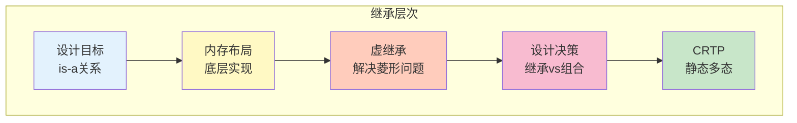
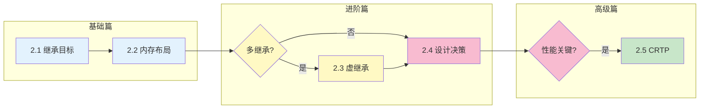

# 第2章 继承 —— 代码复用与层次设计

> [返回目录](../README.md)

## 本章概述

继承是面向对象编程的三大特性之一，它通过**建立类的层次结构**，表达"is-a"（是一种）关系，实现代码复用和多态基础。然而，继承也是一把双刃剑：使用得当可以简化设计、减少重复代码；滥用则会导致强耦合、脆弱基类问题、维护困难。

在本章中，我们将深入探索继承在现代 C++ 中的实现原理与应用：

- 从**设计目标**出发：理解继承的价值与边界
- 到**内存布局**：揭示继承的底层实现机制
- 再到**虚继承**：解决菱形继承的二义性
- 然后是**设计决策**：在继承与组合之间做出选择
- 最后是**CRTP**：静态多态的高级应用

## 本章小节

- [2.1 继承的目标：代码复用与多态基础](./ch02-01-inheritance-goal.md)
  - 问题描述：继承要解决什么问题
  - 核心原理：is-a 关系与成员访问规则
  - 代码示例：继承前后的代码对比

- [2.2 单继承与多继承的内存布局](./ch02-02-memory-layout.md)
  - 单继承对象的内存模型
  - 多继承的内存排列与指针调整
  - 虚表指针（vptr）的位置和作用

- [2.3 虚继承与菱形继承问题](./ch02-03-virtual-inheritance.md)
  - 菱形继承导致的二义性
  - 虚继承的内存布局（vbptr）
  - 虚继承的构造顺序与代价

- [2.4 继承 vs 组合：设计决策](./ch02-04-composition.md)
  - is-a 与 has-a 的判断方法
  - "组合优于继承"的真正含义
  - 脆性基类问题与解决方案

- [2.5 CRTP：奇异递归模板模式](./ch02-05-crtp.md)
  - CRTP 的工作原理
  - 静态多态 vs 动态多态
  - CRTP 的应用场景与局限性

## 学习目标

通过本章学习，你将能够：

| 目标 | 对应小节 |
|-----|---------|
| 理解继承的设计目标和适用边界 | 2.1 |
| 掌握继承的内存布局和底层实现 | 2.2 |
| 理解虚继承解决菱形继承的原理与代价 | 2.3 |
| 在继承与组合之间做出正确的设计决策 | 2.4 |
| 运用 CRTP 实现零开销的静态多态 | 2.5 |
| 编写低耦合、可维护的面向对象代码 | 全章 |

## 章节关系图

## 核心要点速查

| 概念 | 关键要点 |
|-----|---------|
| **is-a 关系** | B is a A 时使用继承，表达类型层次 |
| **has-a 关系** | B has a A 时使用组合，表达部件组装 |
| **虚表指针** | 每个含虚函数的类都有一个 vptr，指向虚函数表 |
| **指针调整** | 多继承类型转换时可能需要调整指针地址 |
| **虚继承** | 解决菱形继承二义性，主要目的不是节省空间 |
| **组合优于继承** | 优先使用组合实现代码复用，继承只用于 is-a |
| **CRTP** | 编译期静态多态，零开销但代码膨胀 |
| **脆性基类** | 基类变化影响所有派生类，组合可避免 |

## 本章思考题

1. 如何判断应该使用继承还是组合？"句子测试法"是什么？
2. 多继承中的指针调整是如何发生的？为什么需要调整？
3. 虚继承会减少内存占用吗？在什么情况下虚继承能节省空间？
4. 什么是"脆性基类"问题？组合如何避免这个问题？
5. CRTP 和虚函数实现的多态有什么本质区别？各适用于什么场景？

---

*上一章：[第1章 封装 —— 数据保护的边界](../ch01/ch01-encapsulation.md)*
*下一章：[第3章 多态 —— 接口抽象与行为扩展](../ch03/ch03-polymorphism.md)*
