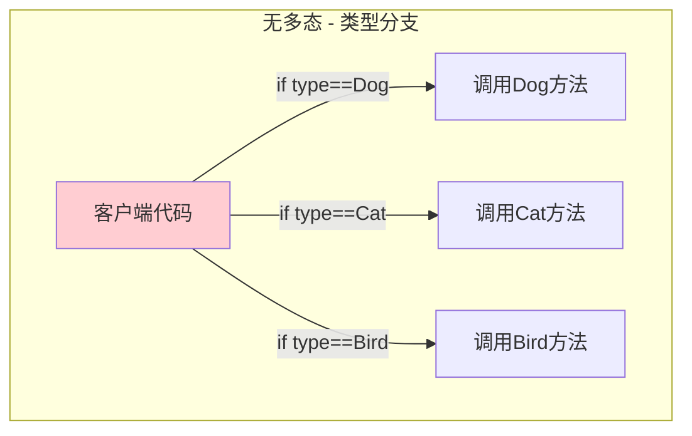
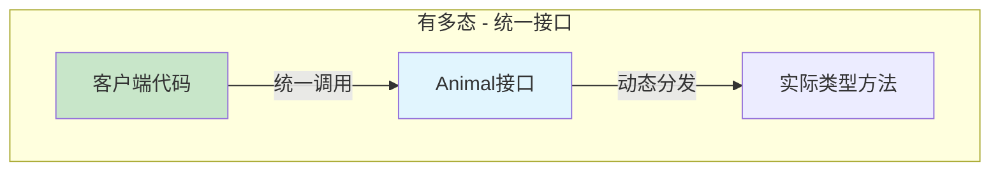
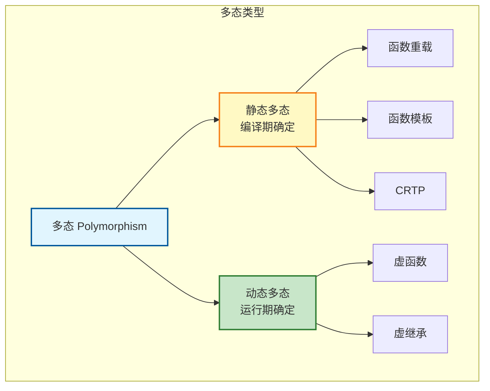
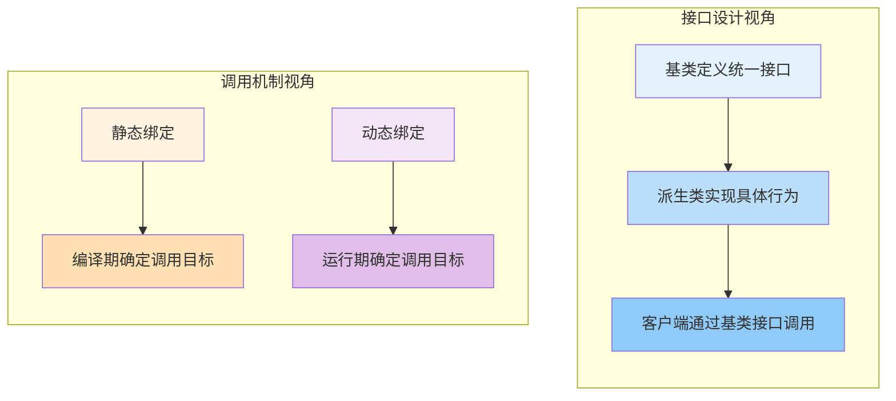
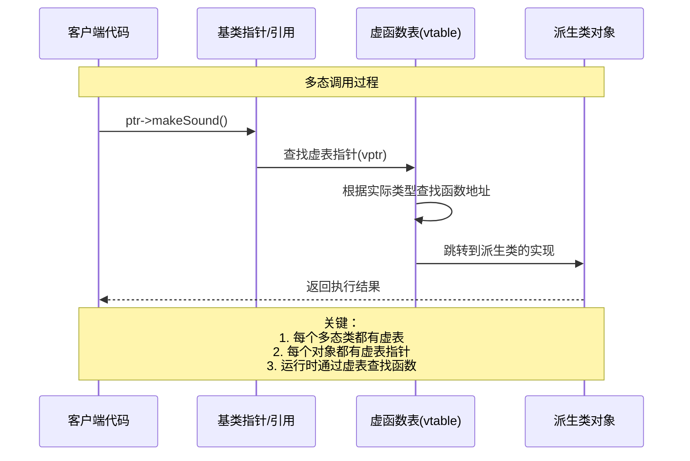
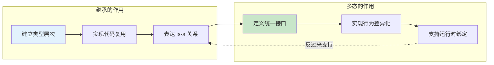
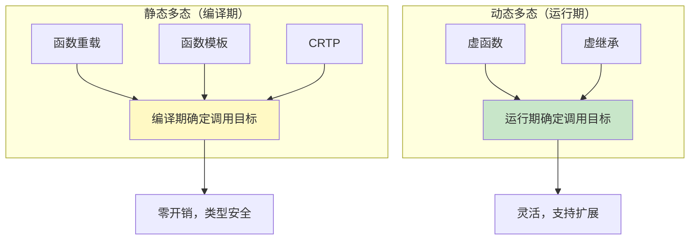
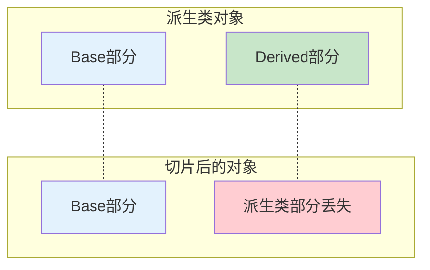

# 3.1 多态的目标：统一接口，不同实现

> [返回第3章](./ch03-polymorphism.md) | [返回目录](../README.md)

在前两章中，我们学习了**封装**（隐藏实现细节）和**继承**（建立类型层次）。多态则是面向对象编程的第三大支柱——它让继承层次真正"活"起来，使得相同的接口调用可以产生不同的行为。

如果说继承建立了"家族关系"，那么多态就是让这个家族的每个成员能够"各司其职"的机制。

---

## 3.1.1 实现目标

### 问题描述

在软件开发中，我们经常需要处理一组具有共同接口但行为不同的对象。如果没有多态机制，会产生以下问题：

| 问题 | 描述 | 后果 |
|------|------|------|
| **类型分支泛滥** | 使用大量 if-else/switch 判断具体类型 | 代码臃肿，难以维护 |
| **扩展困难** | 添加新类型需要修改现有代码 | 违反开闭原则(OCP) |
| **无法统一处理** | 不同类型的对象需要分别处理 | 无法使用容器统一存储和操作 |
| **代码重复** | 相似的操作在不同类型中重复实现 | 维护成本高 |

### 期望效果

通过多态实现以下目标：




1. **统一接口**：通过基类接口统一调用不同派生类的方法
2. **行为扩展**：添加新类型无需修改客户端代码
3. **运行时绑定**：根据实际对象类型动态调用正确的方法
4. **代码简化**：消除大量的类型判断逻辑

---

## 3.1.2 核心原理

### 什么是多态

**多态（Polymorphism）**源自希腊语，意为"多种形态"。在编程中，它允许统一的接口调用产生不同的行为。C++ 支持两种多态：



### 多态的两个视角



### 多态的运作机制



---

## 3.1.3 代码示例

### 示例1：未使用多态（类型分支泛滥）

```cpp
#include <iostream>
#include <string>
#include <vector>

// 枚举类型标识
enum class AnimalType {
    Dog,
    Cat,
    Bird
};

// 动物基类（不使用多态）
class Animal {
public:
    AnimalType type;
    std::string name;

    Animal(AnimalType t, const std::string& n) : type(t), name(n) {}

    void eat() {
        std::cout << name << " is eating.\n";
    }

    void sleep() {
        std::cout << name << " is sleeping.\n";
    }
};

class Dog : public Animal {
public:
    Dog(const std::string& n) : Animal(AnimalType::Dog, n) {}
    void bark() { std::cout << name << " says: Woof!\n"; }
};

class Cat : public Animal {
public:
    Cat(const std::string& n) : Animal(AnimalType::Cat, n) {}
    void meow() { std::cout << name << " says: Meow!\n"; }
};

class Bird : public Animal {
public:
    Bird(const std::string& n) : Animal(AnimalType::Bird, n) {}
    void chirp() { std::cout << name << " says: Tweet!\n"; }
};

// 问题：需要类型分支判断
void makeAnimalSound(const Animal& animal) {
    // 每添加新类型，这里都要修改！
    switch (animal.type) {
        case AnimalType::Dog:
            static_cast<const Dog&>(animal).bark();
            break;
        case AnimalType::Cat:
            static_cast<const Cat&>(animal).meow();
            break;
        case AnimalType::Bird:
            static_cast<const Bird&>(animal).chirp();
            break;
    }
}

int main() {
    Dog dog("Buddy");
    Cat cat("Whiskers");
    Bird bird("Tweety");

    // 必须分别处理
    makeAnimalSound(dog);    // 输出: Buddy says: Woof!
    makeAnimalSound(cat);    // 输出: Whiskers says: Meow!
    makeAnimalSound(bird);   // 输出: Tweety says: Tweet!

    return 0;
}
```

**问题分析**：
1. 每添加新动物类型，需要修改 `makeAnimalSound` 函数
2. 客户端代码必须知道所有具体类型
3. 类型枚举与实际类类型容易不同步

### 示例2：使用多态（统一接口）

```cpp
#include <iostream>
#include <string>
#include <vector>
#include <memory>

// 多态基类：定义统一接口
class Animal {
protected:
    std::string name_;

public:
    Animal(const std::string& name) : name_(name) {}
    virtual ~Animal() = default;  // 虚析构函数（后面详讲）

    // 统一接口：虚函数
    virtual void makeSound() const = 0;  // 纯虚函数

    // 非虚函数：所有派生类共享的行为
    void eat() const {
        std::cout << name_ << " is eating.\n";
    }

    void sleep() const {
        std::cout << name_ << " is sleeping.\n";
    }

    std::string getName() const { return name_; }
};

// 派生类：实现具体行为
class Dog : public Animal {
public:
    Dog(const std::string& name) : Animal(name) {}

    void makeSound() const override {
        std::cout << name_ << " says: Woof!\n";
    }

    void fetch() const {
        std::cout << name_ << " is fetching the ball!\n";
    }
};

class Cat : public Animal {
public:
    Cat(const std::string& name) : Animal(name) {}

    void makeSound() const override {
        std::cout << name_ << " says: Meow!\n";
    }

    void scratch() const {
        std::cout << name_ << " is scratching the furniture!\n";
    }
};

class Bird : public Animal {
public:
    Bird(const std::string& name) : Animal(name) {}

    void makeSound() const override {
        std::cout << name_ << " says: Tweet!\n";
    }

    void fly() const {
        std::cout << name_ << " is flying high!\n";
    }
};

// 统一处理函数：无需类型判断！
void animalSound(const Animal& animal) {
    animal.makeSound();  // 多态调用
}

// 统一处理容器
void zooTour(const std::vector<std::unique_ptr<Animal>>& zoo) {
    std::cout << "\n=== Zoo Tour ===\n";
    for (const auto& animal : zoo) {
        std::cout << "Visiting " << animal->getName() << ": ";
        animal->makeSound();  // 多态调用
    }
}

int main() {
    Dog dog("Buddy");
    Cat cat("Whiskers");
    Bird bird("Tweety");

    // 统一接口调用
    animalSound(dog);    // 输出: Buddy says: Woof!
    animalSound(cat);    // 输出: Whiskers says: Meow!
    animalSound(bird);   // 输出: Tweety says: Tweet!

    // 使用容器统一存储
    std::vector<std::unique_ptr<Animal>> zoo;
    zoo.push_back(std::make_unique<Dog>("Max"));
    zoo.push_back(std::make_unique<Cat>("Mittens"));
    zoo.push_back(std::make_unique<Bird>("Polly"));
    zoo.push_back(std::make_unique<Dog>("Rocky"));

    zooTour(zoo);

    // 输出：
    // === Zoo Tour ===
    // Visiting Max: Max says: Woof!
    // Visiting Mittens: Mittens says: Meow!
    // Visiting Polly: Polly says: Tweet!
    // Visiting Rocky: Rocky says: Woof!

    return 0;
}
```

**优势分析**：
1. 添加新类型只需继承 `Animal`，无需修改 `animalSound` 函数
2. 客户端代码通过基类指针/引用统一处理
3. 可以用容器存储不同类型的派生类对象

### 示例3：多态的实际应用——图形绘制系统

```cpp
#include <iostream>
#include <vector>
#include <memory>
#include <cmath>

const double PI = 3.14159265358979323846;

// 图形基类
class Shape {
protected:
    double x_, y_;  // 位置

public:
    Shape(double x, double y) : x_(x), y_(y) {}
    virtual ~Shape() = default;

    // 统一接口
    virtual double area() const = 0;
    virtual double perimeter() const = 0;
    virtual void draw() const = 0;

    void move(double dx, double dy) {
        x_ += dx;
        y_ += dy;
        std::cout << "Shape moved to (" << x_ << ", " << y_ << ")\n";
    }
};

class Rectangle : public Shape {
    double width_, height_;

public:
    Rectangle(double x, double y, double w, double h)
        : Shape(x, y), width_(w), height_(h) {}

    double area() const override {
        return width_ * height_;
    }

    double perimeter() const override {
        return 2 * (width_ + height_);
    }

    void draw() const override {
        std::cout << "Drawing Rectangle at (" << x_ << ", " << y_
                  << ") size: " << width_ << "x" << height_ << "\n";
    }
};

class Circle : public Shape {
    double radius_;

public:
    Circle(double x, double y, double r)
        : Shape(x, y), radius_(r) {}

    double area() const override {
        return PI * radius_ * radius_;
    }

    double perimeter() const override {
        return 2 * PI * radius_;
    }

    void draw() const override {
        std::cout << "Drawing Circle at (" << x_ << ", " << y_
                  << ") radius: " << radius_ << "\n";
    }
};

class Triangle : public Shape {
    double a_, b_, c_;  // 三边长

public:
    Triangle(double x, double y, double a, double b, double c)
        : Shape(x, y), a_(a), b_(b), c_(c) {}

    double area() const override {
        // 海伦公式
        double s = (a_ + b_ + c_) / 2;
        return std::sqrt(s * (s - a_) * (s - b_) * (s - c_));
    }

    double perimeter() const override {
        return a_ + b_ + c_;
    }

    void draw() const override {
        std::cout << "Drawing Triangle at (" << x_ << ", " << y_
                  << ") sides: " << a_ << ", " << b_ << ", " << c_ << "\n";
    }
};

// 统一处理：计算总面积
double totalArea(const std::vector<std::unique_ptr<Shape>>& shapes) {
    double sum = 0;
    for (const auto& shape : shapes) {
        sum += shape->area();  // 多态调用
    }
    return sum;
}

// 统一处理：绘制所有图形
void drawAll(const std::vector<std::unique_ptr<Shape>>& shapes) {
    std::cout << "\n=== Drawing All Shapes ===\n";
    for (const auto& shape : shapes) {
        shape->draw();  // 多态调用
    }
}

int main() {
    std::vector<std::unique_ptr<Shape>> shapes;

    shapes.push_back(std::make_unique<Rectangle>(0, 0, 5, 3));
    shapes.push_back(std::make_unique<Circle>(10, 10, 2));
    shapes.push_back(std::make_unique<Triangle>(5, 5, 3, 4, 5));

    drawAll(shapes);

    std::cout << "\nTotal Area: " << totalArea(shapes) << "\n";
    // 输出: Total Area: 32.5664

    // 统一移动所有图形
    for (auto& shape : shapes) {
        shape->move(1, 1);
    }

    return 0;
}
```

---

## 3.1.4 深入讲解

### 多态与继承的关系

继承和多态是相辅相成的：



| 方面 | 继承 | 多态 |
|------|------|------|
| **作用** | 建立类型层次 | 实现行为差异化 |
| **关注点** | 类之间的关系 | 接口与实现的映射 |
| **编译期** | 构建类型体系 | 检查虚函数覆盖 |
| **运行期** | 对象包含基类和派生类部分 | 动态绑定实际函数 |

### 多态的三大价值

#### 1. 代码复用与简化

```cpp
// 无多态：每个图形单独处理
void drawRectangle(const Rectangle& r) { r.draw(); }
void drawCircle(const Circle& c) { c.draw(); }
void drawTriangle(const Triangle& t) { t.draw(); }

// 有多态：统一处理
void drawShape(const Shape& s) { s.draw(); }
```

#### 2. 开闭原则（Open-Closed Principle）

> "软件实体应该对扩展开放，对修改关闭。"

```cpp
// 添加新图形类型，无需修改现有代码
class Ellipse : public Shape {
    double a_, b_;  // 长轴和短轴
public:
    Ellipse(double x, double y, double a, double b)
        : Shape(x, y), a_(a), b_(b) {}

    double area() const override { return PI * a_ * b_; }
    double perimeter() const override {
        return PI * (3 * (a_ + b_) - std::sqrt((3 * a_ + b_) * (a_ + 3 * b_)));
    }
    void draw() const override {
        std::cout << "Drawing Ellipse\n";
    }
};

// 现有的 drawAll、totalArea 等函数自动支持 Ellipse！
```

#### 3. 框架设计的基石

许多设计模式依赖多态：

| 设计模式 | 多态的作用 |
|---------|-----------|
| **策略模式** | 不同策略实现同一接口 |
| **工厂模式** | 根据类型创建不同产品 |
| **观察者模式** | 不同观察者响应同一事件 |
| **模板方法** | 基类定义算法骨架，派生类实现具体步骤 |

```cpp
// 策略模式示例
class SortStrategy {
public:
    virtual void sort(std::vector<int>& data) = 0;
    virtual ~SortStrategy() = default;
};

class BubbleSort : public SortStrategy {
public:
    void sort(std::vector<int>& data) override {
        // 冒泡排序实现
    }
};

class QuickSort : public SortStrategy {
public:
    void sort(std::vector<int>& data) override {
        // 快速排序实现
    }
};

// 客户端代码无需关心具体排序算法
void processData(std::vector<int>& data, SortStrategy& strategy) {
    strategy.sort(data);
}
```

### 静态多态 vs 动态多态



| 特性 | 静态多态 | 动态多态 |
|------|---------|---------|
| **绑定时机** | 编译期 | 运行期 |
| **性能** | 零开销（内联优化） | 有虚函数调用开销 |
| **灵活性** | 需要知道所有类型 | 可添加新类型 |
| **类型安全** | 完全编译期检查 | 运行期类型检查 |
| **代码膨胀** | 可能较大（模板实例化） | 较小 |
| **典型应用** | 算法库（STL） | 插件系统、框架设计 |

---

## 3.1.5 常见陷阱与最佳实践

### 常见陷阱

#### 陷阱1：对象切片

```cpp
#include <iostream>

class Base {
public:
    virtual void func() { std::cout << "Base\n"; }
};

class Derived : public Base {
public:
    void func() override { std::cout << "Derived\n"; }
    void extra() { std::cout << "Extra\n"; }
};

// ❌ 陷阱：按值传递导致对象切片
void processByValue(Base obj) {  // 对象被切片为 Base
    obj.func();  // 输出: Base（不是 Derived！）
}

// ✅ 正确：按引用传递
void processByRef(const Base& obj) {
    obj.func();  // 输出: Derived
}

int main() {
    Derived d;
    processByValue(d);   // 输出: Base（多态失效！）
    processByRef(d);     // 输出: Derived

    return 0;
}
```

**原理**：按值传递会复制对象，但只复制基类部分，派生类部分被"切掉"。



#### 陷阱2：在构造/析构函数中调用虚函数

```cpp
#include <iostream>

class Base {
public:
    Base() {
        init();  // 调用虚函数
    }

    virtual void init() {
        std::cout << "Base::init\n";
    }

    virtual ~Base() {
        cleanup();
    }

    virtual void cleanup() {
        std::cout << "Base::cleanup\n";
    }
};

class Derived : public Base {
    std::string data_;

public:
    Derived() : data_("important") {
        // 此时 Base 构造函数已经执行完毕
    }

    void init() override {
        std::cout << "Derived::init, data=" << data_ << "\n";
    }

    void cleanup() override {
        std::cout << "Derived::cleanup\n";
    }
};

int main() {
    Derived d;
    // 输出:
    // Base::init        (不是 Derived::init!)
    // Base::cleanup     (不是 Derived::cleanup!)
}
```

**原因**：在基类构造函数执行时，派生类部分还未初始化，此时调用虚函数只会调用基类版本。

**解决方案**：避免在构造函数中调用虚函数，或者使用非虚的 init 函数由派生类显式调用。

#### 陷阱3：忘记 override 关键字

```cpp
class Base {
public:
    virtual void func() {}
    virtual void process(int x) {}
};

class Derived : public Base {
public:
    // ❌ 拼写错误：没有重写，而是创建新函数
    void fumc() {}  // 编译通过，但不是重写！

    // ❌ 签名不匹配：没有重写
    void process(double x) {}  // 隐藏了基类的 process(int)

    // ✅ 使用 override 让编译器检查
    // void fumc() override {}  // 编译错误！没有名为 fumc 的虚函数
    // void process(double x) override {}  // 编译错误！签名不匹配
};
```

#### 陷阱4：继承破坏封装

```cpp
#include <vector>

class Base {
protected:
    std::vector<int> data_;  // protected让派生类可以直接访问

public:
    void add(int value) {
        data_.push_back(value);
    }
};

class Derived : public Base {
public:
    void modify(int index, int value) {
        if (index >= 0 && index < data_.size()) {
            data_[index] = value;  // 直接操作基类的内部数据
        }
    }
    // 问题：如果 Base 改变了 data_ 的实现，Derived 也需要修改
};
```

**更好的做法**：通过基类的 public 接口操作，而不是直接访问 protected 成员。

---

### 最佳实践

#### 1. 多态基类必须声明虚析构函数

```cpp
// ❌ 危险：没有虚析构函数
class Base {
public:
    ~Base() { std::cout << "Base dtor\n"; }
    virtual void func() = 0;
};

class Derived : public Base {
public:
    ~Derived() { std::cout << "Derived dtor\n"; }
    void func() override {}
};

Base* ptr = new Derived();
delete ptr;  // 未定义行为！Derived析构函数可能不会被调用

// ✅ 正确：声明虚析构函数
class Base {
public:
    virtual ~Base() { std::cout << "Base dtor\n"; }
    virtual void func() = 0;
};

// 现在 delete ptr 会正确调用：Derived析构函数 → Base析构函数
```

#### 2. 始终使用 `override` 关键字（C++11及以上）

```cpp
class Base {
public:
    virtual void func() {}
    virtual void process() {}
};

class Derived : public Base {
public:
    // ✅ 明确表示要重写基类函数
    void func() override {}

    // ✅ 编译器会检查是否真的重写了虚函数
    // void fumc() override {}  // 编译错误：没有名为fumc的虚函数
    // void func() const override {}  // 编译错误：没有const版本的func
};
```

#### 3. 多态传递优先使用引用而非指针

```cpp
// ✅ 更好：使用引用
void process(const Animal& animal) {
    animal.makeSound();
}

// ⚠️ 可用但不推荐：使用原始指针
void process(const Animal* animal) {
    animal->makeSound();
}

// ✅ 最佳：使用智能指针
void process(const std::unique_ptr<Animal>& animal) {
    animal->makeSound();
}
```

#### 4. 纯虚函数 vs 普通虚函数的选择

```cpp
class Animal {
public:
    // 纯虚函数：强制派生类实现
    virtual void makeSound() const = 0;

    // 普通虚函数：提供默认实现，派生类可选择重写
    virtual void eat() const {
        std::cout << "Animal is eating.\n";
    }

    // 非虚函数：不期望派生类改变的行为
    std::string getName() const {
        return name_;
    }

protected:
    std::string name_;
};
```

**选择标准**：
- **纯虚函数**：所有派生类必须提供自己的实现
- **普通虚函数**：提供通用行为，派生类可选择性重写
- **非虚函数**：不期望派生类改变的行为

#### 5. 避免隐藏基类的重载

```cpp
class Base {
public:
    virtual void func(int x) { std::cout << "Base::func int\n"; }
    void func(double x) { std::cout << "Base::func double\n"; }
};

class Derived : public Base {
public:
    // 使用 using 引入基类所有重载
    using Base::func;

    void func(int x) override { std::cout << "Derived::func int\n"; }
};

Derived d;
d.func(1);     // Derived::func int
d.func(1.0);   // Base::func double (因为有 using)
```

---

## 3.1.6 思考题

1. 为什么说"多态是面向对象编程的灵魂"？
   > 提示：从代码复用、扩展性、框架设计等角度思考

2. 以下代码的输出是什么？为什么？
   ```cpp
   class Base {
   public:
       virtual void func() { std::cout << "Base"; }
       Base() { func(); }
   };
   class Derived : public Base {
   public:
       void func() override { std::cout << "Derived"; }
   };
   int main() {
       Derived d;
   }
   ```

3. 对象切片是如何发生的？如何避免？

4. 静态多态和动态多态各有什么优缺点？如何选择？

5. 为什么多态基类的析构函数必须是虚函数？

---

*下一节：[3.2 静态多态：函数重载与模板](./ch03-02-static-polymorphism.md)*
