# 《系统高级编程：从原理到实践》企划方案

## 一、项目背景

### 1.1 目标读者
- 有一定的应用层开发经验（如Web开发、移动应用开发）
- 缺乏底层系统编程知识

### 1.2 读者现状分析
| 优势 | 待提升 |
|------|--------|
| 具备基本编程能力 | 缺乏底层原理理解 |
| 能完成功能开发 | 代码质量和性能意识不足 |
| 熟悉应用层框架 | 不了解系统级资源管理 |
| 有项目实践经验 | 缺乏高级开发技巧 |

### 1.3 学习目标
- 理解C++核心特性（封装、继承、多态）的底层实现原理
- 掌握多线程编程的精髓与常见陷阱
- 掌握原子操作与无锁编程技术
- 理解内存管理的底层机制与优化策略
- 掌握网络编程的核心模型与高性能框架
- 了解数据分发服务(DDS)的原理与应用
- 了解内核编程的基础知识
- 培养编写高质量、高性能代码的思维

---

## 二、文档设计原则

### 2.1 内容结构
每个知识点采用统一的讲述结构：
```
1. 实现目标 → 我们要解决什么问题
2. 核心原理 → 底层是如何实现的
3. 系统架构 → Mermaid流程图/架构图
4. 代码示例 → 完整可运行的示例代码
5. 深入讲解 → 原理分析、最佳实践、常见陷阱
```

### 2.2 难度递进
```
基础原理层 → 机制实现层 → 高级应用层 → 性能优化层
     ↓            ↓            ↓            ↓
   概念理解    源码分析    工程实践    生产级方案
```

### 2.3 图表设计
使用Mermaid绘制：
- **流程图**：展示执行流程、调用关系
- **时序图**：展示多线程交互、消息传递
- **类图**：展示类之间的关系（继承、组合）
- **状态图**：展示对象状态转换
- **架构图**：展示系统整体结构
- **序列图**：展示网络通信交互

---

## 三、内容大纲

### 第一部分：C++核心特性深度剖析

#### 第1章 封装 —— 数据保护的边界
- 1.1 封装的目标：数据隐藏与接口暴露
- 1.2 访问修饰符的底层实现
- 1.3 构造函数与析构函数的调用时机
- 1.4 RAII：资源管理即生命周期
- 1.5 智能指针的现代封装实践

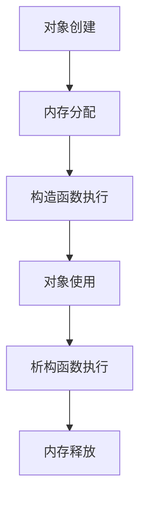
```mermaid
graph TB
    A[对象创建] --> B[内存分配]
    B --> C[构造函数执行]
    C --> D[对象使用]
    D --> E[析构函数执行]
    E --> F[内存释放]
```

#### 第2章 继承 —— 代码复用与层次设计
- 2.1 继承的目标：代码复用与多态基础
- 2.2 单继承与多继承的内存布局
- 2.3 虚继承与菱形继承问题
- 2.4 继承 vs 组合：设计决策
- 2.5 CRTP：奇异递归模板模式

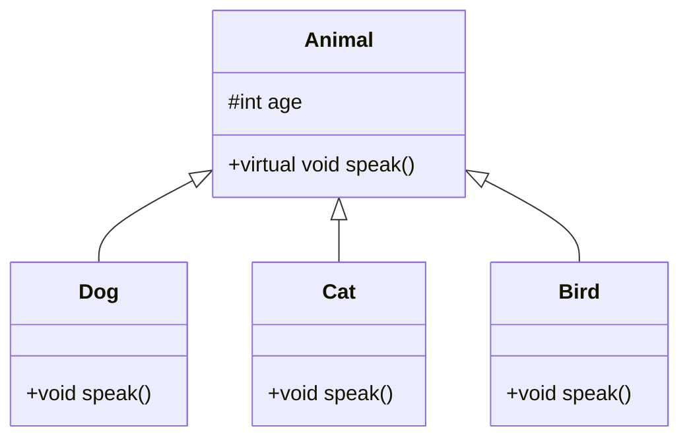
```mermaid
classDiagram
    Animal <|-- Dog
    Animal <|-- Cat
    Animal <|-- Bird
    class Animal {
        +virtual void speak()
        #int age
    }
    class Dog {
        +void speak()
    }
    class Cat {
        +void speak()
    }
    class Bird {
        +void speak()
    }
```

#### 第3章 多态 —— 动态分发的艺术
- 3.1 多态的目标：统一接口，不同实现
- 3.2 静态多态：函数重载与模板
- 3.3 动态多态：虚函数与虚表
- 3.4 虚函数表的内存布局与调用过程
- 3.5 虚析构函数的重要性
- 3.6 final与override关键字

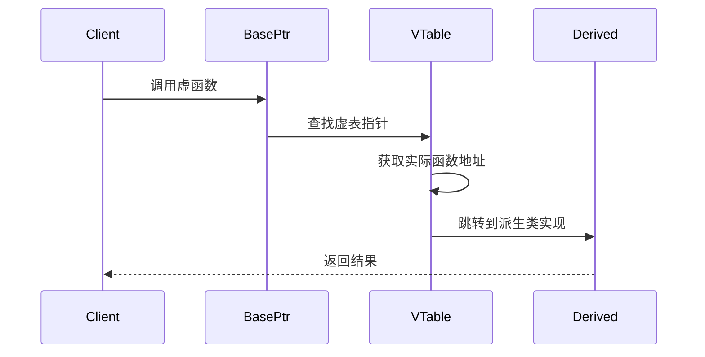
```mermaid
sequenceDiagram
    participant Client
    participant BasePtr
    participant VTable
    participant Derived

    Client->>BasePtr: 调用虚函数
    BasePtr->>VTable: 查找虚表指针
    VTable->>VTable: 获取实际函数地址
    VTable->>Derived: 跳转到派生类实现
    Derived-->>Client: 返回结果
```

---

### 第二部分：多线程编程

#### 第4章 线程基础与原子操作
- 4.1 进程 vs 线程：资源与调度的差异
- 4.2 线程的创建与生命周期
- 4.3 线程标识与线程间通信
- 4.4 **原子操作详解**（扩展）
  - 4.4.1 原子类型与std::atomic
  - 4.4.2 内存序：memory_order_relaxed/acquire/release/seq_cst
  - 4.4.3 原子操作的实现原理（CAS指令）
  - 4.4.4 ABA问题及其解决方案
- 4.5 CAS操作与无锁编程入门

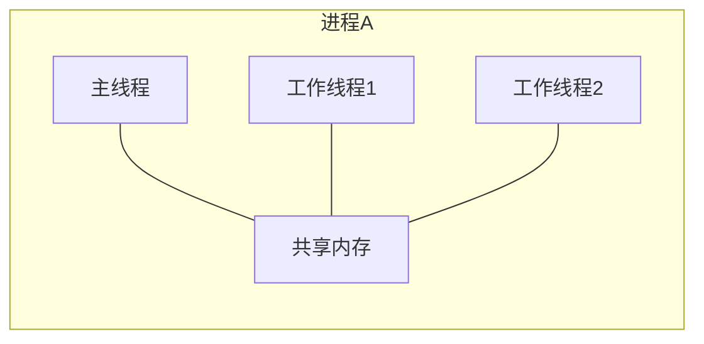
```mermaid
graph LR
    subgraph 进程A
        T1[主线程]
        T2[工作线程1]
        T3[工作线程2]
        M[共享内存]
    end
    T1 --- M
    T2 --- M
    T3 --- M
```

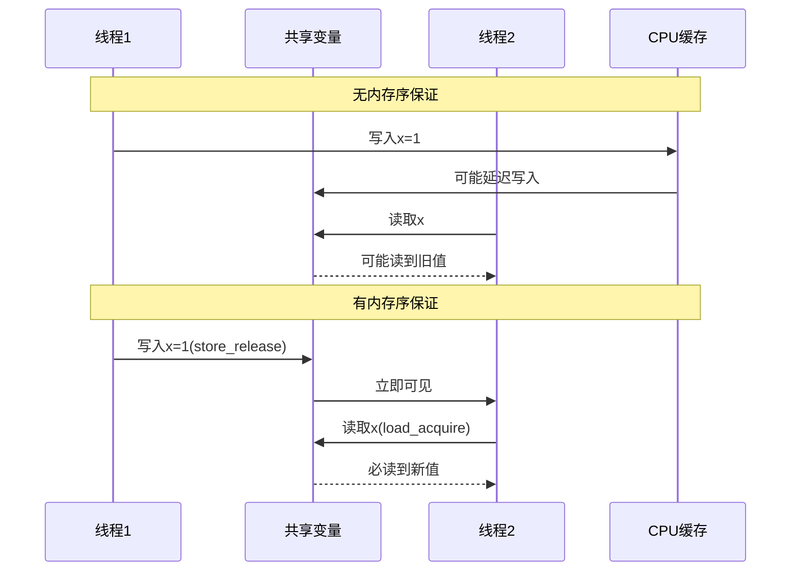
```mermaid
sequenceDiagram
    participant T1 as 线程1
    participant Mem as 共享变量
    participant T2 as 线程2
    participant Cache as CPU缓存

    Note over T1,Cache: 无内存序保证
    T1->>Cache: 写入x=1
    Cache->>Mem: 可能延迟写入
    T2->>Mem: 读取x
    Mem-->>T2: 可能读到旧值

    Note over T1,Cache: 有内存序保证
    T1->>Mem: 写入x=1(store_release)
    Mem->>T2: 立即可见
    T2->>Mem: 读取x(load_acquire)
    Mem-->>T2: 必读到新值
```

#### 第5章 同步原语
- 5.1 互斥锁：独占访问的实现原理
- 5.2 读写锁：读者-写者问题的解决方案
- 5.3 条件变量：线程间的等待与通知机制
- 5.4 信号量：资源计数器
- 5.5 屏障：集合点同步

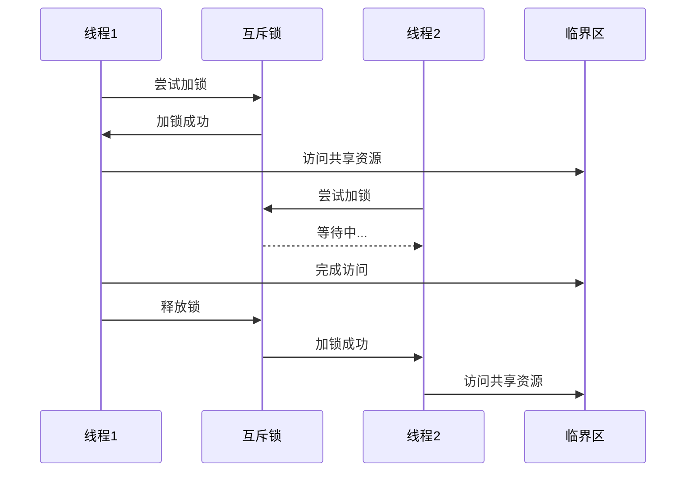
```mermaid
sequenceDiagram
    participant T1 as 线程1
    participant M as 互斥锁
    participant T2 as 线程2
    participant CR as 临界区

    T1->>M: 尝试加锁
    M->>T1: 加锁成功
    T1->>CR: 访问共享资源
    T2->>M: 尝试加锁
    M-->>T2: 等待中...
    T1->>CR: 完成访问
    T1->>M: 释放锁
    M->>T2: 加锁成功
    T2->>CR: 访问共享资源
```

#### 第6章 线程安全设计模式
- 6.1 守卫锁：RAII风格的锁管理
- 6.2 双重检查锁定：单例模式的线程安全实现
- 6.3 读写锁模式：Copy-on-Write
- 6.4 生产者-消费者模式
- 6.5 线程池设计：任务调度与资源复用

#### 第7章 无锁数据结构与算法（新增独立章节）
- 7.1 无锁编程概述：优势与挑战
- 7.2 无锁栈：基于CAS的实现
- 7.3 无锁队列：Michael & Scott算法
- 7.4 无锁单向链表
- 7.5 RCU（Read-Copy-Update）：读者无锁机制
- 7.6 无锁哈希表设计
- 7.7 无锁编程的陷阱与最佳实践

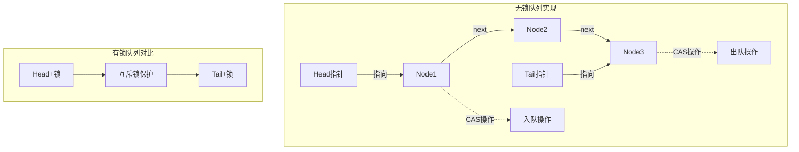
```mermaid
graph TB
    subgraph 无锁队列实现
        Head[Head指针] -->|指向| N1[Node1]
        N1 -->|next| N2[Node2]
        N2 -->|next| N3[Node3]
        Tail[Tail指针] -->|指向| N3

        N1 -.->|CAS操作| Push[入队操作]
        N3 -.->|CAS操作| Pop[出队操作]
    end

    subgraph 有锁队列对比
        MHead[Head+锁] --> Lock[互斥锁保护]
        Lock --> MTail[Tail+锁]
    end
```

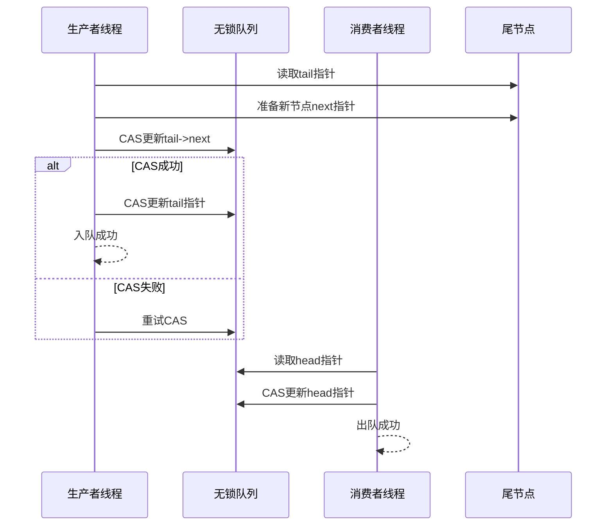
```mermaid
sequenceDiagram
    participant T1 as 生产者线程
    participant Q as 无锁队列
    participant T2 as 消费者线程
    participant N as 尾节点

    T1->>N: 读取tail指针
    T1->>N: 准备新节点next指针
    T1->>Q: CAS更新tail->next
    alt CAS成功
        T1->>Q: CAS更新tail指针
        T1-->>T1: 入队成功
    else CAS失败
        T1->>Q: 重试CAS
    end

    T2->>Q: 读取head指针
    T2->>Q: CAS更新head指针
    T2-->>T2: 出队成功
```

#### 第8章 常见并发问题与调试
- 8.1 竞态条件：TOCTOU与数据竞争
- 8.2 死锁：四个必要条件与预防策略
- 8.3 活锁与饥饿
- 8.4 伪共享：缓存一致性问题的本质
- 8.5 并发调试工具与技巧（ThreadSanitizer、Helgrind等）

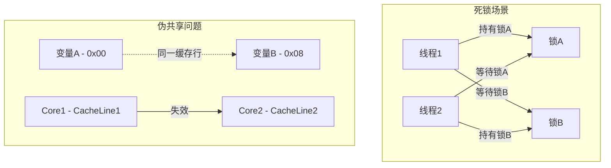
```mermaid
graph TB
    subgraph 死锁场景
        T1[线程1] -->|持有锁A| LK1[锁A]
        T1 -->|等待锁B| LK2[锁B]
        T2[线程2] -->|持有锁B| LK2
        T2 -->|等待锁A| LK1
    end

    subgraph 伪共享问题
        C1[Core1 - CacheLine1]
        C2[Core2 - CacheLine2]
        V1[变量A - 0x00]
        V2[变量B - 0x08]
        V1 -.->|同一缓存行| V2
        C1 -->|失效| C2
    end
```

---

### 第三部分：内存管理

#### 第9章 内存管理深度剖析（新增独立章节）
- 9.1 内存区域划分：栈、堆、全局区、代码区
- 9.2 内存分配器的实现原理
  - 9.2.1 dlmalloc与ptmalloc
  - 9.2.2 tcmalloc：Google的内存分配器
  - 9.2.3 jemalloc：Facebook的内存分配器
- 9.3 内存池设计：预分配与对象复用
- 9.4 对象池：减少分配/释放开销
- 9.5 内存碎片：内部碎片与外部碎片
- 9.6 内存泄漏检测与预防
- 9.7 自定义内存管理与placement new

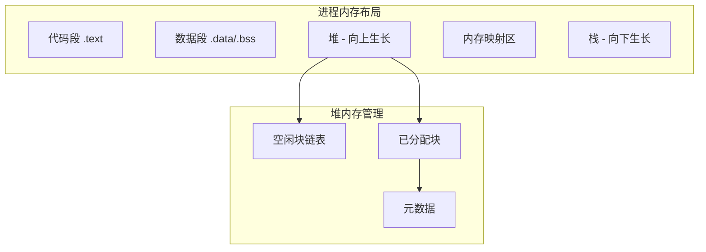
```mermaid
graph TB
    subgraph 进程内存布局
        Code[代码段 .text]
        Data[数据段 .data/.bss]
        Heap[堆 - 向上生长]
        Mapped[内存映射区]
        Stack[栈 - 向下生长]
    end

    subgraph 堆内存管理
        Free[空闲块链表]
        Alloc[已分配块]
        Meta[元数据]
    end

    Heap --> Free
    Heap --> Alloc
    Alloc --> Meta
```

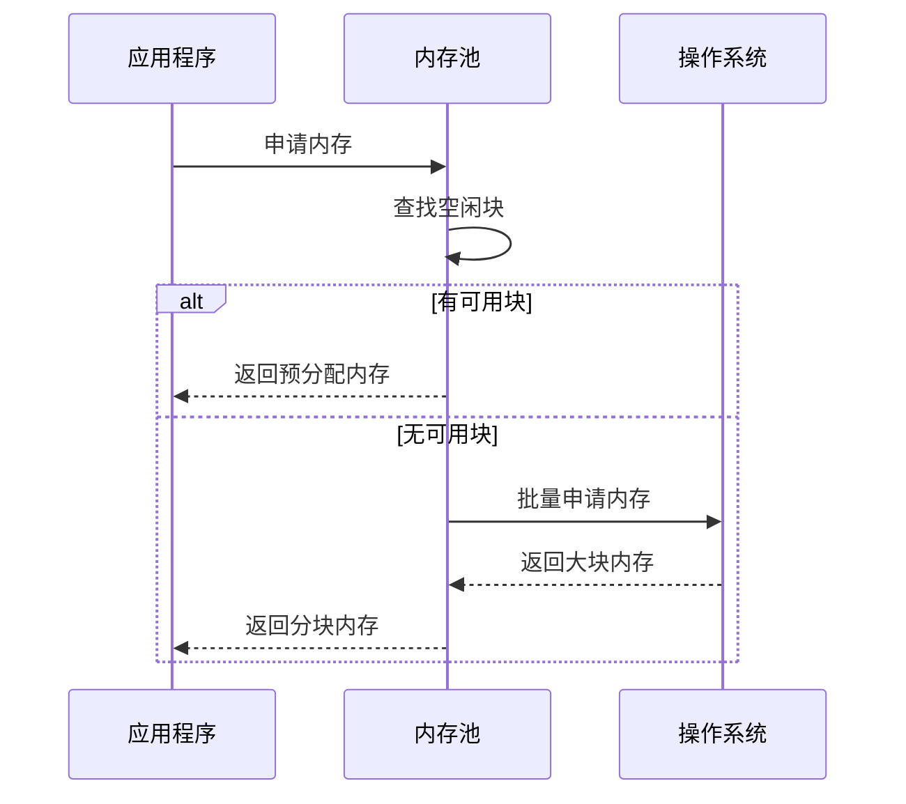
```mermaid
sequenceDiagram
    participant App as 应用程序
    participant Pool as 内存池
    participant Sys as 操作系统

    App->>Pool: 申请内存
    Pool->>Pool: 查找空闲块
    alt 有可用块
        Pool-->>App: 返回预分配内存
    else 无可用块
        Pool->>Sys: 批量申请内存
        Sys-->>Pool: 返回大块内存
        Pool-->>App: 返回分块内存
    end
```

---

### 第四部分：系统实时性开发

#### 第10章 时间与定时器
- 10.1 时间源：CLOCK_REALTIME vs CLOCK_MONOTONIC vs CLOCK_BOOTTIME
- 10.2 高精度定时器实现
- 10.3 定时器轮：时间轮算法
- 10.4 最小堆定时器
- 10.5 时间轮与最小堆的性能对比

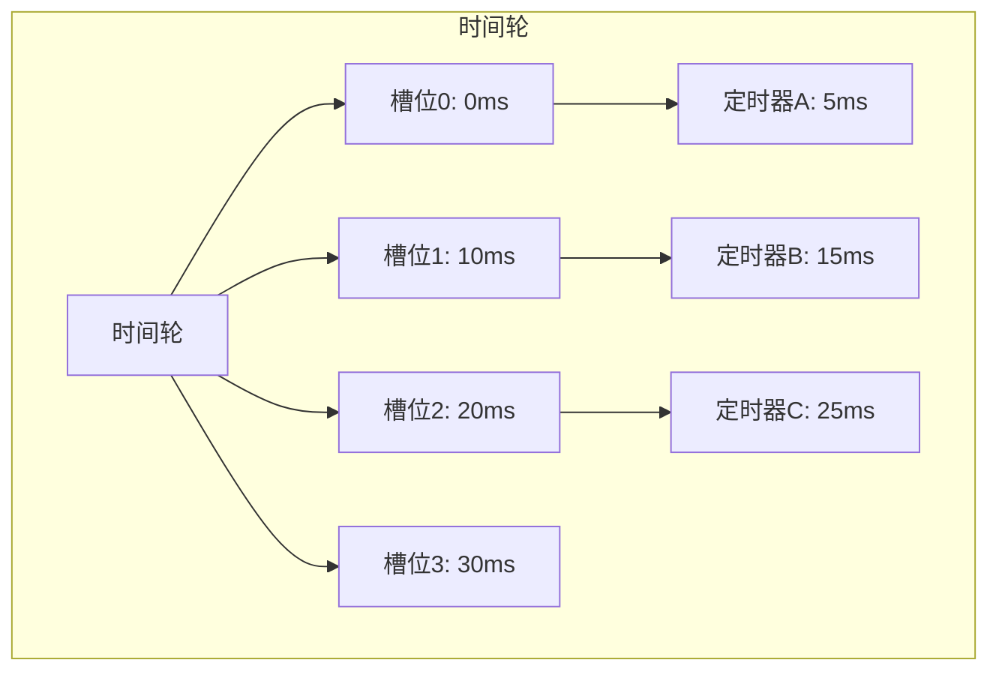
```mermaid
graph TB
    subgraph 时间轮
        W[时间轮] --> S0[槽位0: 0ms]
        W --> S1[槽位1: 10ms]
        W --> S2[槽位2: 20ms]
        W --> S3[槽位3: 30ms]
        S0 --> T1[定时器A: 5ms]
        S1 --> T2[定时器B: 15ms]
        S2 --> T3[定时器C: 25ms]
    end
```

#### 第11章 I/O模型与事件驱动
- 11.1 I/O模型对比：阻塞/非阻塞/多路复用/信号驱动/异步
- 11.2 select/poll/epoll：原理与差异
- 11.3 Reactor模式：事件分发与处理
- 11.4 Proactor模式：异步I/O
- 11.5 边缘触发 vs 电平触发
- 11.6 事件驱动框架：libevent、libuv

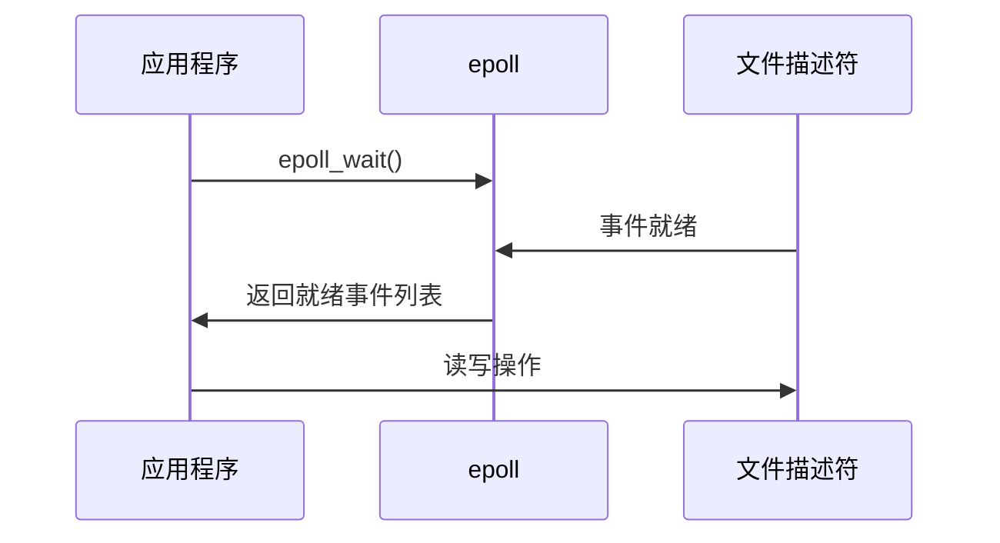
```mermaid
sequenceDiagram
    participant App as 应用程序
    participant Epoll as epoll
    participant FD as 文件描述符

    App->>Epoll: epoll_wait()
    FD->>Epoll: 事件就绪
    Epoll->>App: 返回就绪事件列表
    App->>FD: 读写操作
```

#### 第12章 实时调度策略
- 12.1 调度策略：SCHED_OTHER/SCHED_FIFO/SCHED_RR/SCHED_DEADLINE
- 12.2 优先级反转与优先级继承
- 12.3 CPU亲和性：绑定核心
- 12.4 实时编程的约束与限制

#### 第13章 性能优化技术
- 13.1 缓存友好代码设计
- 13.2 分支预测与代码优化
- 13.3 SIMD指令入门
- 13.4 性能分析工具：perf、gprof、valgrind
- 13.5 热点优化实战案例

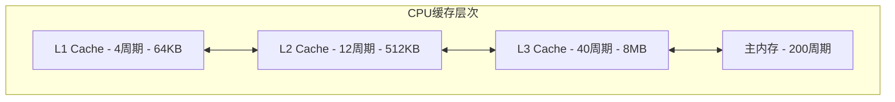
```mermaid
graph TB
    subgraph CPU缓存层次
        L1[L1 Cache - 4周期 - 64KB]
        L2[L2 Cache - 12周期 - 512KB]
        L3[L3 Cache - 40周期 - 8MB]
        MEM[主内存 - 200周期]
    end
    L1 <--> L2
    L2 <--> L3
    L3 <--> MEM
```

---

### 第五部分：网络编程

#### 第14章 网络编程基础（新增独立章节）
- 14.1 TCP/IP协议栈回顾
- 14.2 Socket API详解
  - 14.2.1 Socket创建与配置
  - 14.2.2 bind/listen/accept
  - 14.2.3 connect/send/recv
- 14.3 TCP协议细节：三次握手、四次挥手、拥塞控制
- 14.4 UDP协议与组播
- 14.5 Socket选项与优化

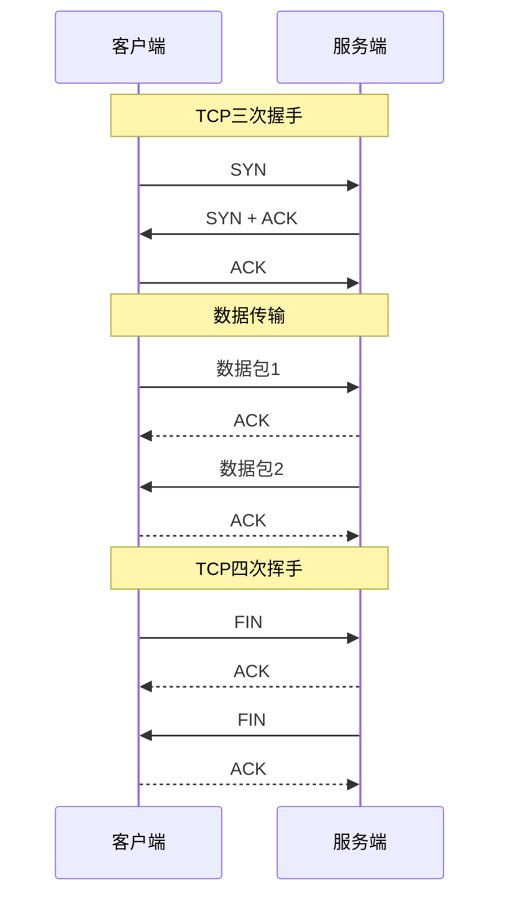
```mermaid
sequenceDiagram
    participant Client as 客户端
    participant Server as 服务端

    Note over Client,Server: TCP三次握手
    Client->>Server: SYN
    Server->>Client: SYN + ACK
    Client->>Server: ACK

    Note over Client,Server: 数据传输
    Client->>Server: 数据包1
    Server-->>Client: ACK
    Server->>Client: 数据包2
    Client-->>Server: ACK

    Note over Client,Server: TCP四次挥手
    Client->>Server: FIN
    Server-->>Client: ACK
    Server->>Client: FIN
    Client-->>Server: ACK
```

#### 第15章 高性能网络服务器模型（新增独立章节）
- 15.1 传统并发模型：每连接一个进程/线程
- 15.2 Reactor模式：单线程/多线程Reactor
- 15.3 Proactor模式：基于异步I/O
- 15.4 主从Reactor：Netty/Muduo模式
- 15.5 零拷贝技术：sendfile、splice、mmap
- 15.6 高性能框架案例：Muduo、ACE、Boost.Asio

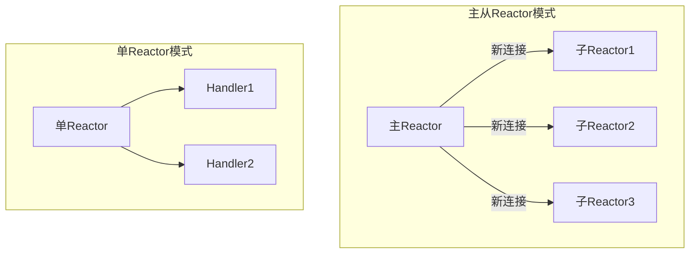
```mermaid
graph TB
    subgraph 主从Reactor模式
        MainReactor[主Reactor]
        SubReactor1[子Reactor1]
        SubReactor2[子Reactor2]
        SubReactor3[子Reactor3]

        MainReactor -->|新连接| SubReactor1
        MainReactor -->|新连接| SubReactor2
        MainReactor -->|新连接| SubReactor3
    end

    subgraph 单Reactor模式
        Reactor[单Reactor]
        Handler1[Handler1]
        Handler2[Handler2]
        Reactor --> Handler1
        Reactor --> Handler2
    end
```

#### 第16章 RPC框架原理（新增小节）
- 16.1 RPC概述：从本地调用到远程调用
- 16.2 序列化与反序列化
- 16.3 网络传输层设计
- 16.4 服务注册与发现
- 16.5 负载均衡策略
- 16.6 开源RPC框架：gRPC、Thrift、brpc

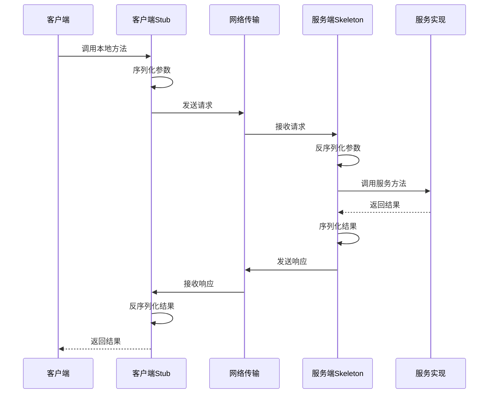
```mermaid
sequenceDiagram
    participant Client as 客户端
    participant Stub as 客户端Stub
    participant Net as 网络传输
    participant Skeleton as 服务端Skeleton
    participant Server as 服务实现

    Client->>Stub: 调用本地方法
    Stub->>Stub: 序列化参数
    Stub->>Net: 发送请求
    Net->>Skeleton: 接收请求
    Skeleton->>Skeleton: 反序列化参数
    Skeleton->>Server: 调用服务方法
    Server-->>Skeleton: 返回结果
    Skeleton->>Skeleton: 序列化结果
    Skeleton->>Net: 发送响应
    Net->>Stub: 接收响应
    Stub->>Stub: 反序列化结果
    Stub-->>Client: 返回结果
```

---

### 第六部分：数据分发服务

#### 第17章 数据分发服务DDS（新增独立章节）
- 17.1 DDS概述：实时发布订阅协议
- 17.2 DDS核心概念
  - 17.2.1 Domain（域）
  - 17.2.2 Topic（主题）
  - 17.2.3 Publisher/Subscriber（发布者/订阅者）
  - 17.2.4 DataWriter/DataReader（数据写入者/读取者）
- 17.3 QoS策略：质量服务策略详解
  - 17.3.1 可靠性QoS
  - 17.3.2 持久性QoS
  - 17.3.3 延迟与吞吐量QoS
  - 17.3.4 资源限制QoS
- 17.4 DDS发现机制
- 17.5 DDS通信模型
- 17.6 开源DDS实现：FastDDS、OpenDDS、CycloneDDS

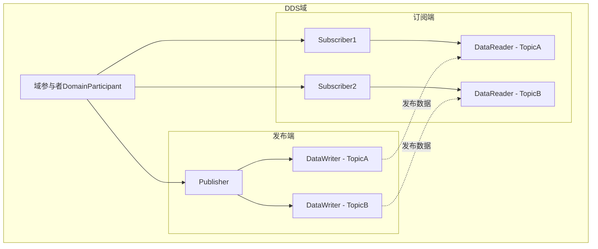
```mermaid
graph TB
    subgraph DDS域
        DC[域参与者DomainParticipant]

        subgraph 发布端
            Pub[Publisher]
            DW1[DataWriter - TopicA]
            DW2[DataWriter - TopicB]
            Pub --> DW1
            Pub --> DW2
        end

        subgraph 订阅端
            Sub1[Subscriber1]
            Sub2[Subscriber2]
            DR1[DataReader - TopicA]
            DR2[DataReader - TopicB]
            Sub1 --> DR1
            Sub2 --> DR2
        end

        DC --> Pub
        DC --> Sub1
        DC --> Sub2

        DW1 -.->|发布数据| DR1
        DW2 -.->|发布数据| DR2
    end
```

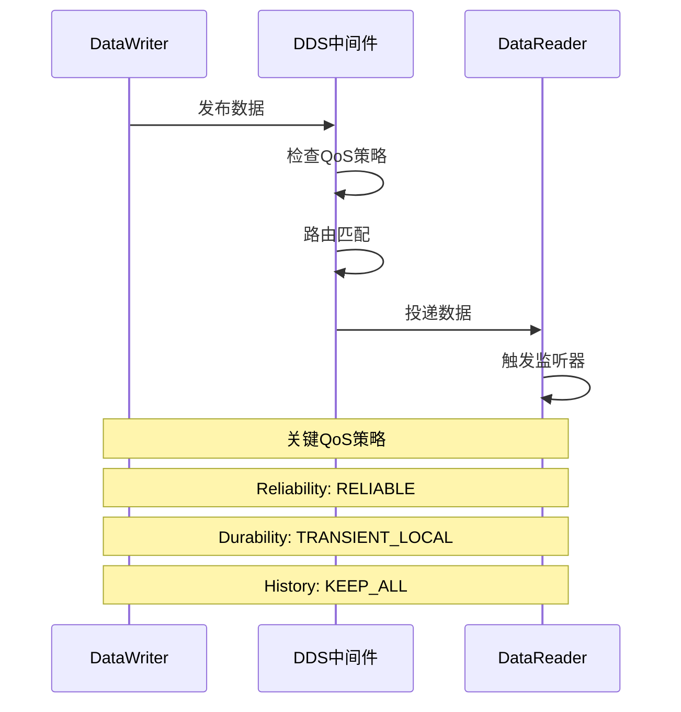
```mermaid
sequenceDiagram
    participant Pub as DataWriter
    participant DDS as DDS中间件
    participant Sub as DataReader

    Pub->>DDS: 发布数据
    DDS->>DDS: 检查QoS策略
    DDS->>DDS: 路由匹配
    DDS->>Sub: 投递数据
    Sub->>Sub: 触发监听器

    Note over Pub,Sub: 关键QoS策略
    Note over Pub,Sub: Reliability: RELIABLE
    Note over Pub,Sub: Durability: TRANSIENT_LOCAL
    Note over Pub,Sub: History: KEEP_ALL
```

---

### 第七部分：内核编程基础

#### 第18章 Linux内核编程入门（新增独立章节）
- 18.1 内核概述：用户态与内核态
- 18.2 内核模块开发基础
  - 18.2.1 模块结构：init/exit
  - 18.2.2 模块参数与模块信息
  - 18.2.3 模块加载与卸载
- 18.3 内核中的并发控制
  - 18.3.1 自旋锁
  - 18.3.2 互斥锁
  - 18.3.3 原子操作
  - 18.3.4 RCU与读写锁
- 18.4 内核内存管理
  - 18.4.1 kmalloc/kfree
  - 18.4.2 vmalloc/vfree
  - 18.4.3 Slab分配器
- 18.5 内核中的延迟与定时器
- 18.6 /proc与sysfs接口
- 18.7 字符设备驱动程序入门

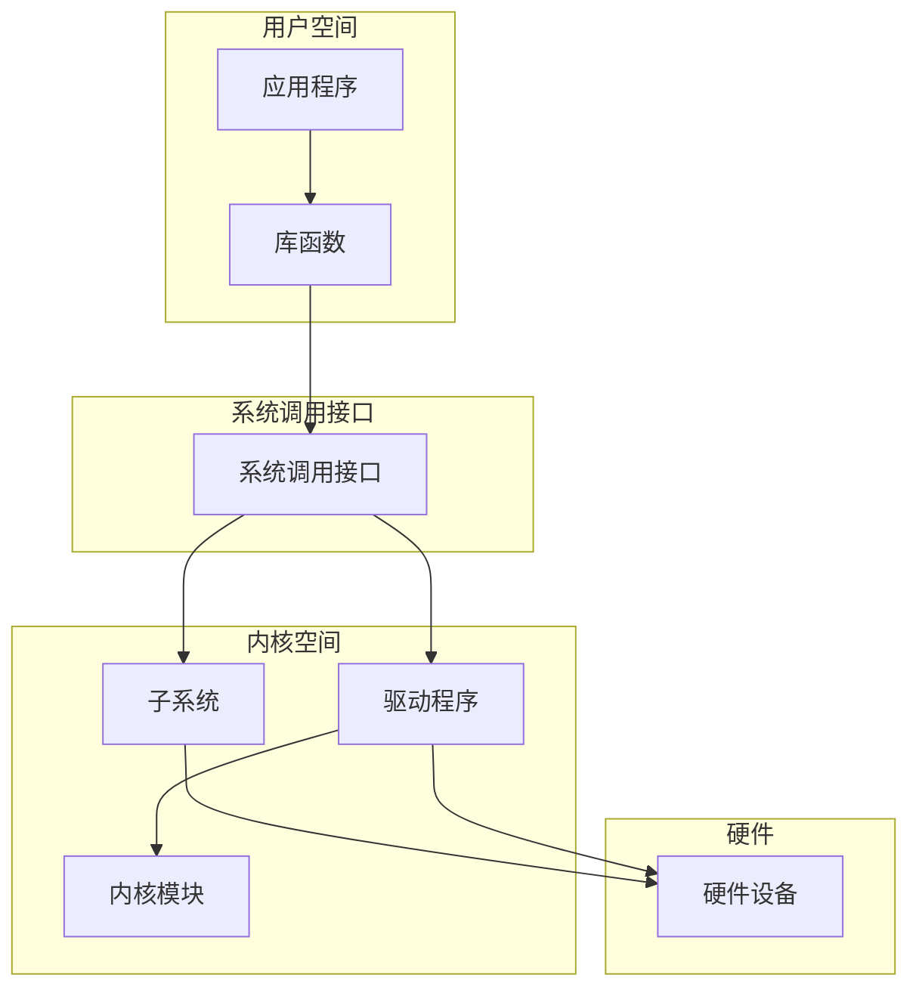
```mermaid
graph TB
    subgraph 用户空间
        App[应用程序]
        Lib[库函数]
    end

    subgraph 系统调用接口
        SCI[系统调用接口]
    end

    subgraph 内核空间
        Sub[子系统]
        Driver[驱动程序]
        Mod[内核模块]
    end

    subgraph 硬件
        HW[硬件设备]
    end

    App --> Lib
    Lib --> SCI
    SCI --> Sub
    SCI --> Driver
    Driver --> Mod
    Sub --> HW
    Driver --> HW
```

```mermaid
sequenceDiagram
    participant User as 用户程序
    participant Syscall as 系统调用
    participant Kernel as 内核
    participant Driver as 驱动
    participant HW as 硬件

    User->>Syscall: open("/dev/mydev")
    Syscall->>Kernel: 切换到内核态
    Kernel->>Driver: 调用驱动open
    Driver->>HW: 初始化硬件
    HW-->>Driver: 就绪
    Driver-->>Kernel: 返回文件描述符
    Kernel-->>User: 返回fd
```

#### 第19章 内核调试与性能分析（新增小节）
- 19.1 内核调试技术
  - 19.1.1 printk与日志级别
  - 19.1.2 /proc/kallsyms与动态调试
  - 19.1.3 crash工具分析内核崩溃
- 19.2 内核追踪
  - 19.2.1 ftrace追踪框架
  - 19.2.2 perf事件工具
  - 19.2.3 eBPF与BCC工具
- 19.3 内核性能优化要点

---

## 四、章节模板示例

### 4.1 章节结构模板
```markdown
# 第X章 [章节标题]

## X.1 实现目标
> 本节要解决的核心问题是什么

**问题描述**
- 痛点1
- 痛点2

**期望效果**
- 效果1
- 效果2

## X.2 核心原理
> 底层是如何实现的

**基本概念**
- 概念解释

**实现机制**
- 机制说明

## X.3 系统架构
```mermaid
[架构图]
```

## X.4 代码示例
```cpp
[完整示例代码]
```

## X.5 深入讲解
- 原理分析
- 最佳实践
- 常见陷阱
- 性能考量

## X.6 思考题
- 问题1
- 问题2
```

---

## 五、特色亮点

### 5.1 图文并茂
- 每个核心概念配备Mermaid图解
- 内存布局可视化
- 调用链路追踪图
- 网络交互时序图

### 5.2 渐进式难度
- 从简单示例到复杂场景
- 从基本原理到工程实践
- 从理论到性能优化

### 5.3 实战导向
- 所有代码示例可直接编译运行
- 包含常见错误的演示与修复
- 提供性能对比数据

### 5.4 覆盖全面
- 从C++特性到系统编程
- 从多线程到无锁编程
- 从网络编程到内核开发
- 从基础理论到生产级实践

---

## 六、内容体量评估

| 部分 | 章节数 | 内容体量 | 预计代码示例数 |
|------|--------|----------|----------------|
| C++核心特性 | 3章 | 中等 | ~15个 |
| 多线程编程 | 5章（含无锁） | 大 | ~25个 |
| 内存管理 | 1章 | 大 | ~12个 |
| 系统实时性 | 4章 | 大 | ~20个 |
| 网络编程 | 3章 | 很大 | ~20个 |
| 数据分发服务 | 1章 | 中等 | ~10个 |
| 内核编程 | 2章 | 很大 | ~15个 |
| **总计** | **19章** | - | **~117个** |

---

## 七、文档使用说明

### 7.1 配套环境
- 操作系统：Linux（推荐Ubuntu 20.04+）
- 编译器：GCC 9.0+ 或 Clang 10.0+
- C++标准：C++11/14/17/20
- 调试工具：gdb、valgrind、perf
- 内核开发：kernel headers、build-essential

### 7.2 学习建议
1. 按顺序阅读，理解每个概念后再继续
2. 动手运行每段示例代码
3. 使用调试工具验证原理
4. 完成每章的思考题
5. 对照源码理解实现细节

### 7.3 学习路径建议
```
路径1（应用开发）：
第1-3章 → 第4-6章 → 第9-10章 → 第14-15章

路径2（系统编程）：
第1-3章 → 第4-8章 → 第9-13章 → 第18-19章

路径3（全栈深入）：
全书按顺序学习
```

---

## 八、项目计划

| 阶段 | 内容 | 交付物 |
|------|------|--------|
| 第一阶段 | C++核心特性（第1-3章） | 3章完整内容 |
| 第二阶段 | 多线程编程（第4-8章） | 5章完整内容 |
| 第三阶段 | 内存管理（第9章） | 1章完整内容 |
| 第四阶段 | 系统实时性（第10-13章） | 4章完整内容 |
| 第五阶段 | 网络编程（第14-16章） | 3章完整内容 |
| 第六阶段 | 数据分发服务（第17章） | 1章完整内容 |
| 第七阶段 | 内核编程（第18-19章） | 2章完整内容 |
| 第八阶段 | 审校优化 | 完整教程 |

---

*文档版本：v2.0*
*创建日期：2026-01-19*
*最后更新：2026-01-19*
